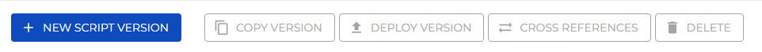
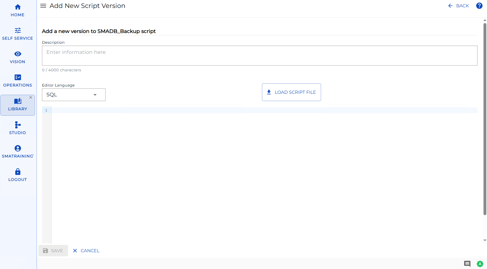
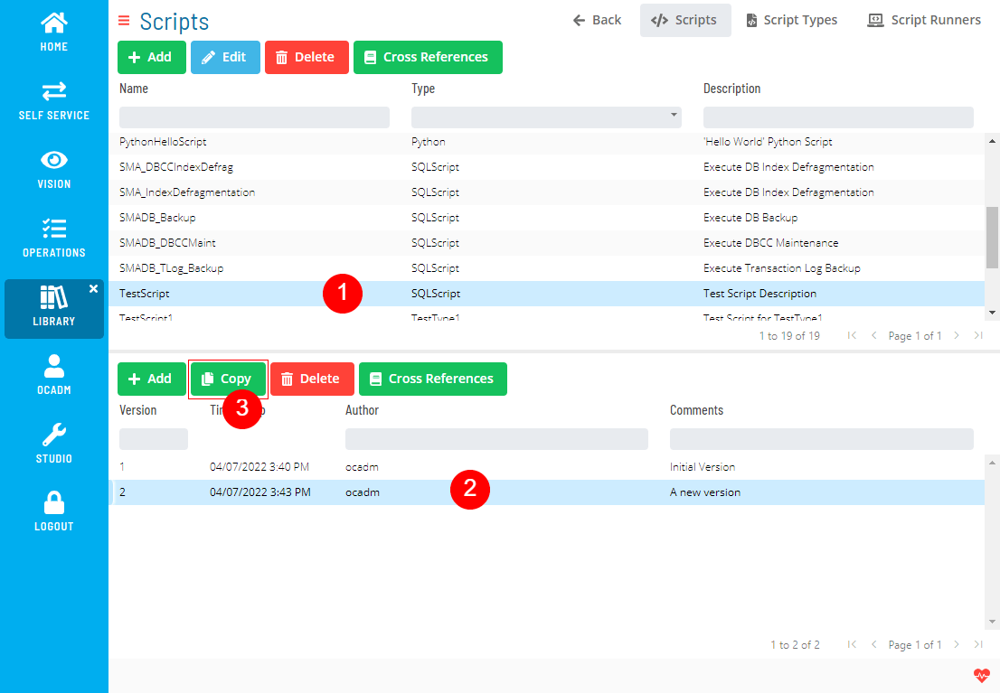
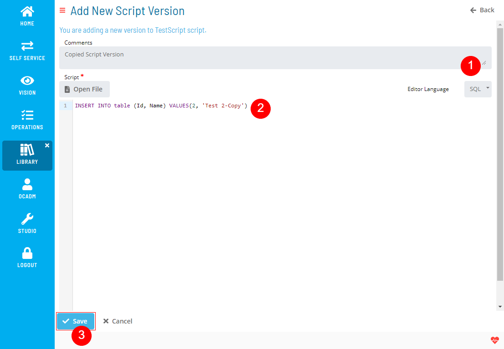
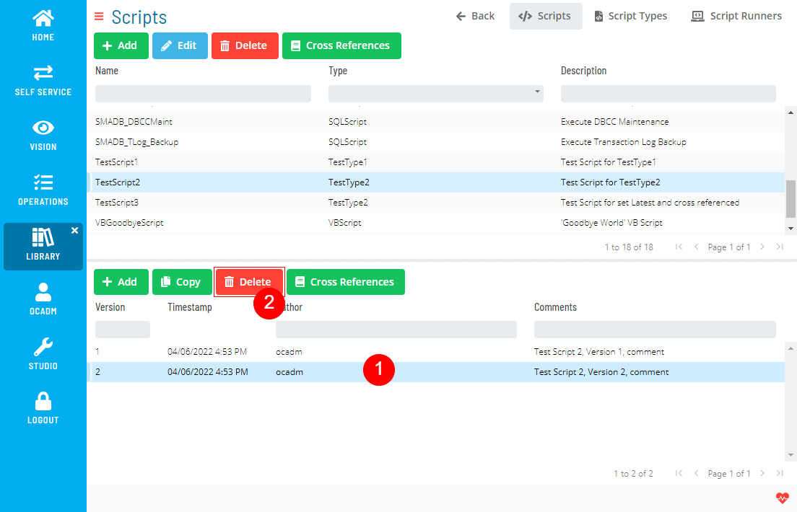
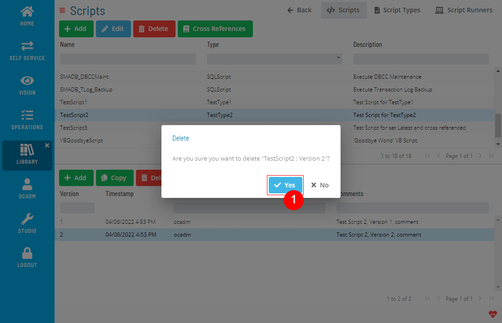
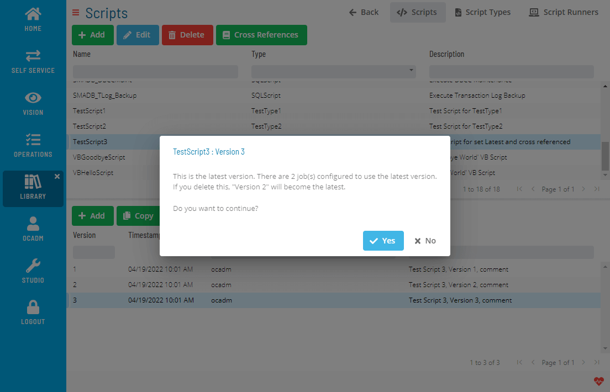
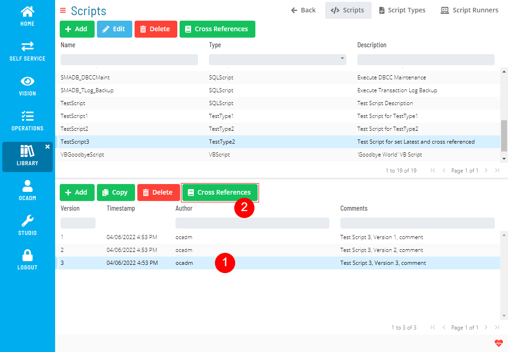
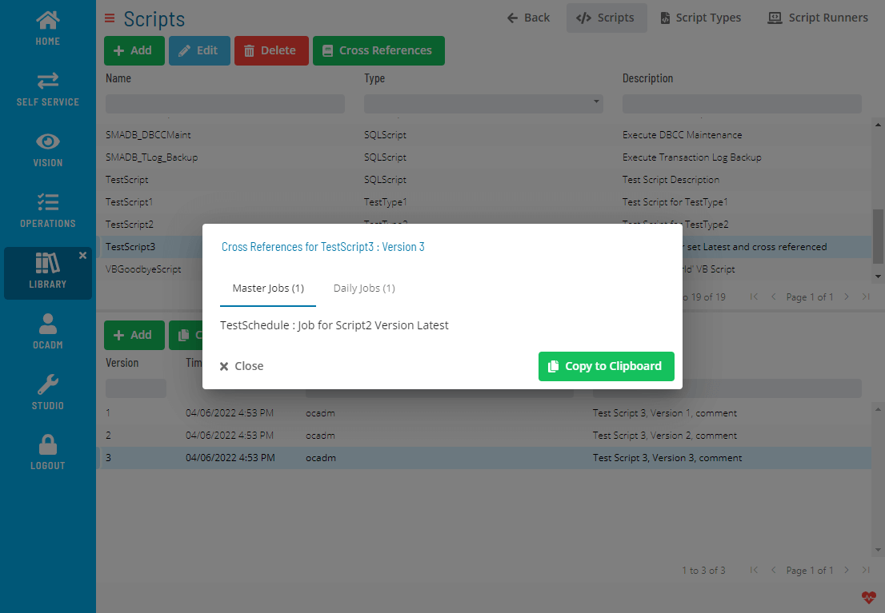

# Managing Script Versions

**Theme:** Configure  
**Who Is It For?** System Administrator, Automation Engineer

## What Is It?

The **Script Versions** module allows you to add, edit, delete, deploy, and check cross-references for script versions.

### Creating Script Versions

To create Script Versions, complete the following steps:

1. Select a Script and select the Add button above the Script Version list
   
2. Fill out the Script Version form
   
   :::note
    Editor Language is only for formatting the syntax highlighter. It won't have any effect on the Script itself.
   :::

### Copying Script Versions

Create a new script version based on an existing version.

1. Select a Script, select a Script Version and select the Copy button above the Script Version list
   
2. Fill out the Script Version form
   

### Deleting Script Versions

To delete Script Versions, complete the following steps:

1. Select a Script, select a Script Version and select the Delete button above the Script Version list
   

2. Select Yes to confirm the delete operation
   

   :::note
    The delete operation is not allowed:
      - If the script version has cross-references
      - If the script version is the only version for the script
   :::

   :::note
    If you are deleting the Latest Version of a deployed Script, the previous version becomes the new Latest version.
    
   :::

### Deploying Script Versions

To deploy Script Versions, complete the following steps:

1. Select a Script, select a Script Version and select the Deploy button above the Script Version list
2. Repeat the 2nd step in [Deploying a Script](Managing-Scripts#deploying-a-script)

### Checking Cross References

To check Cross References, complete the following steps:

1. Select a Script, select a Script Version and select the Cross References button above the Script Version list
   
2. A dialog will show the Cross References
   

.png "More Info icon")
Related Topics

- [Managing Scripts](Managing-Scripts.md)
- [Managing Script Types](Managing-Script-Types.md)
- [Managing Script Runners](Managing-Script-Runners.md)

## When Would You Use It?

- You need to review or update Script Versions settings in Solution Manager
- Script Versions needs to be reviewed as part of routine system maintenance or a compliance audit

## Why Would You Use It?

- **Reduce administrative overhead**: Centralizing Script Versions management in Solution Manager reduces the time needed to locate and update settings across the environment
- All Script Versions changes are captured in the OpCon audit system, supporting change management and compliance processes

## FAQs

**Q: What does managing script versions involve?**

Managing script versions includes adding, editing, and deleting records. Access script versions through the Enterprise Manager navigation pane.

**Q: Who can manage script versions in OpCon?**

Users with the appropriate privileges assigned through their role can manage script versions. Contact your OpCon system administrator if you do not have access.

## Glossary

**Enterprise Manager (EM)**: OpCon's rich client graphical user interface for Windows and Linux, used to define schedules and jobs, manage automation data, and perform operational tasks.

**Resource**: A numeric variable in OpCon representing a finite pool. Jobs can be configured to require a set number of resource units to run, limiting concurrent executions and preventing resource contention.

**Role**: A named security profile in OpCon that groups privileges together. Roles are assigned to user accounts to control which features, schedules, jobs, machines, and administrative functions a user can access.

**Privilege**: A specific permission granted through an OpCon role that controls access to a feature, function, or object type. Privileges are organized into categories such as Function Privileges, Machine Privileges, Schedule Privileges, and Access Codes.

**OpCon**: Continuous' workflow automation platform. The OpCon server includes the database, SAM and Supporting Services (SAM-SS), and graphical user interfaces. agents installed on target platforms run jobs and report results.
