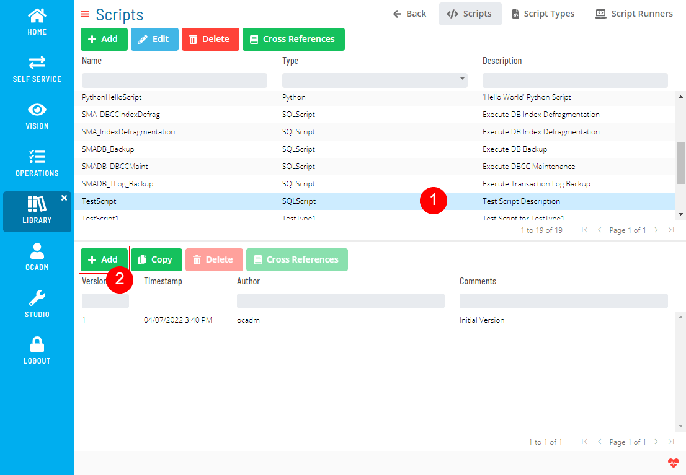
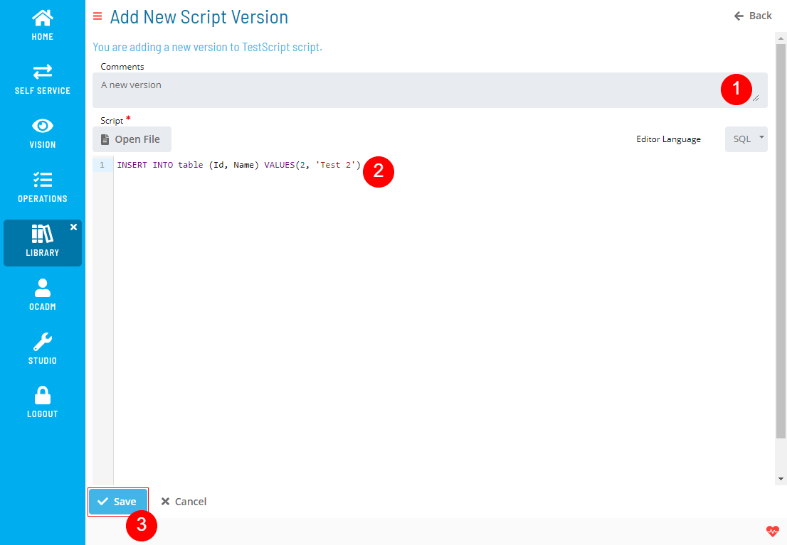
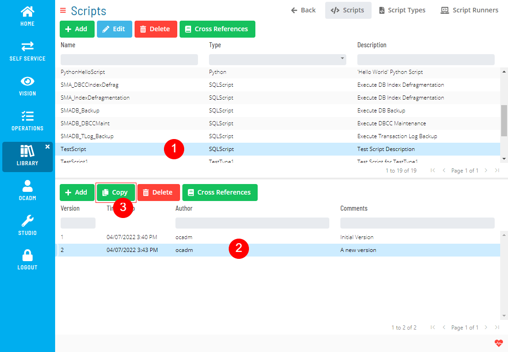
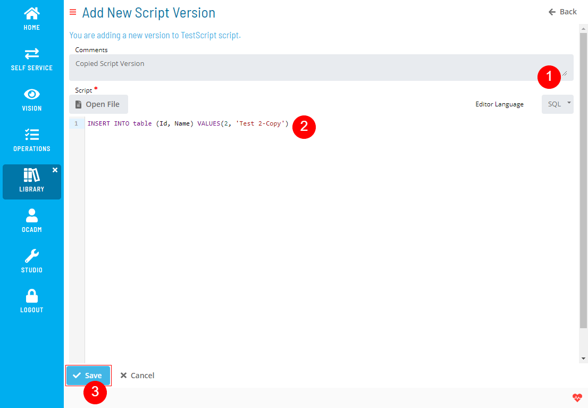
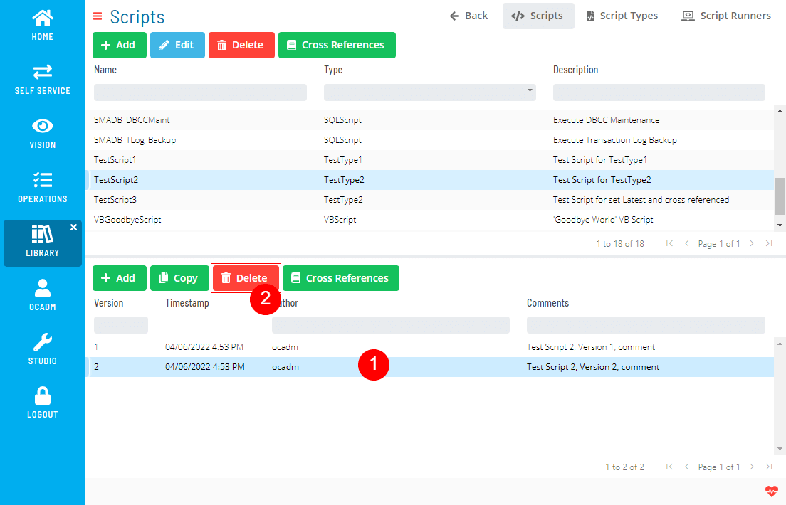
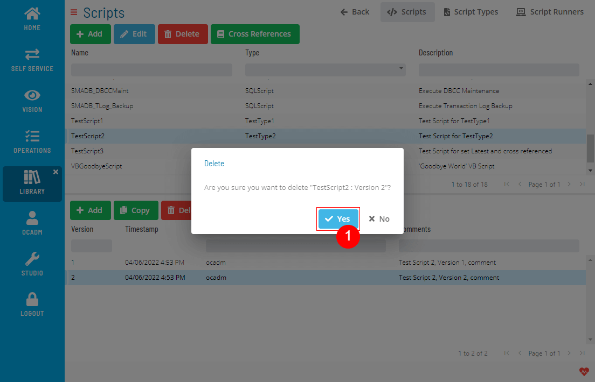
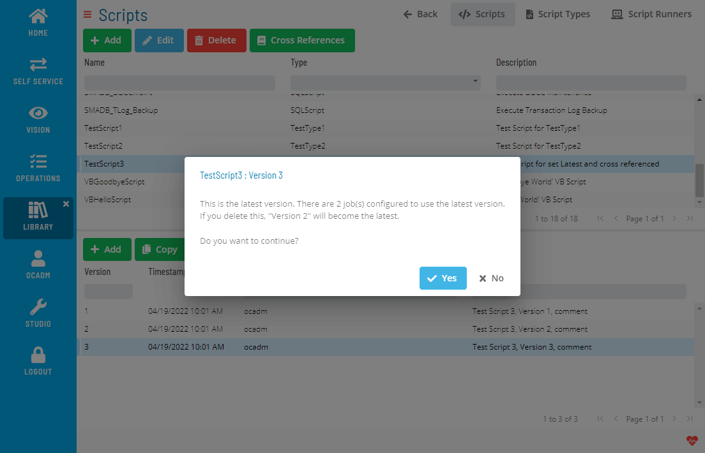
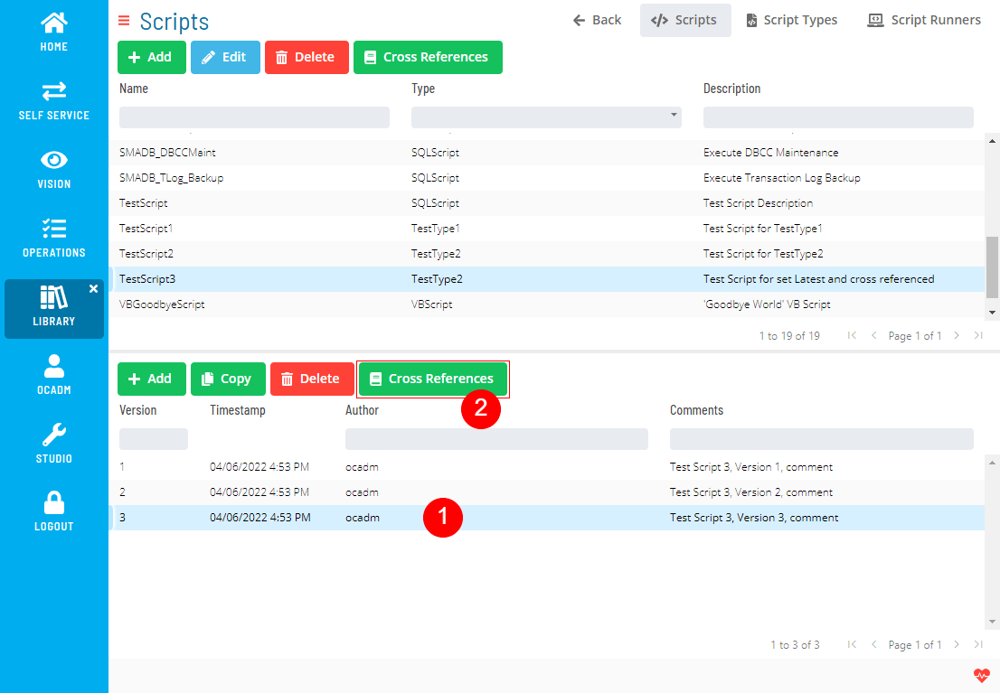
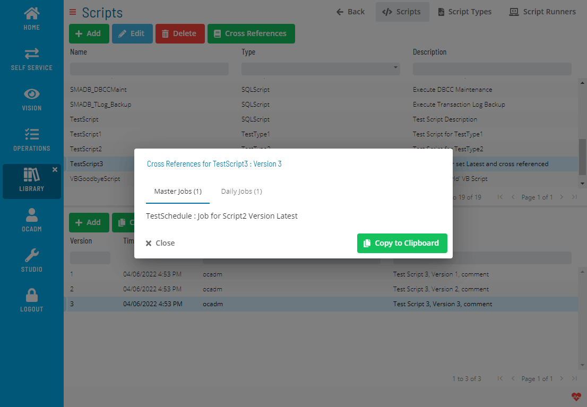

# Managing Script Versions

The **Script Versions** module allows you to add, edit, delete, deploy, and check cross-references for script versions.

### Creating Script Versions

1. Select a Script and click the Add button above the Script Version list
   
2. Fill out the Script Version form
   
   :::note
    Editor Language is only for formatting the syntax highlighter. It won't have any effect on the Script itself.
   :::

### Copying Script Versions

You can create a new script version based on an existing version.

1. Select a Script, select a Script Version and click the Copy button above the Script Version list
   
2. Fill out the Script Version form
   

### Deleting Script Versions

1. Select a Script, select a Script Version and click the Delete button above the Script Version list
   

2. Click Yes to confirm the delete operation
   

   :::note
    The delete operation is not allowed;
      - If the script version has cross-references,
      - If the script version is the only version for the script,
   :::

   :::note
    If you are deleting the Latest Version of a deployed Script, the version before the latest will become a new Latest version.
    
   :::

### Deploying Script Versions

1. Select a Script, select a Script Version and click the Deploy button above the Script Version list
2. Repeat the 2nd step in [Deploying a Script](Managing-Scripts#deploying-a-script)

### Checking Cross References

1. Select a Script, select a Script Version and click the Cross References button above the Script Version list
   
2. A dialog will show the Cross References
   

.png "More Info icon")
Related Topics

- [Managing Scripts](Managing-Scripts.md)
- [Managing Script Types](Managing-Script-Types.md)
- [Managing Script Runners](Managing-Script-Runners.md)