# Managing Scripts

**Theme:** Configure  
**Who Is It For?** System Administrator, Automation Engineer

## What Is It?

The **Scripts** module allows you to add, edit, delete, deploy, and check cross-references for scripts.

### Creating Scripts

To create a script, complete the following steps:

1. Select the **Add** button above the list.
   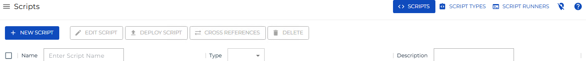
2. Fill out the Script form.
   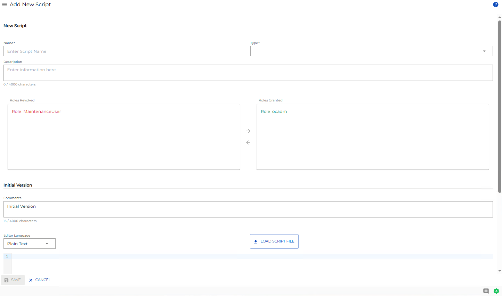
   :::note
   - **Editor Language** is only for formatting the syntax highlighter. It does not affect the script itself.
   - Script content is saved as a new Version.
   :::

### Editing Scripts

To edit a script, complete the following steps:

1. Select a script and select the **Edit** button above the list.
   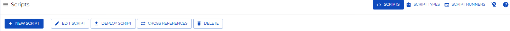
2. Fill out the Script form.
   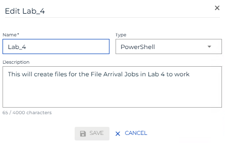
   :::note
   You cannot edit script content with this function. To edit script content, create a new Version.
   :::

### Deleting Scripts

To delete a script, complete the following steps:

1. Select a script and select the **Delete** button above the list.
   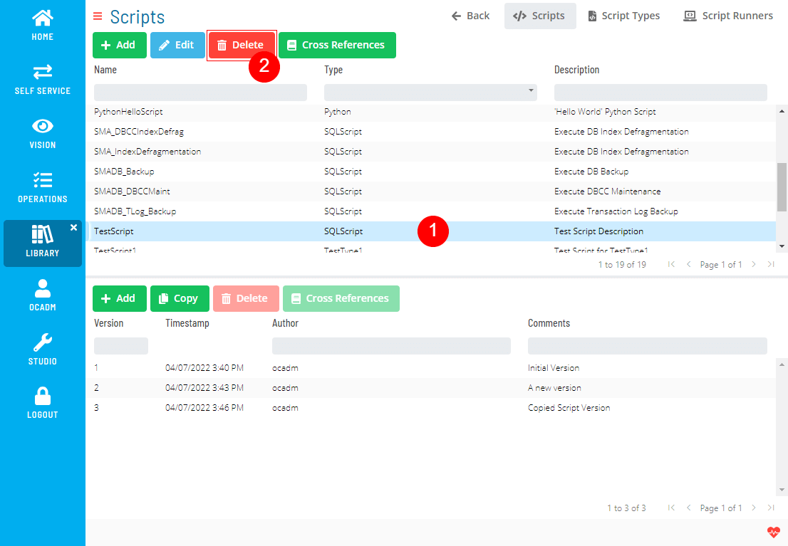
2. Select **Yes** to confirm the deletion.
   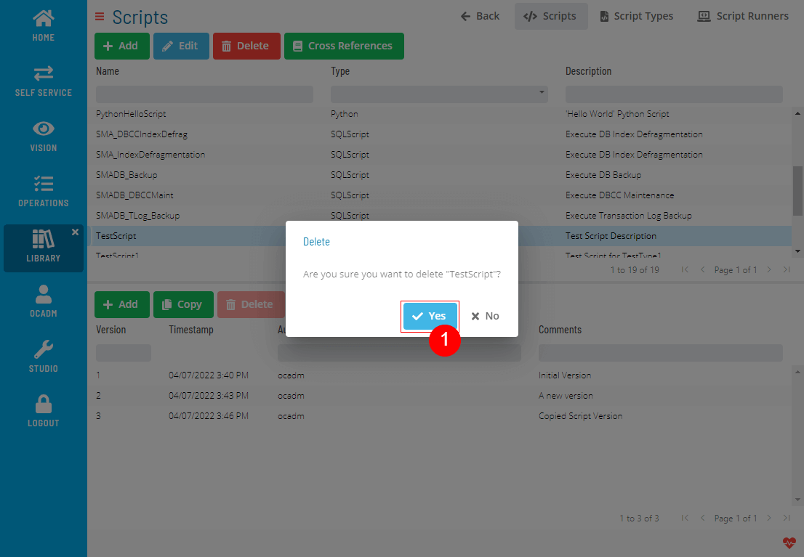

Delete is not allowed if the script has any cross-references.
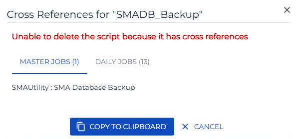

### Deploying Scripts

To deploy a script, complete the following steps:

1. Select a script and select the **Deploy** button above the list.
   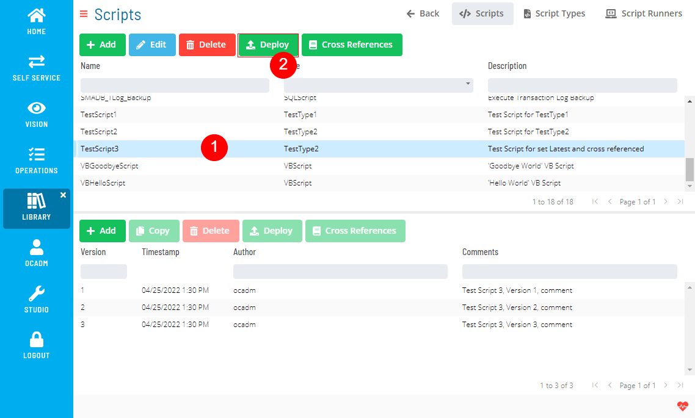
2. Fill out the Script deploy form.
   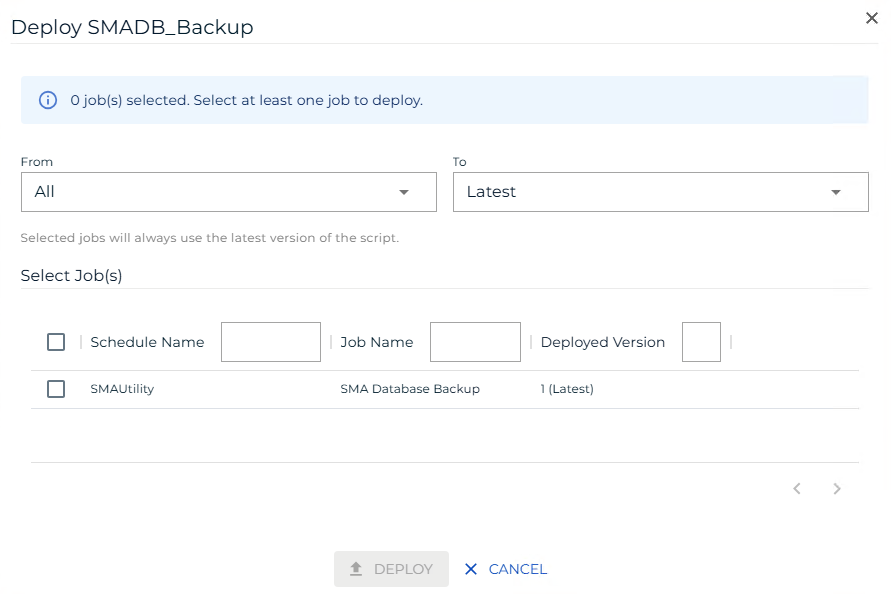

### Checking Cross References

To check cross references for a script, complete the following steps:

1. Select a script and select the **Cross References** button above the list.
   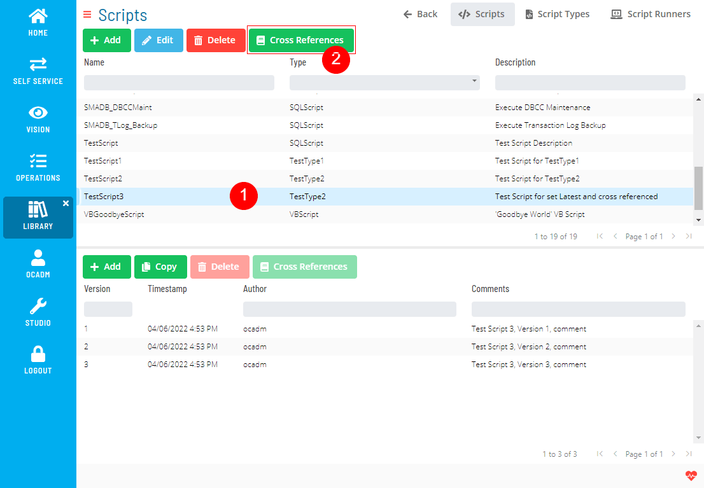
2. A dialog displays the cross references.
   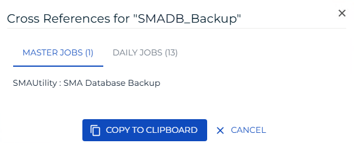

.png "More Info icon")
Related Topics

- [Managing Script Versions](Managing-Script-Versions.md)
- [Managing Script Types](Managing-Script-Types.md)
- [Managing Script Runners](Managing-Script-Runners.md)

## FAQs

**Q: What does managing scripts involve?**

Managing scripts includes adding, editing, deleting, and deploying records. Access scripts in Solution Manager under **Library** > **Scripts**.

**Q: Who can manage scripts in OpCon?**

Users with the appropriate privileges assigned through their role can manage scripts. Contact your OpCon system administrator if you do not have access.

## Glossary

**Resource**: A numeric variable in OpCon representing a finite pool. Jobs can be configured to require a set number of resource units to run, limiting concurrent executions and preventing resource contention.

**Role**: A named security profile in OpCon that groups privileges together. Roles are assigned to user accounts to control which features, schedules, jobs, machines, and administrative functions a user can access.

**Privilege**: A specific permission granted through an OpCon role that controls access to a feature, function, or object type. Privileges are organized into categories such as Function Privileges, Machine Privileges, Schedule Privileges, and Access Codes.

**OpCon**: Continuous' workflow automation platform. The OpCon server includes the database, SAM and Supporting Services (SAM-SS), and graphical user interfaces. Agents installed on target platforms run jobs and report results.
