# Managing Scripts

The **Scripts** module allows you to add, edit, delete, deploy, and check cross-references for scripts.

### Creating Scripts

1. Click the Add button above the list
   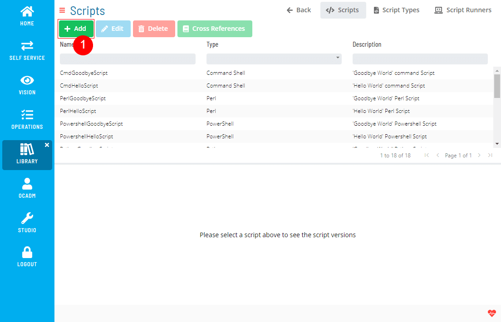
2. Fill out the Script form
   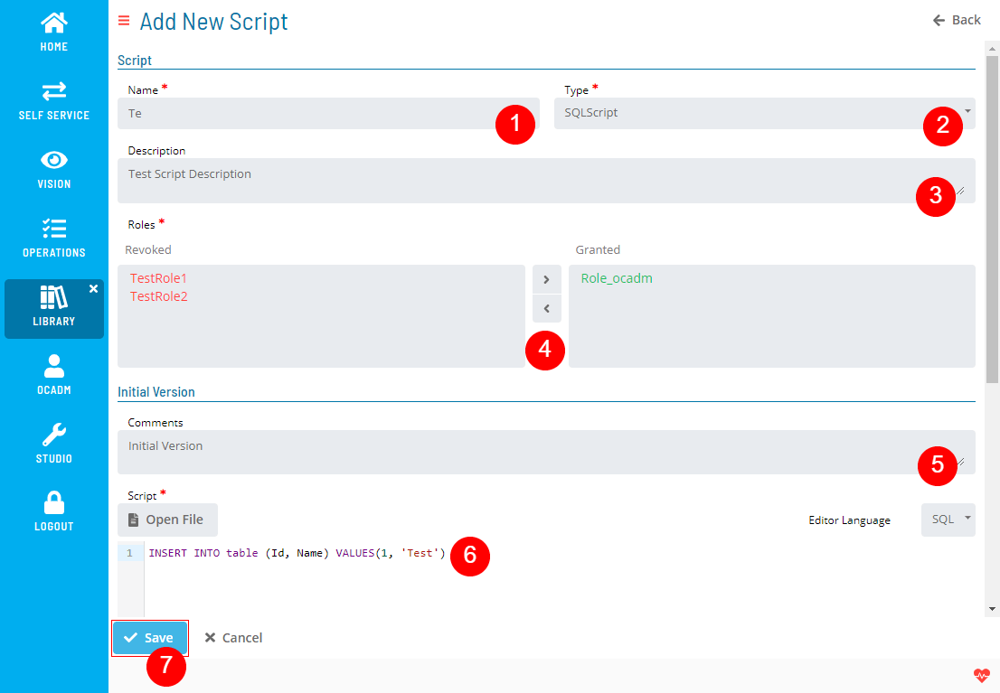
   :::note
    1. Editor Language is only for formatting the syntax highlighter. It won't have any effect on the Script itself.
    2. Script content will be created as a new Version.
   :::

### Editing Scripts

1. Select a Script and click the Edit button above the list
   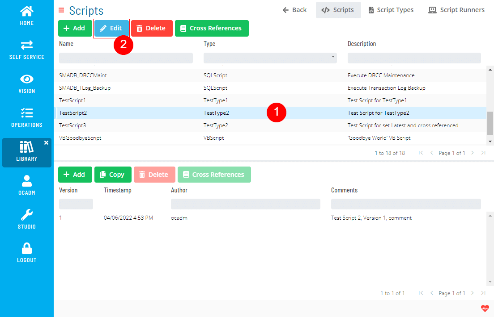
2. Fill out the Script form
   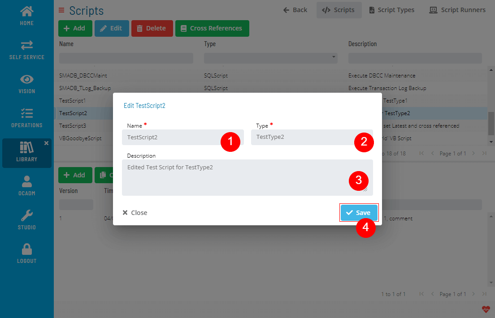
   :::note
    You cannot edit the Script content with this function. If you want to edit the Script content, you need to create a new Version.
   :::

### Deleting Scripts

1. Select a Script and click the Delete button above the list
   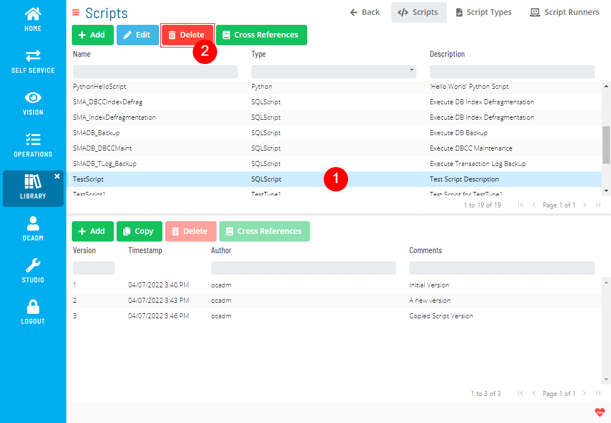

2. Click Yes to confirm the delete operation
   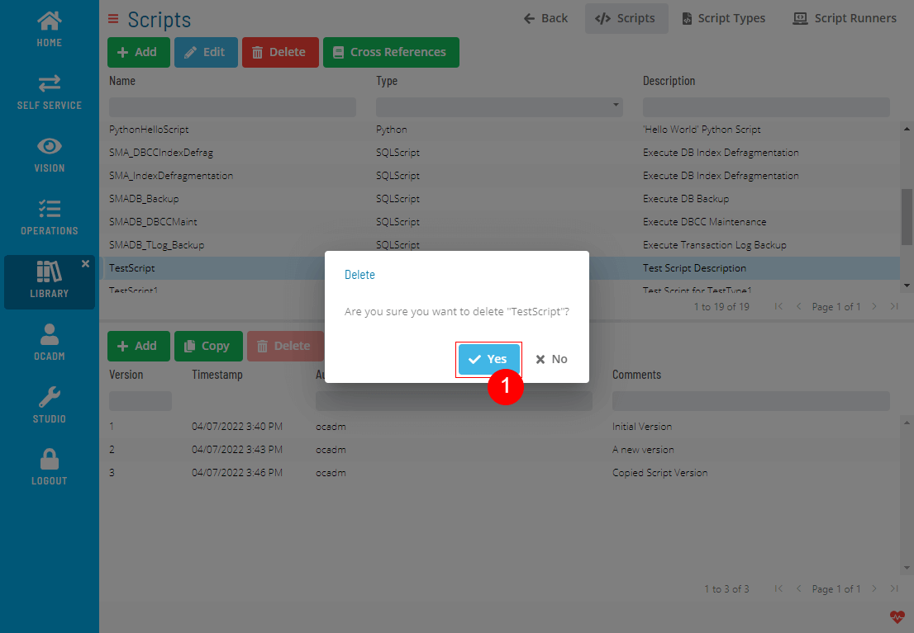

Delete operation is not allowed if Script has any cross-references.
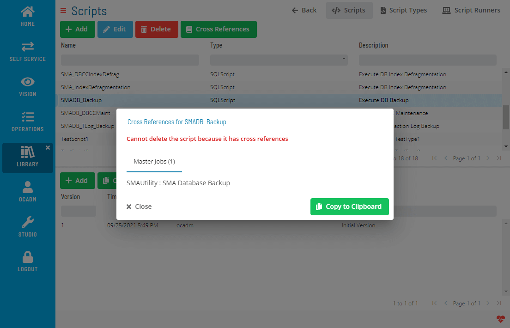

### Deploying Scripts

1. Select a Script and click the Deploy button above the list
   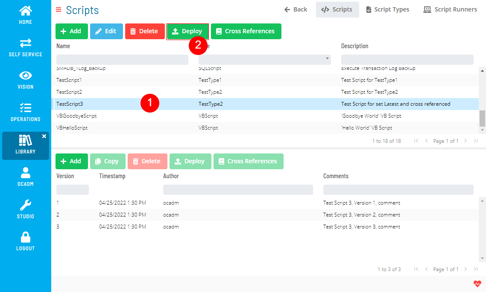
2. Fill out the Script deploy form
   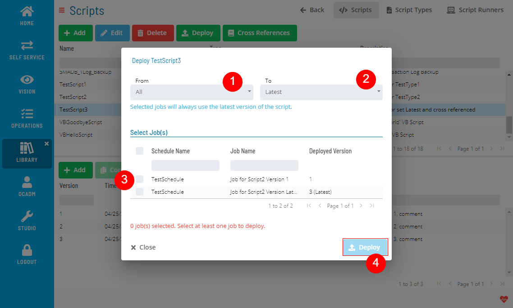

### Checking Cross References

1. Select a Script and click the Cross References button above the list
   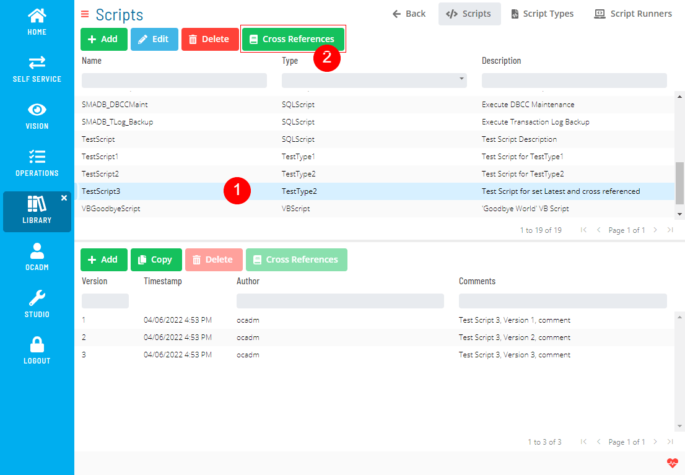
2. A dialog will show the Cross References
   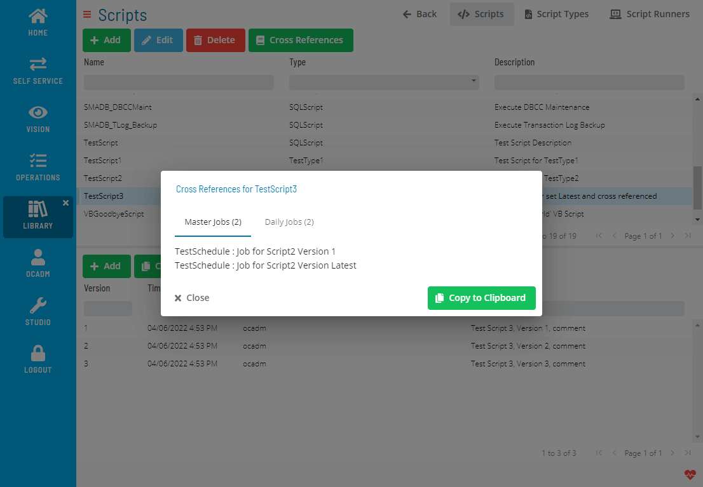

.png "More Info icon")
Related Topics

- [Managing Script Versions](Managing-Script-Versions.md)
- [Managing Script Types](Managing-Script-Types.md)
- [Managing Script Runners](Managing-Script-Runners.md)