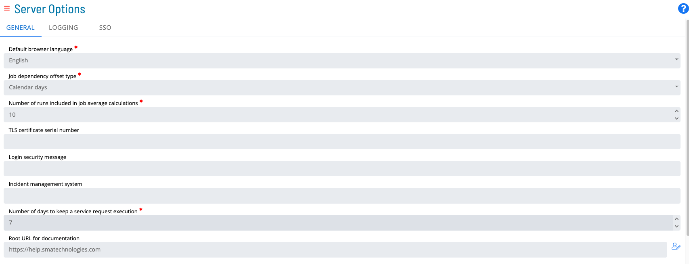
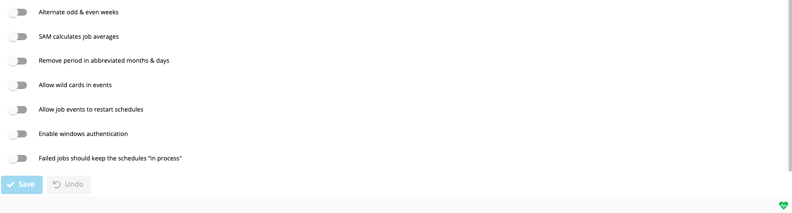

# Managing General Settings

**Theme:** Configure  
**Who Is It For?** System Administrator, Automation Engineer

## What Is It?

Use this procedure to manage General Settings in Solution Manager.

## Administration

### Required Privileges

To configure the **General** setting, you must have one of the following:

- **Role**: Role_ocadm
- **Function Privilege**: Maintian server options

---

## Configuring General

To configure General Settings, go to **Library** > **Server Options** > select on the **GENERAL** tab.

### Configuration Options

The General category contains default behavior settings for the SAM.

||||
|--- |--- |--- |--- |
|Job Dependency Offset Type|Calendar Days|Y|Determines whether job dependency offset values are calculated in calendar days or by job occurrence. With **Calendar Days**, OpCon looks for the job on the specified number of calendar days from the current schedule date. With **Occurrence**, OpCon looks for the job on the numbered occurrence of the schedule (e.g., the last time Job A ran, regardless of holidays). Valid values: Calendar Days, Occurrence.|
|Alternate Odd and Even Weeks|False|Y|When set to True, jobs using the Odd/Even Weeks frequency are treated as Every Other Week frequency.|
|Number of Runs Included in Job Average Calculations|10|Y|Defines the number of most recent job history records used when SAM calculates job averages. Valid values: 1–999.|
|SAM Calculates Job Averages|False|Y|Determines if SAM calculates job start and run time averages after each job run. When True, SAM calculates averages using the SMA_JOBAVG stored procedure logic for jobs active in the Daily; this may cause slight processing delays. When False, configure the SMA JOB AVERAGE job on the SMAUtility schedule to run once per day. Valid values: True, False.|
|Remove Period in Abbreviated Months and Days|False|Y|Controls whether SAM strips periods from abbreviated months and days when resolving tokens. Set to True only for backward compatibility with locales where periods were previously included in abbreviations. Valid values: True, False.|
|Allow Wild Cards in Events|False|Y|Determines whether \* (asterisk) and ? (question mark) are treated as wild cards in Schedule, Job, and Machine Names within Events. Valid values: True, False.|
|TLS Certificate Serial Number|*blank*|Y|Identifies the digital certificate assigned to SMANetCom, required only when TLS Customer Validation is selected by one or more agents. The number can be found in the certificate store on the OpCon server machine. When blank, SMANetCom does not supply a TLS Customer certificate to any agent; the connection will fail for any agent requiring TLS Customer validation.|
|Login Security Message|*blank*|Y|Configures a security message displayed to users after login. The message appears in both the Enterprise Manager and Solution Manager applications.|
|Incident Management System|*blank*|Y|Identifies the ticketing system used for incident management. When specified, this value replaces the "Incident Ticket ID" label in the Daily Job Information dialog.|
|Allow Job Events to Restart Schedules|False|Y|When True, the following events can restart a completed schedule: $JOB:ADD, $JOB:RESTART, $JOB:RESCHEDULE. By default, the SAM does not restart completed schedules and logs the event as an error in Critical.log. Valid values: True, False.|
|Failed jobs should keep the Schedule "In Process"|False|Y|When True, schedules containing Failed or Marked Failed jobs remain In Process. By default, the SAM closes a schedule when all jobs are Cancelled, Skipped, Finished OK, or Failed. Valid values: True, False.|
|Number of Days to Keep a Service Request Execution|7|Y|Defines the number of days to retain service request execution history.|
|Solution Manager URL|*blank*|N|Defines the Solution Manager URL for opening Solution Manager within the Enterprise Manager. When specified, a Solution Manager option appears in the Navigation frame. Note: Log out and back in to the Enterprise Manager after saving this value for the option to appear.|

## FAQs

**Q: What does managing general settings involve?**

Managing general settings includes Required Privileges, Configuring General. Access general settings through the Enterprise Manager navigation pane.

**Q: Who can manage general settings in OpCon?**

Users with the appropriate privileges assigned through their role can manage general settings. Contact your OpCon system administrator if you do not have access.

## Glossary

**TLS (Transport Layer Security)**: An encryption protocol used to secure TCP/IP communications between SMANetCom and agents, ensuring that job start and status data is transmitted safely.

**SMANetCom (SMA Network Communications Module)**: Handles TCP/IP communication of platform-specific automation information between SAM and all agents. Uses database tables to maintain reliable communication and data integrity.

**SMAUtility Schedule**: A pre-built OpCon schedule installed during setup that contains standard maintenance jobs for audit history cleanup, job history cleanup, and BIRT report generation.

**SAM (Schedule Activity Monitor)**: The logical processor for OpCon workflow automation. SAM monitors schedule and job start times, dependencies, and user commands to determine job execution timing, and processes OpCon events.

**LSAM (Local Schedule Activity Monitor)**: An agent installed on a target platform that runs jobs in the native language of that platform and communicates results back to SAM via SMANetCom over TCP/IP.

**Enterprise Manager (EM)**: OpCon's rich client graphical user interface for Windows and Linux, used to define schedules and jobs, manage automation data, and perform operational tasks.

**Solution Manager**: OpCon's browser-based graphical user interface for managing automation data, performing operational actions, and administering the system.

**Frequency**: A set of rules that defines when a job or schedule is eligible to run, based on calendar rules, day-of-week settings, period offsets, and other timing criteria.
