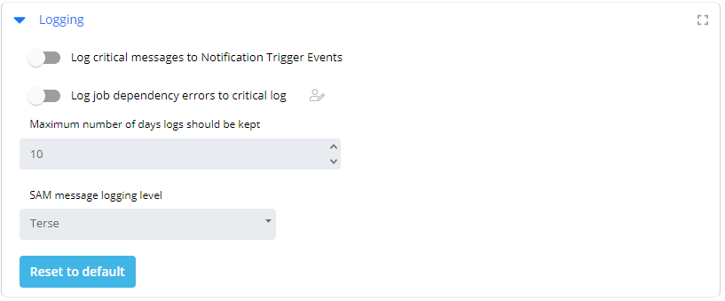

# Managing Logging Settings

## Required Privileges

In order to access the Server Options page and configure the **Logging** setting, you must have the following:

- **Role**: User must be assigned to the Role_ocadm.

---

## Configuring Logging

To configure Logging Settings, go to **Library** > **Server Options** > click on the **LOGGING** tab.

### Reset Values to Default

1. Click **Reset to Default** button to reset the settings to their default.
2. Click **Save** button to save your changes.

**The table below shows default values for each settings. If user changes the default value of a setting,  icon will show next to the field.*

### Configuration Options

The Logging settings contains log and trace settings for the SAM.

| Setting | Default Value | Required | Description |
| --- | --- | --- | --- |
| Log Critical messages to Notification Trigger Events | False | Y | This parameter enables writing of all SAM critical errors to the Application Log in the Microsoft Event Log. To minimize overhead, the SAM does not write critical messages to the Windows event log by default. Valid values are True and False. |
| Log job dependency errors to Critical.log | True | Y | This parameter enables/disables logging job dependency errors to the critical log. Valid values are True and False.If True, the SAM logs all job dependency errors to Critical.log.If False, the SAM stops logging job dependency errors to the Critical.log. When the SAM Message Logging Level is set to Verbose or Debug, the SAM writes job dependency errors to the SAM.log. Refer to SAM Message Logging Level below. |
| Maximum number of days logs should be kept | 10 | Y | This parameter sets the maximum number of archive folders (i.e., days) for all log archives including Schedule Manager logs. By default, the SAM deletes archived logs older than 10 days. The SAM archives log files once per day. Valid values range from 0 to 365. CAUTION: This number must be less than the ArchiveDaysToKeep setting in the SMAServMan configuration file. Refer to License Types in the Server Programs online help. |
| SAM Message Logging Level | Terse | Y | This parameter determines the amount of SAM processing information written to the SAM log files. Valid values are Terse, Verbose, and Debug.Terse is the default setting providing only job/schedule start and finish information.Verbose provides additional information regarding machine processing.Debug provides verbose messaging plus more detailed information on SAM processing. |
