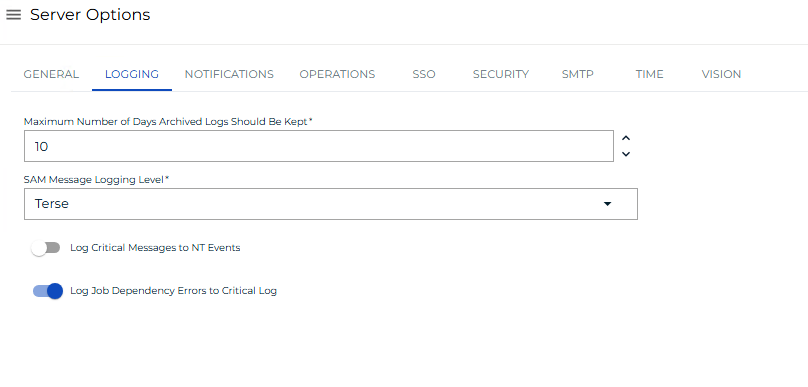

# Managing Logging Settings

**Theme:** Configure  
**Who Is It For?** System Administrator, Automation Engineer

## What Is It?

Use this procedure to manage Logging Settings in Solution Manager.

## When Would You Use It?

- You need to review or update Logging Settings settings in Solution Manager
- Logging Settings needs to be reviewed as part of routine system maintenance or a compliance audit

## Why Would You Use It?

- **Reduce administrative overhead**: Centralizing Logging Settings management in Solution Manager reduces the time needed to locate and update settings across the environment
- All Logging Settings changes are captured in the OpCon audit system, supporting change management and compliance processes

## Administration

### Required Privileges

To configure the **Logging** setting, you must have one of the following:

- **Role**: Role_ocadm
- **Function Privilege**: Maintian server options

---

## Configuring Logging

To configure Logging Settings, go to **Library** > **Server Options** > select on the **LOGGIGN** tab.

**The table below shows default values for each setting. If a user changes the default value,  icon will show next to the field.*

### Configuration Options

The Logging settings contains log and trace settings for the SAM.

| Setting | Default Value | Required | Description |
| --- | --- | --- | --- |
| Log Critical messages to Notification Trigger Events | False | Y | Enables writing all SAM critical errors to the Application Log in the Microsoft Event Log. Disabled by default to minimize overhead. Valid values: True, False. |
| Log job dependency errors to Critical.log | True | Y | Controls whether job dependency errors are logged to Critical.log. When True, all job dependency errors are written to Critical.log. When False, they are suppressed from Critical.log but written to SAM.log if the SAM Message Logging Level is Verbose or Debug. Valid values: True, False. |
| Maximum number of days logs should be kept | 10 | Y | Sets the maximum number of archive folders (days) retained for all log archives, including Schedule Manager logs. The SAM archives logs once per day and deletes archives older than this value. Valid values: 0–365. CAUTION: This number must be less than the ArchiveDaysToKeep setting in the SMAServMan configuration file. |
| SAM Message Logging Level | Terse | Y | Determines the amount of SAM processing information written to log files. **Terse**: job/schedule start and finish only. **Verbose**: adds machine processing details. **Debug**: adds detailed SAM processing information. Valid values: Terse, Verbose, Debug. |

## FAQs

**Q: What does managing logging settings involve?**

Managing logging settings includes Required Privileges, Configuring Logging. Access logging settings through the Enterprise Manager navigation pane.

**Q: Who can manage logging settings in OpCon?**

Users with the appropriate privileges assigned through their role can manage logging settings. Contact your OpCon system administrator if you do not have access.

## Glossary

**SMAServMan (SMA Service Manager)**: Manages the starting, stopping, and restarting of all OpCon server programs. Monitors configured applications and restarts them automatically if they fail unexpectedly.

**SAM (Schedule Activity Monitor)**: The logical processor for OpCon workflow automation. SAM monitors schedule and job start times, dependencies, and user commands to determine job execution timing, and processes OpCon events.

**Enterprise Manager (EM)**: OpCon's rich client graphical user interface for Windows and Linux, used to define schedules and jobs, manage automation data, and perform operational tasks.

**Notification**: A message sent by the SMA Notify Handler when a Machine, Schedule, or Job changes to a specific status. Notifications can be delivered as emails, text messages, Windows Event Log entries, SNMP traps, or other formats.

**Resource**: A numeric variable in OpCon representing a finite pool. Jobs can be configured to require a set number of resource units to run, limiting concurrent executions and preventing resource contention.

**Role**: A named security profile in OpCon that groups privileges together. Roles are assigned to user accounts to control which features, schedules, jobs, machines, and administrative functions a user can access.

**Privilege**: A specific permission granted through an OpCon role that controls access to a feature, function, or object type. Privileges are organized into categories such as Function Privileges, Machine Privileges, Schedule Privileges, and Access Codes.

**Machine**: A platform defined in the OpCon database that has an agent installed. OpCon routes job execution requests to machines via SMANetCom, and machines report job completion status back to SAM.
