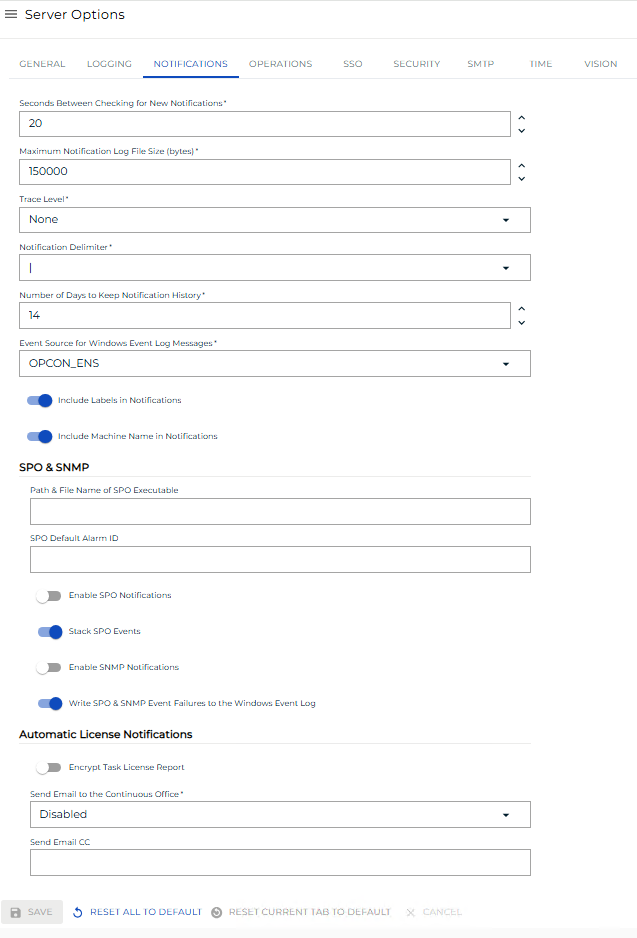

# Managing Notification Settings

**Theme:** Configure  
**Who Is It For?** System Administrator, Automation Engineer

## What Is It?

Use this procedure to manage Notification Settings in Solution Manager.

## When Would You Use It?

- You need to review or update Notification Settings settings in Solution Manager
- Notification Settings needs to be reviewed as part of routine system maintenance or a compliance audit

## Why Would You Use It?

- **Reduce administrative overhead**: Centralizing Notification Settings management in Solution Manager reduces the time needed to locate and update settings across the environment
- All Notification Settings changes are captured in the OpCon audit system, supporting change management and compliance processes

## Administration

### Required Privileges

To configure the **Notification** setting, you must have one of the following:

- **Role**: Role_ocadm
- **Function Privilege**: Maintian server options

---

## Configuring Notification

To configure Notifications Settings, go to **Library** > **Server Options** > **NOTIFICATIONS** tab.

\*_The table below shows default values for each settings. If user changes the default value of a setting,  icon will show next to the field._

### Configuration Options

The Notification settings tab includes SPO & SNMP Settings, as well as Automatic License Renewal Notification settings.

| Setting                                                    | Default Value | Required | Description                                                                                                                                                                                                                                                                                                                                       |
| ---------------------------------------------------------- | ------------- | -------- | ------------------------------------------------------------------------------------------------------------------------------------------------------------------------------------------------------------------------------------------------------------------------------------------------------------------------------------------------- |
| Maximum Log File Size                                      | 150000        | Y        | Maximum size in bytes for each log file. When reached, the file is "rolled over" and a new file starts. Valid range: 50000-500000                                                                                                                                                                                                                 |
| Trace Level                                                | None          | N        | Detail level for debug trace logs. Valid options: "None", "Basic", "Detailed", "Very Detailed"                                                                                                                                                                                                                                                    |
| Include Labels in Notifications                            | TRUE          | Y        | Enables/disables inclusion of labels (Machine Name, Schedule Name, Job Name, etc.) in notification messages. Applies to all notification types except "Text Message." Valid options: True/False                                                                                                                                                    |
| Include Machine Name in Notifications                      | TRUE          | Y        | Enables/disables inclusion of the Machine Name in notification messages. Applies to all notification types except "Text Message." Valid options: True/False                                                                                                                                                                                        |
| Notification Delimiter                                     | \|            | Y        | Delimiter used between fields in notification messages, allowing third-party tools to parse messages more easily. Valid options: tilde (~), "at" symbol (@), exclamation mark (!), pound sign (#), dollar sign ($), caret symbol (^), pipe symbol ( \| )                                                                                           |
| Seconds between Checking for New Notifications             | 20            | Y        | Delay in seconds between searches for new events in the NOTIFY table. Valid range: 5-20                                                                                                                                                                                                                                                           |
| Days to Keep Notification History                          | 14            | Y        | Number of days of Notification history to keep in the database. Valid range: 1-35                                                                                                                                                                                                                                                                 |
| Event Source for Windows Event Log Messages                | OPCON_ENS     | Y        | Event source displayed in the Source column in Windows Event Viewer. Valid options: OPCON_ENS, SMANotifyHandler                                                                                                                                                                                                                                   |
| SPO Notifications Enabled                                  | FALSE         | Y        | Enables/disables processing of SPO events by the SMA Notify Handler. Valid options: True/False                                                                                                                                                                                                                                                    |
| Path and File Name of SPO Executable                       | <blank\>      | N        | Full path to the executable responsible for processing SPO messages. Constraints: max 4000 characters, ' (single quote) invalid character                                                                                                                                                                                                         |
| SPO Default Alarm ID                                       | <None\>       | N        | Default machine name for SPO Events. Constraints: max 24 characters, ' (single quote) invalid character                                                                                                                                                                                                                                           |
| Stack SPO Events                                           | TRUE          | Y        | Enables/disables the SMA Notify Handler making the ALARM qualifier unique across multiple job states. Valid options: True/False                                                                                                                                                                                                                    |
| SNMP Notifications Enabled                                 | FALSE         | Y        | Enables/disables processing of SNMP events by the SMA Notify Handler. Valid options: True/False                                                                                                                                                                                                                                                   |
| Write SPO and SNMP Event Failures to the Windows Event Log | TRUE          | Y        | Enables/disables the SMA Notify Handler writing SNMP or SPO event failures to the Windows Event Log. Valid options: True/False                                                                                                                                                                                                                    |
| Send Email Cc                                              | <Blank\>      | N        | Configures email addresses copied when SAM automatically sends license expiration notices. For Task-based license customers, also applies to monthly license notifications sent to SMA. Enter one or more SMTP email addresses separated by semicolons (;). Constraint: max 4000 characters                                                        |
| Encrypt Task License Report                                | FALSE         | Y        | For Task-based license customers, determines whether SAM encrypts data in license reports. Valid options: True/False                                                                                                                                                                                                                              |
| Send Email to SMA Office                                   | Disabled      | N        | Determines whether SAM automatically sends email notifications to an SMA office when the license is expiring or when the monthly task count report is due (Task Based licensed customers). When set to Disabled, SAM writes the information to SAM.log and Critical.log instead. Valid options: "Disabled", "Europe", "USA"                        |

## Security Considerations

### Authorization

Configuring Notification Settings requires the Role_ocadm role or the Maintain Server Options function privilege.

### Data Security

The Encrypt Task License Report setting (default: False) controls whether SAM encrypts the data included in monthly task license reports sent to Continuous. When set to True, only Continuous can decrypt the report content.

SNMP and SPO notification processing are disabled by default (SNMP Notifications Enabled and SPO Notifications Enabled both default to False). Enabling these delivery methods requires that the corresponding external agents (SNMP service, SPO Agent) are installed and configured on the SAM application server.

## FAQs

**Q: What does managing notification settings involve?**

Managing notification settings includes Required Privileges, Configuring Notification. Access notification settings through the Enterprise Manager navigation pane.

**Q: Who can manage notification settings in OpCon?**

Users with the appropriate privileges assigned through their role can manage notification settings. Contact your OpCon system administrator if you do not have access.

## Glossary

**SMA Notify Handler**: Processes notifications triggered by Machine, Schedule, and Job status changes. Can send emails, text messages, Windows Event Log entries, SNMP traps, and SPO notifications.

**SAM (Schedule Activity Monitor)**: The logical processor for OpCon workflow automation. SAM monitors schedule and job start times, dependencies, and user commands to determine job execution timing, and processes OpCon events.

**Enterprise Manager (EM)**: OpCon's rich client graphical user interface for Windows and Linux, used to define schedules and jobs, manage automation data, and perform operational tasks.

**Notification**: A message sent by the SMA Notify Handler when a Machine, Schedule, or Job changes to a specific status. Notifications can be delivered as emails, text messages, Windows Event Log entries, SNMP traps, or other formats.

**Resource**: A numeric variable in OpCon representing a finite pool. Jobs can be configured to require a set number of resource units to run, limiting concurrent executions and preventing resource contention.

**Role**: A named security profile in OpCon that groups privileges together. Roles are assigned to user accounts to control which features, schedules, jobs, machines, and administrative functions a user can access.

**Privilege**: A specific permission granted through an OpCon role that controls access to a feature, function, or object type. Privileges are organized into categories such as Function Privileges, Machine Privileges, Schedule Privileges, and Access Codes.

**Machine**: A platform defined in the OpCon database that has an agent installed. OpCon routes job execution requests to machines via SMANetCom, and machines report job completion status back to SAM.
