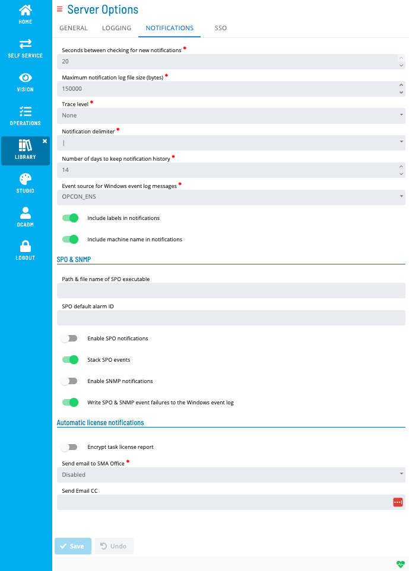

# Managing Notification Settings

## Required Privileges

In order to access the Server Options page and configure the **Notifications** settings, you must have the following:

- **Role**: User must be assigned to the Role_ocadm.

---

## Configuring Notification

To configure Notifications Settings, go to **Library** > **Server Options** > click on the **NOTIFICATIONS** tab.

\*_The table below shows default values for each settings. If user changes the default value of a setting,  icon will show next to the field._

### Configuration Options

The Notification settings tab includes SPO & SNMP Settings, as well as Automatic License Renewal Notification settings.

| Setting                                                    | Default Value | Required | Description                                                                                                                                                                                                                                                                                                                                                                                                                                                                        |
| ---------------------------------------------------------- | ------------- | -------- | ---------------------------------------------------------------------------------------------------------------------------------------------------------------------------------------------------------------------------------------------------------------------------------------------------------------------------------------------------------------------------------------------------------------------------------------------------------------------------------- |
| Maximum Log File Size                                      | 150000        | Y        | Defines the maximum size in bytes for each log file. Determines when the current log file is closed and a new file is started. When the file reaches this maximum size, it is "rolled over." Valid range: 50000-500000                                                                                                                                                                                                                                                             |
| Trace Level                                                | None          | N        | Determines the detail of debug trace logs. Valid options: "None", "Basic", "Detailed", "Very Detailed"                                                                                                                                                                                                                                                                                                                                                                             |
| Include Labels in Notifications                            | TRUE          | Y        | This parameter enables/disables the inclusion of labels for Machine Name, Schedule Name, Job Name, and so forth in notification messages. This setting applies to all notification types except "Text Message." Valid options: True/False                                                                                                                                                                                                                                          |
| Include Machine Name in Notifications                      | TRUE          | Y        | This parameter enables/disables inclusion of the Machine Name in notification messages. This setting applies to all notification types except "Text Message." Valid options: True, False                                                                                                                                                                                                                                                                                           |
| Notification Delimiter                                     | \|            | Y        | This parameter determines the delimiter used between fields in notification messages. This delimiter allows third-party notification tools to easier read messages. Valid options: tilde (~), "at" symbol (@), exclamation mark (!), pound sign (#), dollar sign ($), caret symbol (^), pipe symbol ( \| )                                                                                                                                                                         |
| Seconds between Checking for New Notifications             | 20            | Y        | This parameter defines the delay in seconds between searches for new events in the NOTIFY table. Valid range: 5-20                                                                                                                                                                                                                                                                                                                                                                 |
| Days to Keep Notification History                          | 14            | Y        | Defines the number of days of Notification history to keep in the database. Valid range: 1-35                                                                                                                                                                                                                                                                                                                                                                                      |
| Event Source for Windows Event Log Messages                | OPCON_ENS     | Y        | This parameter defines the event source that show up in the Source column in the Windows Event Viewer. Valid options: OPCON_ENS, SMANotifyHandler                                                                                                                                                                                                                                                                                                                                  |
| SPO Notifications Enabled                                  | FALSE         | Y        | This parameter enables/disables processing of SPO events by the SMA Notify Handler. Valid options: True/False                                                                                                                                                                                                                                                                                                                                                                      |
| Path and File Name of SPO Executable                       | <blank\>      | N        | This parameter defines the full path to the executable responsible for processing SPO messages. Constraints: max 4000 characters, ' (single quote) invalid character                                                                                                                                                                                                                                                                                                               |
| SPO Default Alarm ID                                       | <None\>       | N        | This parameter is the default machine name for SPO Events. Constraints: max 24 characters, ' (single quote) invalid character                                                                                                                                                                                                                                                                                                                                                      |
| Stack SPO Events                                           | TRUE          | Y        | This parameter enables/disables the SMA Notify Handler to make the ALARM qualifier unique across multiple job states. Valid options: True/False                                                                                                                                                                                                                                                                                                                                    |
| SNMP Notifications Enabled                                 | FALSE         | Y        | This parameter enables/disables processing of SNMP events by the SMA Notify Handler. Valid options: True/False                                                                                                                                                                                                                                                                                                                                                                     |
| Write SPO and SNMP Event Failures to the Windows Event Log | TRUE          | Y        | This parameter enables/disables the SMA Notify Handler to write SNMP or SPO event failures to the Windows Event Log. Valid options: True/False                                                                                                                                                                                                                                                                                                                                     |
| Send Email Cc                                              | <Blank\>      | N        | For all customers, this parameter configures the list of email addresses that will be copied when the SAM automatically sends license expiration notices. For customers with a Task-based license, this parameter also configures the list of email addresses that will be copied when SAM automatically sends the license notification at the beginning of each month to SMA. Enter one or more SMTP email addresses separated by semicolons (;). Constraint: max 4000 characters |
| Encrypt Task License Report                                | FALSE         | Y        | For customers with a Task-based license, this parameter determines if the SAM will encrypt the data for the license reports. Valid options: True/False                                                                                                                                                                                                                                                                                                                             |
| Send Email to SMA Office                                   | Disabled      | N        | This parameter determines if SAM will automatically send email notifications to an SMA office when: The license is expiring -or- At the beginning of the month, the task count report is due for Task Based licensed customers. The value of Disabled will disable the SAM from automatically sending email to SMA. Instead, the SAM will write the information to the SAM.log and Critical.log files. Valid options: "Disabled", "Europe", "USA"                                  |
