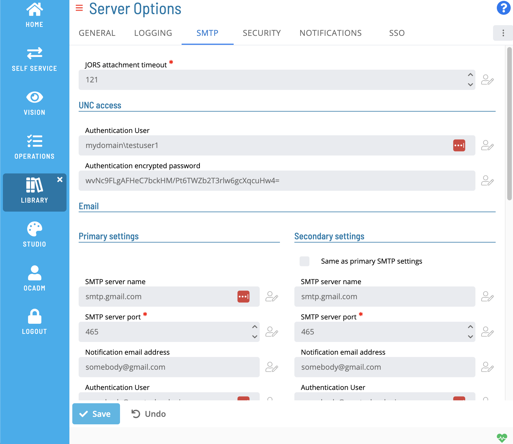

# Managing SMTP Settings

**Theme:** Configure  
**Who Is It For?** System Administrator, Automation Engineer

## What Is It?

Use this procedure to manage SMTP Settings in Solution Manager.

## When Would You Use It?

- You need to review or update SMTP Settings settings in Solution Manager
- SMTP Settings needs to be reviewed as part of routine system maintenance or a compliance audit

## Why Would You Use It?

- **Reduce administrative overhead**: Centralizing SMTP Settings management in Solution Manager reduces the time needed to locate and update settings across the environment
- All SMTP Settings changes are captured in the OpCon audit system, supporting change management and compliance processes

## Administration

### Required Privileges

To configure the **SMTP** setting, you must have one of the following:

- **Role**: Role_ocadm
- **Function Privilege**: Maintian server options

---

## Configuring SMTP Settings

To configure SMTP Settings, go to **Library** > **Server Options** > select on the **SMTP** tab.

\*_The table below shows default values for each settings. If user changes the default value of a setting,  icon will show next to the field._

### Configuration Options

The SMTP settings tab includes configuration for SMTP Email and SMS settings. It includes a option to mirror primary and secondary settings.

| Option Parameter                                         | Default            | Dynamic (Y/N) | Valid Options                                          | Description                                                                                                                                                                                                                                                                      |
| -------------------------------------------------------- | ------------------ | ------------- | ------------------------------------------------------ | -------------------------------------------------------------------------------------------------------------------------------------------------------------------------------------------------------------------------------------------------------------------------------- |
| JORS Attachment Timeout                                  | 120                | Y             | 60-3600                                                | Number of seconds SMA Notify Handler waits for an attachment from a JORS request.                                                                                                                                                                                                |
| Authentication User (UNC Access)                         | <blank\>           | Y             | max 4000 characters ' (single quote) invalid character | Windows user account SMA Notify Handler uses to access machines and UNC paths. Required when sending email attachments from network shares or sending Network Message notifications. The user must have Read access to all network shares and Write access to the <Output Director\>\SAM\Log folder. |
| Authentication Encrypted Password (UNC Access)           | <blank\>           | Y             | max 4000 characters ' (single quote) invalid character | Encrypted password for the UNC Access user. To encrypt manually, use the Password encryption tool in Enterprise Manager, then paste the result here. See Encrypting Passwords in the Enterprise Manager online help.                                                              |
| SMTP Server Name (Primary Email)                         | <blank\>           | Y             | max 4000 characters ' (single quote) invalid character | Name of the Primary SMTP server for email. If no SMS servers are defined, this server also sends SMS text messages. If blank, SMA Notify Handler cannot send email or text notifications.                                                                                         |
| SMTP Server Port (Primary Email)                         | 25                 | Y             | 1-65535                                                | Port SMA Notify Handler uses when sending email through the Primary SMTP server.                                                                                                                                                                                                 |
| SMTP Notification Address (Primary Email)                | noreply@mycorp.com | Y             | max 4000 characters all characters are valid           | "From" address for email and text messages sent through the Primary Email server. If the server requires authentication, this setting is ignored; configure the SMTP Authentication User and Password instead. SMA Notify Handler does not validate the address.                  |
| SMTP Authentication User (Primary Email)                 | <blank\>           | Y             | max 4000 characters all characters are valid           | Email address for authentication to the Primary Email SMTP server. Required if the server requires authentication; if missing, SMA Notify Handler cannot send emails or text messages. *Not used in OAuth configurations.*                                                        |
| SMTP Authentication Encrypted Password (Primary Email)   | <blank\>           | Y             | max 4000 characters all characters are valid           | Encrypted password for the Primary Email SMTP Authentication User. Required if the server requires authentication. To encrypt manually, use the Password encryption tool in Enterprise Manager. *Not used in OAuth configurations.*                                               |
| SMTP Authentication -Enable SSL (Primary Email)          | False              | Y             | True/False                                             | Set to True if the Primary Email SMTP server requires SSL encryption.                                                                                                                                                                                                            |
| SMTP Total Attachment Size in MB (Primary Email)         | 10                 | Y             | 0-99                                                   | Maximum total attachment size (MB) per email from the Primary Email server. Should match the limit set by the SMTP server.                                                                                                                                                       |
| SMTP Maximum Number of Attachments (Primary Email)       | 50                 | Y             | 0-999                                                  | Maximum number of attachments per email from the Primary Email server. Should match the limit set by the SMTP server.                                                                                                                                                            |
| SMTP Application ID (Primary Email)                      | <blank\>           | Y             | GUID                                                   | Application (customer) ID GUID from your organization's Azure app registrations.                                                                                                                                                                                                   |
| SMTP Client Secret (Primary Email)                       | <blank\>           | Y             | secret string                                          | Client secret for the application in your organization's Azure app registrations for Notify Handler.                                                                                                                                                                             |
| SMTP Tenant ID (Primary Email)                           | <blank\>           | Y             | GUID                                                   | Tenant ID GUID from your organization's Azure.                                                                                                                                                                                                                                   |
| SMTP Server Name (Secondary Email)                       | <blank\>           | Y             | max 4000 characters all characters are valid           | Name of the Secondary SMTP server for email. Used when Primary Email server delivery fails. If no SMS servers are defined, also serves as the secondary SMS server. If blank, SMA Notify Handler will not attempt a secondary server.                                              |
| SMTP Server Port (Secondary Email)                       | 25                 | Y             | 1-65535                                                | Port SMA Notify Handler uses when sending email through the Secondary SMTP server.                                                                                                                                                                                               |
| SMTP Notification Address (Secondary Email)              | noreply@mycorp.com | Y             | max 4000 characters all characters are valid           | "From" address for email and text messages sent through the Secondary Email server. If the server requires authentication, this setting is ignored; configure the SMTP Authentication User and Password instead. SMA Notify Handler does not validate the address. *Not used in OAuth configurations.* |
| SMTP Authentication User (Secondary Email)               | <blank\>           | Y             | max 4000 characters all characters are valid           | Email address for authentication to the Secondary Email SMTP server. Required if the server requires authentication; if missing, SMA Notify Handler cannot send emails or text messages through the secondary server. *Not used in OAuth configurations.*                          |
| SMTP Authentication Encrypted Password (Secondary Email) | <blank\>           | Y             | max 4000 characters all characters are valid           | Encrypted password for the Secondary Email SMTP Authentication User. Required if the server requires authentication. To encrypt manually, use the Password encryption tool in Enterprise Manager. *Not used in OAuth configurations.*                                             |
| SMTP Authentication -Enable SSL (Secondary Email)        | False              | Y             | True/False                                             | Set to True if the Secondary Email SMTP server requires SSL encryption.                                                                                                                                                                                                          |
| SMTP Total Attachment Size in MB (Secondary Email)       | 10                 | Y             | 0-99                                                   | Maximum total attachment size (MB) per email from the Secondary Email server. Should match the limit set by the SMTP server.                                                                                                                                                     |
| SMTP Maximum Number of Attachments (Secondary Email)     | 50                 | Y             | 0-999                                                  | Maximum number of attachments per email from the Secondary Email server. Should match the limit set by the SMTP server.                                                                                                                                                          |
| SMTP Application ID (Secondary Email)                    | <blank\>           | Y             | GUID                                                   | Application (customer) ID GUID from your organization's Azure app registrations.                                                                                                                                                                                                   |
| SMTP Client Secret (Secondary Email)                     | <blank\>           | Y             | secret string                                          | Client secret for the application in your organization's Azure app registrations for Notify Handler.                                                                                                                                                                             |
| SMTP Tenant ID (Secondary Email)                         | <blank\>           | Y             | GUID                                                   | Tenant ID GUID from your organization's Azure.                                                                                                                                                                                                                                   |
| SMTP Server Name (Primary SMS)                           | <blank\>           | Y             | max 4000 characters all characters are valid           | Name of the Primary SMTP server for SMS text messages. When defined, SMA Notify Handler uses only SMS-defined servers for SMS (email servers handle email only). If blank, SMA Notify Handler uses the Primary Email SMTP server for SMS.                                          |
| SMTP Server Port Number (Primary SMS)                    | 25                 | Y             | 1-65535                                                | Port SMA Notify Handler uses when sending SMS through the Primary SMS server.                                                                                                                                                                                                    |
| SMTP Notification Address (Primary SMS)                  | noreply@mycorp.com | Y             | max 4000 characters all characters are valid           | "From" address for SMS messages sent through the Primary SMS server. If the server requires authentication, this setting is ignored; configure the SMTP Authentication User and Password instead. SMA Notify Handler does not validate the address.                                |
| SMTP Authentication User (Primary SMS)                   | <blank\>           | Y             | max 4000 characters all characters are valid           | Email address for authentication to the Primary SMS SMTP server. Required if the server requires authentication; if missing, SMA Notify Handler cannot send SMS messages. *Not used in OAuth configurations.*                                                                     |
| SMTP Authentication Encrypted Password (Primary SMS)     | <blank\>           | Y             | max 4000 characters all characters are valid           | Encrypted password for the Primary SMS SMTP Authentication User. Required if the server requires authentication. To encrypt manually, use the Password encryption tool in Enterprise Manager. *Not used in OAuth configurations.*                                                 |
| SMTP Authentication -Enable SSL (Primary SMS)            | False              | Y             | True/False                                             | Set to True if the Primary SMS SMTP server requires SSL encryption.                                                                                                                                                                                                              |
| SMTP Application ID (Primary SMS)                        | <blank\>           | Y             | GUID                                                   | Application (customer) ID GUID from your organization's Azure app registrations.                                                                                                                                                                                                   |
| SMTP Client Secret (Primary SMS)                         | <blank\>           | Y             | secret string                                          | Client secret for the application in your organization's Azure app registrations for Notify Handler.                                                                                                                                                                             |
| SMTP Tenant ID (Primary SMS)                             | <blank\>           | Y             | GUID                                                   | Tenant ID GUID from your organization's Azure.                                                                                                                                                                                                                                   |
| SMTP Server Name (Secondary SMS)                         | <blank\>           | Y             | max 4000 characters all characters are valid           | Name of the Secondary SMTP server for SMS. Used when Primary SMS delivery fails. If no Primary SMS server is defined, this server handles SMS. If blank, SMA Notify Handler will not attempt a secondary SMS server.                                                               |
| SMTP Server Port Number (Secondary SMS)                  | 25                 | Y             | 1-65535                                                | Port SMA Notify Handler uses when sending SMS through the Secondary SMS server.                                                                                                                                                                                                  |
| SMTP Notification Address (Secondary SMS)                | noreply@mycorp.com | Y             | max 4000 characters all characters are valid           | "From" address for text messages sent through the Secondary SMS server. If the server requires authentication, this setting is ignored; configure the SMTP Authentication User and Password instead. SMA Notify Handler does not validate the address.                             |
| SMTP Authentication User (Secondary SMS)                 | <blank\>           | Y             | max 4000 characters all characters are valid           | Email address for authentication to the Secondary SMS SMTP server. Required if the server requires authentication; if missing, SMA Notify Handler cannot send text messages through the secondary server. *Not used in OAuth configurations.*                                      |
| SMTP Authentication Encrypted Password (Secondary SMS)   | <blank\>           | Y             | max 4000 characters all characters are valid           | Encrypted password for the Secondary SMS SMTP Authentication User. Required if the server requires authentication. To encrypt manually, use the Password encryption tool in Enterprise Manager. *Not used in OAuth configurations.*                                               |
| SMTP Authentication -Enable SSL (Secondary SMS)          | False              | Y             | True/False                                             | Set to True if the Secondary SMS SMTP server requires SSL encryption.                                                                                                                                                                                                            |
| SMTP Application ID (Secondary SMS)                      | <blank\>           | Y             | GUID                                                   | Application (customer) ID GUID from your organization's Azure app registrations.                                                                                                                                                                                                   |
| SMTP Client Secret (Secondary SMS)                       | <blank\>           | Y             | secret string                                          | Client secret for the application in your organization's Azure app registrations for Notify Handler.                                                                                                                                                                             |
| SMTP Tenant ID (Secondary SMS)                           | <blank\>           | Y             | GUID                                                   | Tenant ID GUID from your organization's Azure.                                                                                                                                                                                                                                   |

## Exception Handling

**SMA Notify Handler cannot send email or text notifications** — If the SMTP Server Name (Primary Email) is left blank, the Notify Handler has no server to connect to and cannot deliver email or SMS messages — Enter a valid SMTP server name in the Primary Email configuration; if a Secondary Email server is also available, configure it as a fallback for when primary delivery fails.

**SMA Notify Handler cannot send emails when authentication is required but credentials are missing** — If the SMTP server requires authentication and the SMTP Authentication User (Primary Email) is not configured, the Notify Handler cannot authenticate and will not send emails or text messages — Enter the authentication email address in the SMTP Authentication User field and the corresponding encrypted password in the SMTP Authentication Encrypted Password field.

**UNC path email attachments cannot be accessed** — When sending email attachments from network shares or Network Message notifications, the Notify Handler requires a Windows account with Read access to the shares and Write access to the Output Directory SAM Log folder — Configure the Authentication User (UNC Access) and its encrypted password with an account that has the required network permissions.

## Security Considerations

### Authentication

SMTP servers that require authentication use an SMTP Authentication User (an email address) and an encrypted password. Passwords must be encrypted using the Password encryption tool in Enterprise Manager before being pasted into the configuration. SSL encryption can be enabled per server via the SMTP Authentication - Enable SSL setting (default: False).

OAuth is supported as an alternative to username/password SMTP authentication. When OAuth is configured, the SMTP Authentication User and SMTP Authentication Encrypted Password fields are not used. OAuth requires an Application (customer) ID, a Client Secret, and a Tenant ID from Azure app registrations. The client secret has a limited lifespan and must be renewed when it expires.

The Authentication User (UNC Access) and its encrypted password define the Windows account SMA Notify Handler uses to access network shares and UNC paths. This user must have Read access to network shares and Write access to the SAM log folder.

### Authorization

Configuring SMTP Settings requires the Role_ocadm role or the Maintain Server Options function privilege.

### Sensitive Data

SMTP Authentication Encrypted Passwords for all email and SMS server configurations are stored in the server options. Client secrets for OAuth configurations are stored in the SMTP Client Secret field. These values should be treated as sensitive credentials and access to the SMTP settings tab should be limited to authorized administrators.

## FAQs

**Q: What does managing smtp settings involve?**

Managing smtp settings includes Required Privileges, Configuring SMTP Settings. Access smtp settings through the Enterprise Manager navigation pane.

**Q: Who can manage smtp settings in OpCon?**

Users with the appropriate privileges assigned through their role can manage smtp settings. Contact your OpCon system administrator if you do not have access.

**Q: What happens if no SMS-specific SMTP server is configured?**

If no Primary or Secondary SMS server is defined, SMA Notify Handler uses the Primary Email SMTP server (and Secondary Email server as fallback) for SMS text messages. Dedicated SMS servers only take effect when explicitly configured in the SMS settings.

## Glossary

**JORS (Job Output Retrieval System)**: The system used to retrieve and display job output — logs and reports — from agent machines directly within the OpCon graphical interfaces.

**SMA Notify Handler**: Processes notifications triggered by Machine, Schedule, and Job status changes. Can send emails, text messages, Windows Event Log entries, SNMP traps, and SPO notifications.

**SAM (Schedule Activity Monitor)**: The logical processor for OpCon workflow automation. SAM monitors schedule and job start times, dependencies, and user commands to determine job execution timing, and processes OpCon events.

**Enterprise Manager (EM)**: OpCon's rich client graphical user interface for Windows and Linux, used to define schedules and jobs, manage automation data, and perform operational tasks.

**Notification**: A message sent by the SMA Notify Handler when a Machine, Schedule, or Job changes to a specific status. Notifications can be delivered as emails, text messages, Windows Event Log entries, SNMP traps, or other formats.

**Resource**: A numeric variable in OpCon representing a finite pool. Jobs can be configured to require a set number of resource units to run, limiting concurrent executions and preventing resource contention.

**Role**: A named security profile in OpCon that groups privileges together. Roles are assigned to user accounts to control which features, schedules, jobs, machines, and administrative functions a user can access.

**Privilege**: A specific permission granted through an OpCon role that controls access to a feature, function, or object type. Privileges are organized into categories such as Function Privileges, Machine Privileges, Schedule Privileges, and Access Codes.
