# Managing SSO Configurations

**Theme:** Configure  
**Who Is It For?** System Administrator, Automation Engineer

## What Is It?

Use this procedure to manage SSO Configurations in Solution Manager.

## Administration

### Required Privileges

To configure the **Single Sign-On** setting, you must have one of the following:

- **Role**: Role_ocadm
- **Function Privilege**: Maintian server options

---

## Configuring SSO

To configure SSO Settings, go to **Library** > **Server Options** > select on the **SSO** tab.

#### SSO Configuration Fields

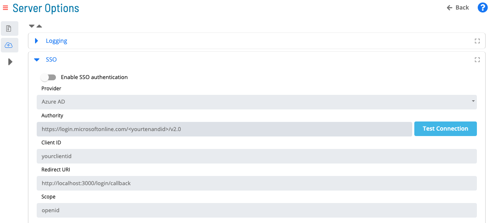

1. Select the **Switch** to enable the SSO login button

1. Enter a **Provider**. Select the identity provider (IdP) from the **Provider** list. Options include **Okta**, **Azure AD**, and **Other**

1. Enter an **Authority**. The URL of the OIDC/OAuth2 provider

1. Enter a **Client ID**. Your client application's identifier as registered with the OIDC/OAuth2 provider

1. Enter a **Redirect URI**. The location where the authorization server sends the user after successful authorization. Adding **/login/callback** is **required** for SSO to function. For example, **https://host:80443/login/callback**.

1. Enter a **Scope**. The scopes requested from the OIDC/OAuth2 provider (default: **openid**). Separate multiple scopes with a space

\* OpenID Connect (OIDC) is an open authentication protocol that works on top of the OAuth 2.0 (OAuth2) framework.

#### Test Connection Button

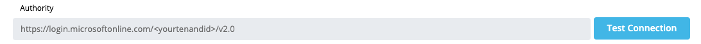

The **test connection button** retrieves metadata from the IdP using the value in the **Authority** field. The **Authority** field is required to establish a proper configuration with the IdP and enable communication with the OpenID Connect application.

#### Group Mappings

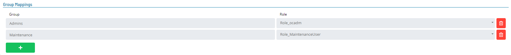

1. Enter a **Group Name** matching the group name used in your IdP

1. Enter a **Role** representing a valid **OpCon** role

1. Select **Save**

:::note

- If the switch is **On**, values are required in all fields, including **Group Mappings**
- SSO can be implemented with any IdP that follows the OpenID Connect authentication protocol
- The IdP must return a token with a **groups** claim containing the user's group memberships and an **opconid** claim composed of the user's email
- See examples below for [**Okta**](#okta-application) and [**Azure AD**](#azure-ad-application)

:::

:::caution

Once a user accesses **Solution Manager** through **SSO**, their **password** automatically changes to a random value, ensuring SSO is the only means of authentication.

:::

The following table describes actions taken when a user logs in through Single Sign-On.

| Exists in IdP Group | Exists in OpCon | Member of OpCon Role | Can access application in IdP | Enabled in OpCon | Action Taken                                              |
| ------------------- | --------------- | -------------------- | ----------------------------- | ---------------- | --------------------------------------------------------- |
| Y                   | Y               | Y                    | Y                             | Y                | No action user is already in sync                         |
| Y                   | N               | N/A                  | Y                             | N/A              | User created and added to role                            |
| Y                   | Y               | N                    | Y                             | Y                | User added to role                                        |
| Y                   | Y               | Y                    | Y                             | N                | User enabled in OpCon                                     |
| Y                   | Y               | Y                    | N                             | Y                | No action since user cannot access the application        |
| Y                   | Y               | Y                    | N                             | N                | No action since user cannot access the application        |
| N                   | Y               | Y                    | N/A                           | Y                | No action since user does not belong to an existing group |
| N                   | Y               | Y                    | N/A                           | N                | No action since user does not belong to an existing group |
| N                   | N               | N/A                  | N/A                           | N/A              | No action                                                 |

:::tip Group Mappings

- Group name values should be unique
- Group names can be linked to many roles
- Roles can be linked to many group names

:::

:::tip Example
The following is an example of filling out the required fields:

To configure SSO, complete the following steps:

1. SSO Settings:
   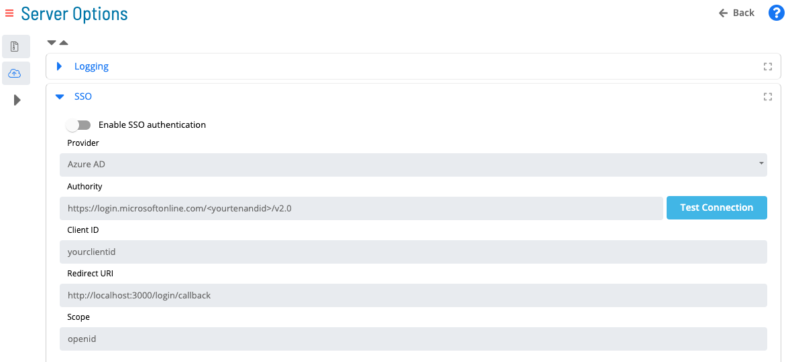
1. Group Mappings:
   

:::

---

### Creating an applications that are OpenID Connect Compatible

#### Okta Application

These steps create a custom Okta application that returns custom optional claims in an access token used by SMAOpConRestApi. The user performing these steps must have privileges to create an application, assign users, and create custom claims.

1. Log in to Okta and select **Admin** in the upper right corner to go to the administration dashboard
   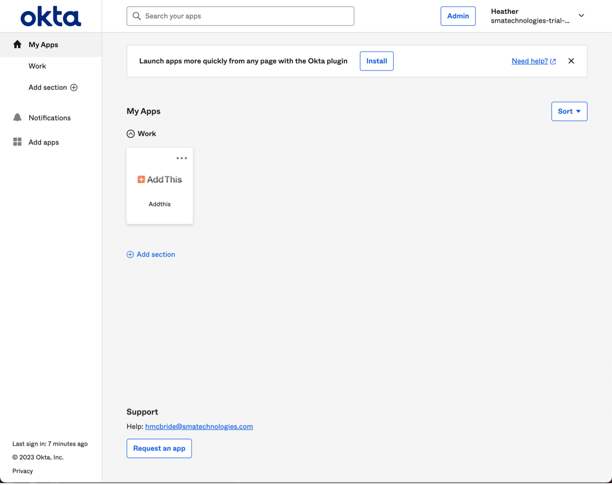
1. From the administration dashboard, select **Applications** in the left navigation
   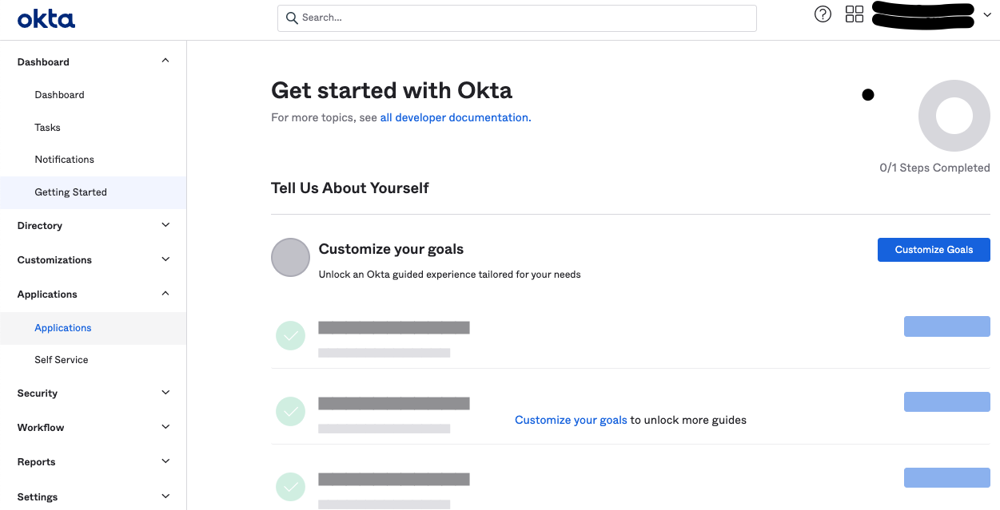
1. Select the **Create App Integration** button
   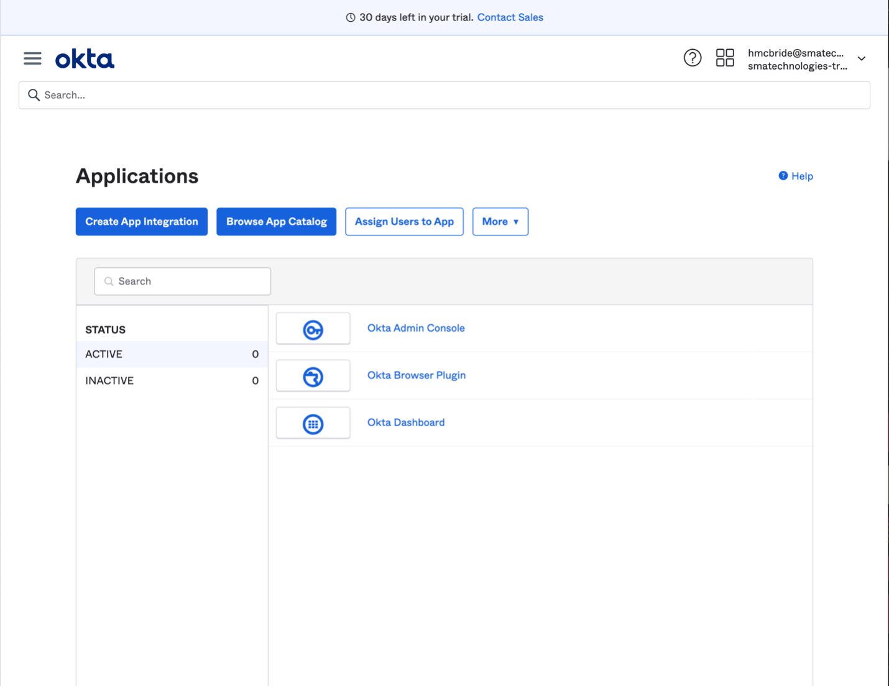
   1. In the modal, select:
      - Sign-in method: **OIDC - OpenID Connect**
      - Application type: **Single-Page Application**
        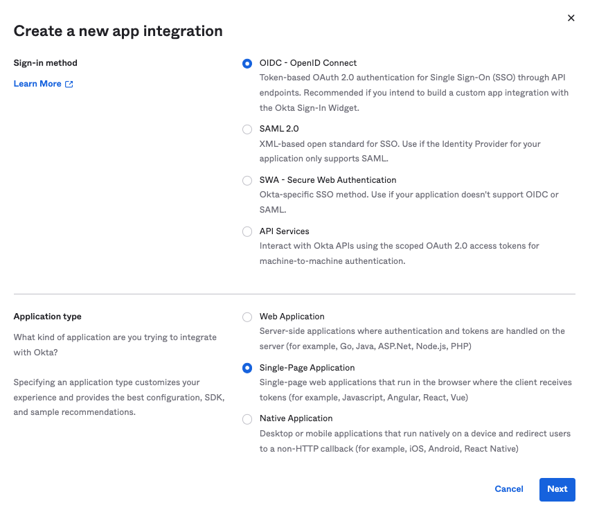
   1. Select **Next**
   1. Set the following options:
      - Grant type: **Authorization Code**
      - Sign-in redirect URI: `https://<hostname:443>/login/callback` — must include **/login/callback**; this value maps to the **Redirect URI** in the SSO configuration tab
      - Sign-out redirect URI: not required
      - Controlled access: set based on your organization's needs
        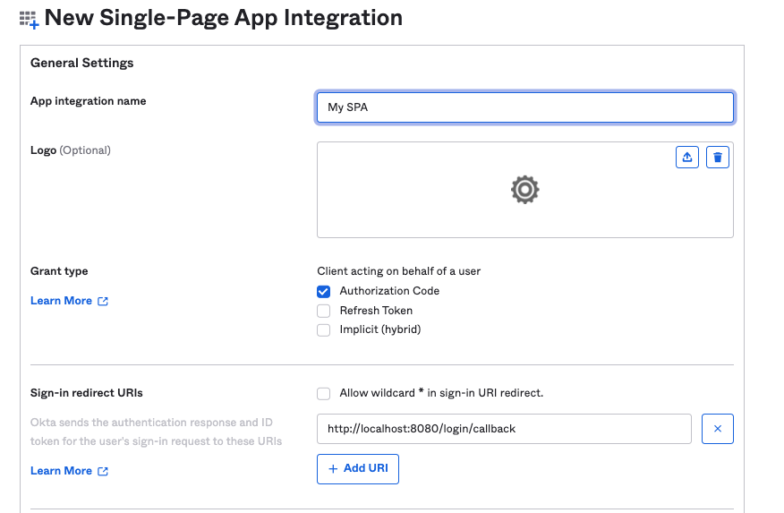
   1. Select **Save**
   1. Note the **Customer ID** value — it is used to configure SSO in Solution Manager
1. Open the newly created application and go to **Assignments**. Assign the relevant users from your organization
   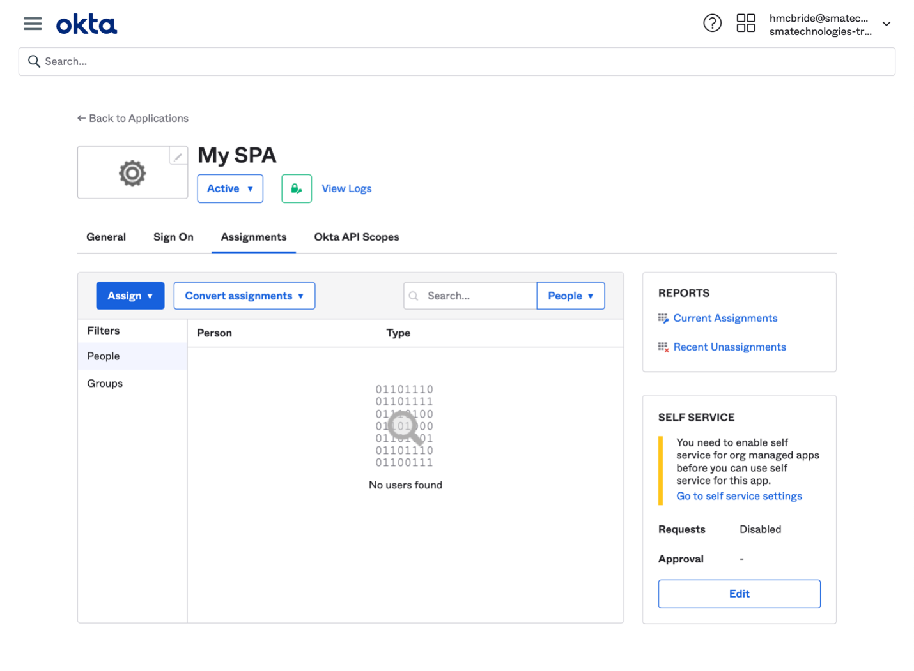
1. Go to **Security** > **API** from the main menu
   1. On the **Authorization Server** tab, select the **default** server. Note the Issuer URI — this is the **Authority** value for SSO configuration
   1. Select the **Claims** tab
      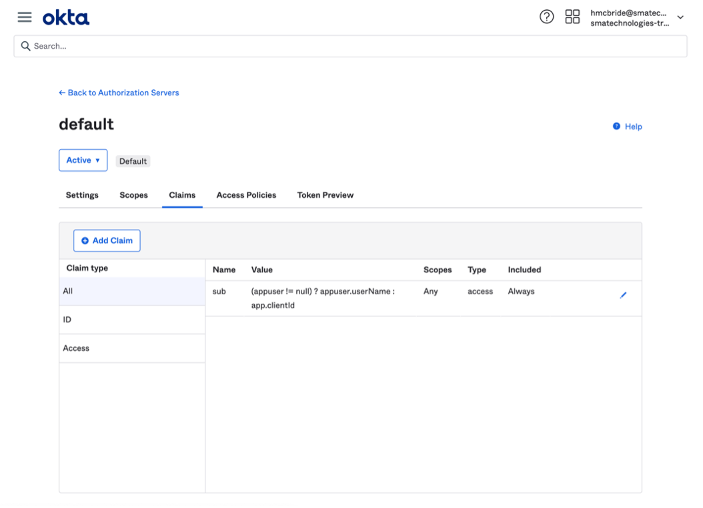
   1. Select **Add Claim** and configure a **groups** claim:
      - Token type: Access Token
      - Regex: **`.*`**
      - Name: **groups**
        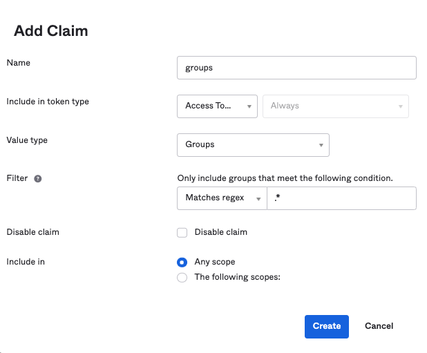
   1. Repeat to add an **opconid** claim with **appuser.email** in the **Value** field
      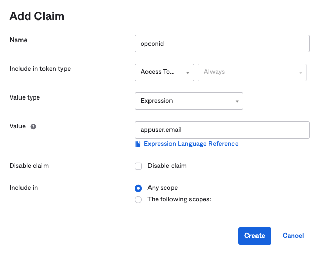
   1. Select the **Settings** tab and note the Issuer — used as the **Authority** value
      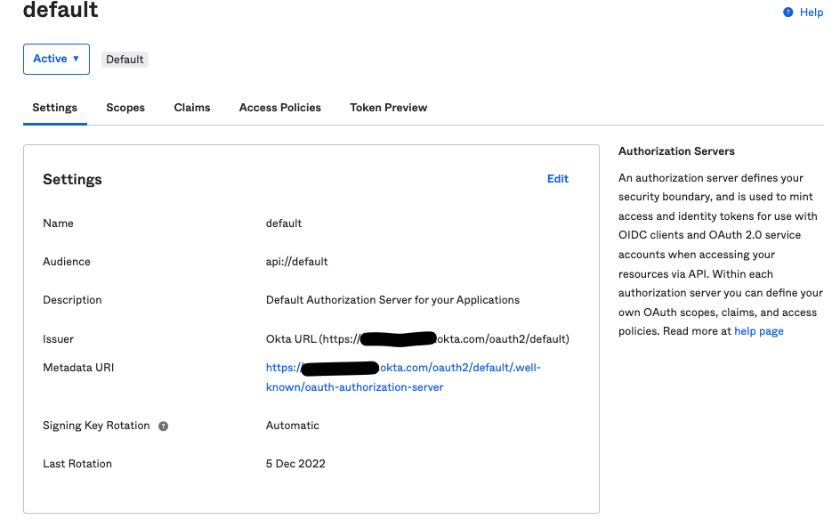
   1. Select the **Token Preview** tab:
      - Enter your application name
      - Select **Authorization Code** for Grant Type
      - Select a user with access to this application
      - Enter **openid** in the Scopes field
      - Select **Preview Token**, then select the **token** tab. Confirm **groups** and **opconid** claims appear
        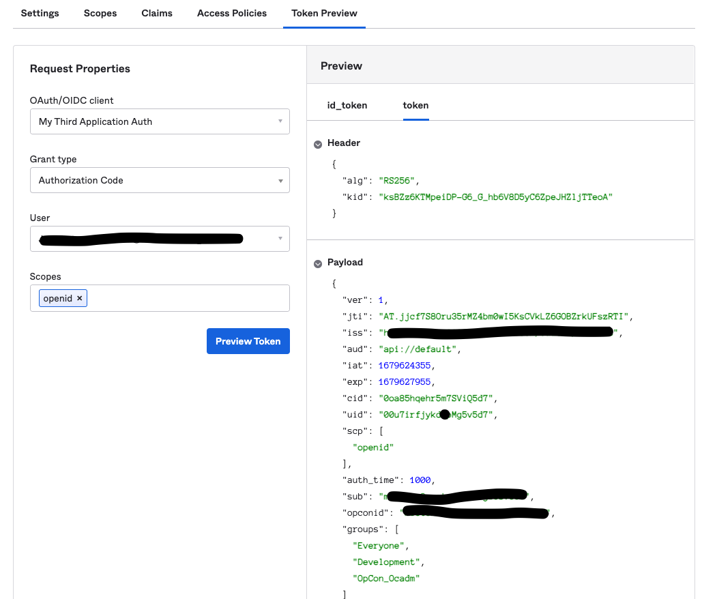
1. Select the **Access Policies** tab
   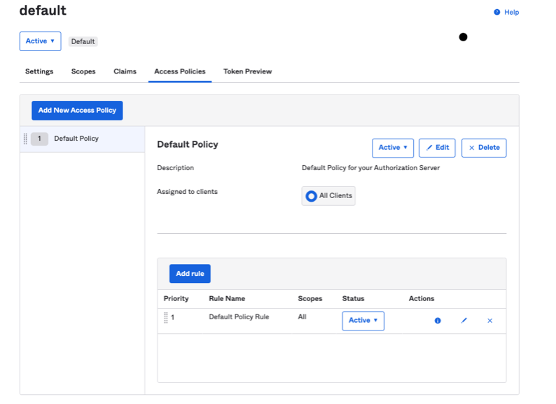
   1. Select **Edit** on the **Default Policy Rule** row. Confirm **Authorization Code** is selected
      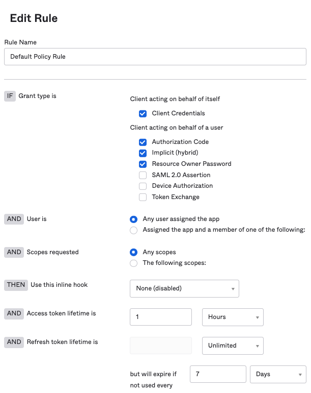

:::note

- Enter **openid** in the Scope field in the SSO configuration tab in Solution Manager
- The user's **email** must match their username and will be used to pair with or create an OpCon user

:::

#### Azure AD Application

These steps create a custom Azure AD application that grants SMAOpConRestApi access to Microsoft Graph API. The user performing these steps must have privileges to create an application, assign users, and assign Microsoft Graph API permissions.

1. Go to **Azure Active Directory** > **App registrations**
   1. Select **New registration** and configure:
      - Add a name
      - Select who can access (for example, Single tenant)
      - Select **Single-page application (SPA)**
      - Set the Redirect URI (for example, `https://<yourhostname>:8080/login/callback`) — must include **/login/callback**
        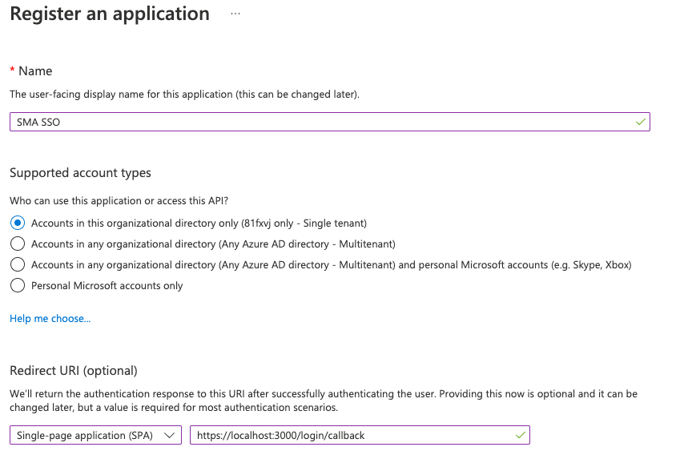
   1. Select **Register**

1. Open the newly created application (Home > Azure Active Directory > App registrations > your application)
1. Go to **Authentication** in the side menu. Confirm a redirect value is present in the single-page application area
   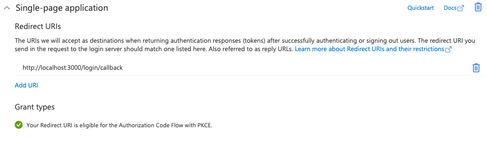
1. Go to **Overview** in the left navigation. Note:
   - The application (customer) ID — used as **Customer ID** in Solution Manager
   - Select **Endpoints**, copy the OpenID Connect value, paste it in a browser, and find the issuer value in the JSON — used as **Authority** in Solution Manager
     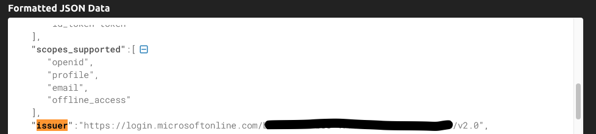
1. Go to **API permissions** in the left navigation
   1. Select **Add a permission** > **Microsoft Graph**
      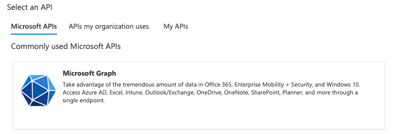
   1. Select **Delegated permissions**, search **groupmember**, and select **GroupMember.Read.All**
      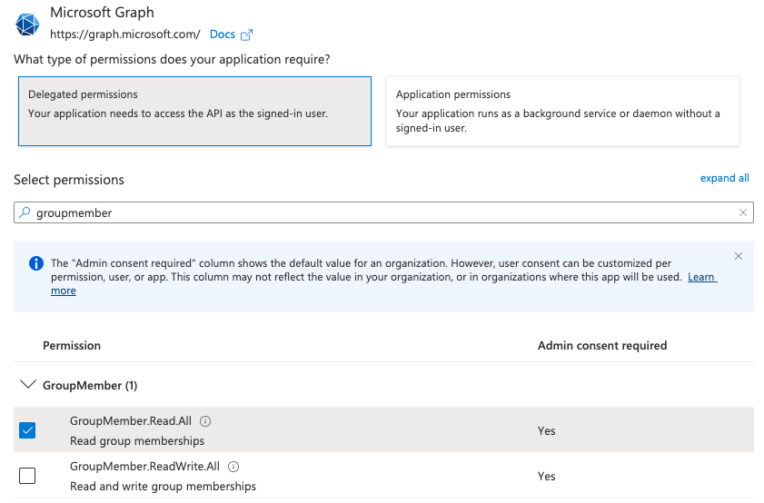
   1. Search **user.read** and select **User.Read**
   1. Select **Add permissions**, then select **Grant admin consent**
      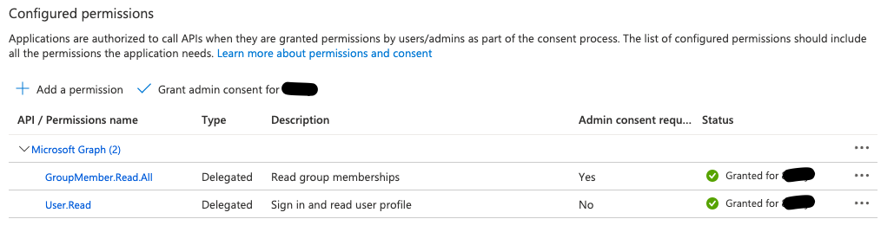

1. Go to **Manifest** in the left navigation. Set **accessTokenAcceptedVersion** to **2**
   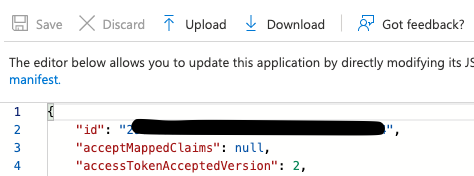
1. Restrict access to the application (optional)
   1. Go to Azure Active Directory > Enterprise Applications > All applications and select your application
   1. Select **Properties**, set **Assignment Required** to **Yes**, and save
      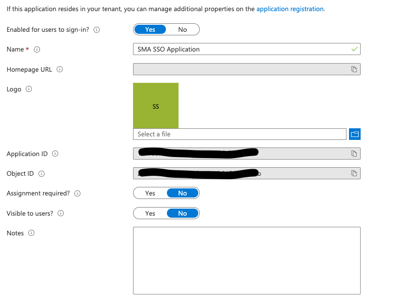
   1. Under **Manage**, select **Users and groups** > **Add user/group**. Assign the users and groups that need access. Confirm they appear in the updated list

:::note

- Add **openid** in the Scope field in the SSO configuration tab in Solution Manager
- The token from this application is used to call Microsoft Graph API:
  - `https://graph.microsoft.com/v1.0/me` — retrieves **userPrincipalName** (user's email), used as the OpCon identifier
  - `https://graph.microsoft.com/v1.0/me/getMemberGroups` — retrieves group IDs the user belongs to
  - `https://graph.microsoft.com/v1.0/groups/{group-guid}` — retrieves **displayName**, mapped against an existing group

:::

:::note
Common errors when connecting to your IdP OIDC application:

- **Invalid Redirect URI**: The redirect URI in the SSO configuration must match the one configured in your IdP. Mismatches prevent successful authentication
- **Incorrect Authority**: The authority (OIDC provider URL) must match exactly. Any mismatch causes connection and authentication failures
- **Invalid Customer ID**: The customer ID in the SSO configuration must match the one expected by your IdP. An incorrect customer ID prevents successful authentication

:::

---

## Security Considerations

### Authentication

SSO in OpCon uses OpenID Connect (OIDC), which operates on top of the OAuth 2.0 framework. Supported identity providers include Okta, Azure AD, and any IdP that follows the OIDC authentication protocol. The IdP must return a token with a groups claim containing the user's group memberships and an opconid claim containing the user's email.

Once a user accesses Solution Manager through SSO, their OpCon password is automatically changed to a random value, ensuring SSO becomes the only means of authentication for that account.

The Redirect URI in the SSO configuration must include `/login/callback` and must exactly match the redirect URI configured in the IdP. Mismatches in the Redirect URI, Authority URL, or Client ID prevent successful authentication.

For Okta, the Authorization Code grant type is used with the openid scope. For Azure AD, the application requires Delegated permissions for GroupMember.Read.All and User.Read from Microsoft Graph API, and admin consent must be granted.

### Authorization

Configuring SSO requires the Role_ocadm role or the Maintain Server Options function privilege. Group Mappings link IdP group names to OpCon roles. When a user logs in via SSO, OpCon automatically creates the user account if it does not exist and adds it to the mapped role. Users removed from an IdP group are not automatically disabled in OpCon.

### Sensitive Data

The Client ID, Authority URL, and Redirect URI are registered with the IdP and must match the values configured in Solution Manager. For Okta, the Customer ID from the app registration is a sensitive identifier. For Azure AD, the Application ID, Tenant ID, and access token version (set to 2 in the manifest) are required for the integration.

## Configuration Options

| Setting | What It Does | Default | Notes |
|---|---|---|---|
| Function Privilege | Maintian server options | — | — |
| Invalid Redirect URI | The redirect URI in the SSO configuration must match the one configured in your IdP. | — | — |
| Incorrect Authority | The authority (OIDC provider URL) must match exactly. | — | — |
| Invalid Customer ID | The customer ID in the SSO configuration must match the one expected by your IdP. | — | — |

## FAQs

**Q: What does managing sso configurations involve?**

Managing sso configurations includes Required Privileges, Configuring SSO. Access sso configurations through the Enterprise Manager navigation pane.

**Q: Who can manage sso configurations in OpCon?**

Users with the appropriate privileges assigned through their role can manage sso configurations. Contact your OpCon system administrator if you do not have access.

**Q: What happens to a user's OpCon password after they first log in through SSO?**

Once a user accesses Solution Manager through SSO, their OpCon password automatically changes to a random value, ensuring SSO becomes the only means of authentication for that user going forward.

## Glossary

**Enterprise Manager (EM)**: OpCon's rich client graphical user interface for Windows and Linux, used to define schedules and jobs, manage automation data, and perform operational tasks.

**Solution Manager**: OpCon's browser-based graphical user interface for managing automation data, performing operational actions, and administering the system.

**Token (Global Property)**: A named value stored in the OpCon database, referenced in job definitions and events using [[PropertyName]] syntax. Tokens pass dynamic values — such as dates, file paths, or counts — into automation workflows.

**Resource**: A numeric variable in OpCon representing a finite pool. Jobs can be configured to require a set number of resource units to run, limiting concurrent executions and preventing resource contention.

**Role**: A named security profile in OpCon that groups privileges together. Roles are assigned to user accounts to control which features, schedules, jobs, machines, and administrative functions a user can access.

**Privilege**: A specific permission granted through an OpCon role that controls access to a feature, function, or object type. Privileges are organized into categories such as Function Privileges, Machine Privileges, Schedule Privileges, and Access Codes.

**OpCon**: Continuous' workflow automation platform. The OpCon server includes the database, SAM and Supporting Services (SAM-SS), and graphical user interfaces. agents installed on target platforms run jobs and report results.
