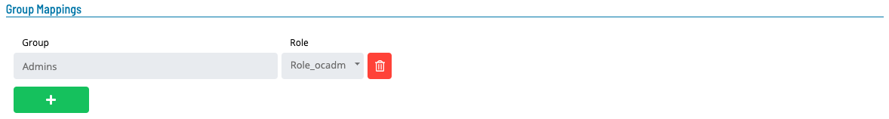
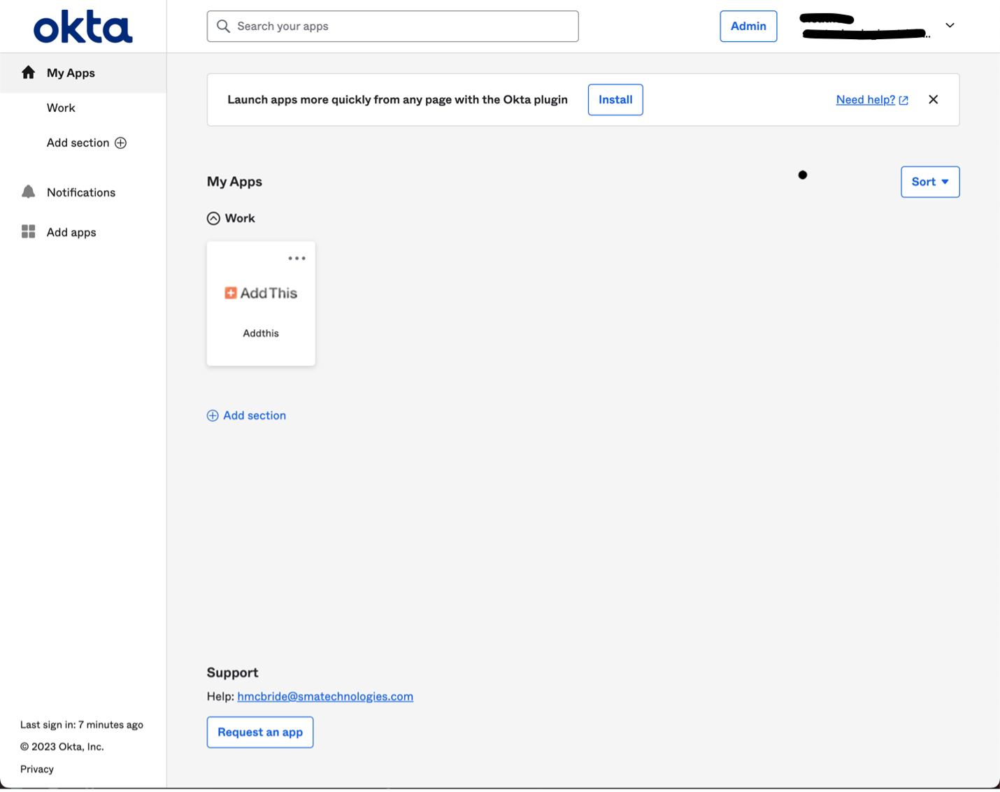
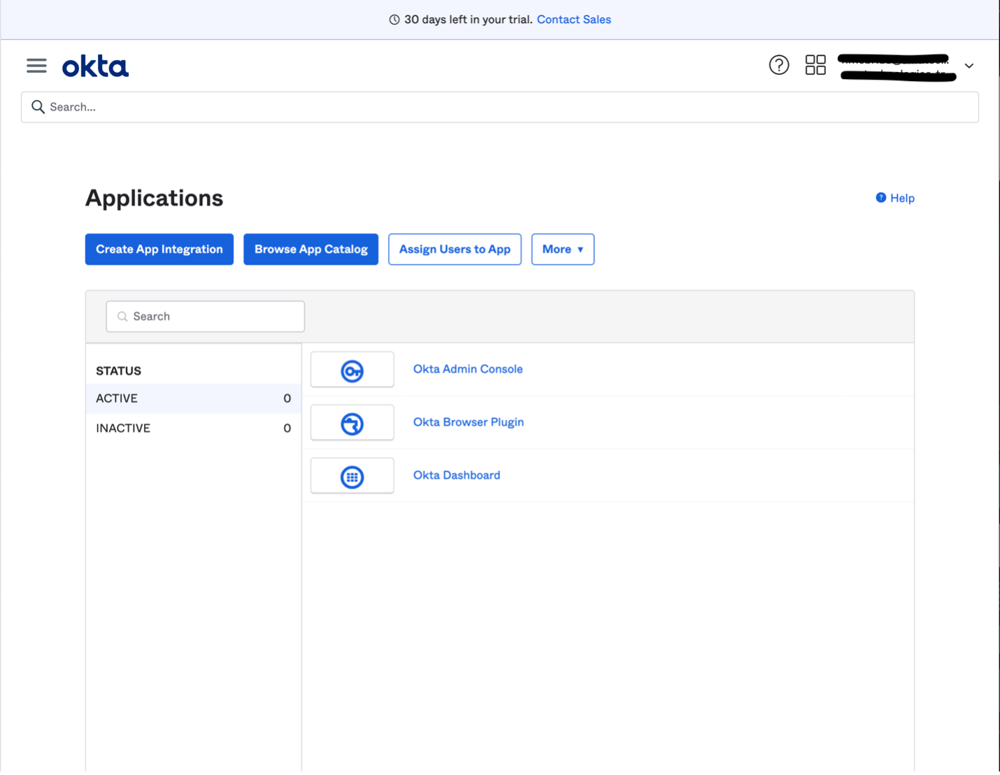
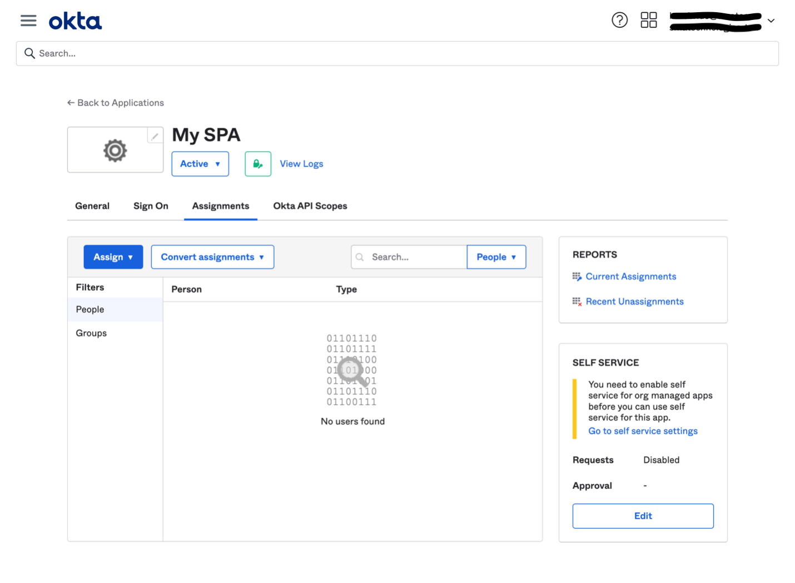
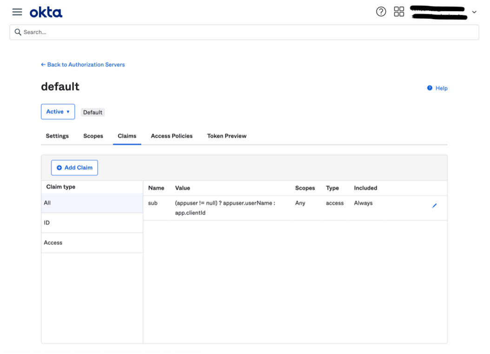

# Managing SSO Configurations

## Required Privileges

In order to configure the **Single Sign-On** setting, you must have one of the following:

- **Role**: Role_ocadm.
- **Function Privilege**: Maintian server options.

---

## Configuring SSO

To configure SSO Settings, go to **Library** > **Server Options** > click on the **SSO** tab.

#### SSO Configuration Fields

1. Click on the **Switch** to enable access to the SSO login button.

1. Enter a **Provider**. The identity provider (IdP) for the client should be selected from the **Provider** dropdown. Options include **Okta**, **Azure AD**, and **Other**.

1. Enter an **Authority**. **Authority** is the URL of the OIDC/OAuth2 provider.

1. Enter a **Client ID**. This is your client application's identifier as registered with the OIDC/OAuth2.

1. Enter a **Redirect URI**. A **Redirect URI**, is the location where the authorization server sends the user once the app has been successfully authorized and granted an authorization code or access token. Adding **/login/callback** is **required** for SSO to function. For example, **https://host:80443/login/callback**.

1. Enter a **Scope**. The **Scopes** being requested from the OIDC/OAuth2 provider (default: **openid**). You can enter various scopes separated by an empty space.

\* OpenID Connect (OIDC) is an open authentication protocol that works on top of the OAuth 2.0 (OAuth2) framework.

#### Test Connection Button

The **test connection button** retrieves metadata from the identity provider (IdP) by using the value specified in the **Authority** field. The **Authority** field is vital to establish a proper configuration with the IdP and enable successful communication with the OpenID Connect application.

#### Group Mappings

1. Enter a **Group Name**: this should match the group name used in your IdP.

1. Enter a **Role**: this value represents a valid **OpCon** role.

1. Select **Save**.

:::note

1.  If the switch is in the **On** position, the user must input values in all fields including values for **Group Mappings**.
1.  Examples of how to gather these requirements will be posted below (for the [**Okta Application**](#okta-application) and the [**Azure AD Application**](#azure-ad-application)).
1.  SSO can be implemented with any identity provider as long as the required values are provided and they follow the OpenID Connect authentication protocol.
1.  The IdP must return a token with a **groups** claim that contains the authenticated user's group memberships. It must also return an **opconid** claim, that should be composed of the authenticated user's email.

:::

:::caution

1. Once a user has successfully accessed **Solution Manager** through **SSO**, the user's current **password** will automatically change to a random value. This is done to ensure that the user only uses **SSO** as the preferred means of authentication.

:::

The following are a list of actions that will take place when a user logs in through Single Sign-On.

| Exists in IdP Group | Exists in OpCon | Member of OpCon Role | Can access application in IdP | Enabled in OpCon | Action Taken                                              |
| ------------------- | --------------- | -------------------- | ----------------------------- | ---------------- | --------------------------------------------------------- |
| Y                   | Y               | Y                    | Y                             | Y                | No action user is already in sync                         |
| Y                   | N               | N/A                  | Y                             | N/A              | User created and added to role                            |
| Y                   | Y               | N                    | Y                             | Y                | User added to role                                        |
| Y                   | Y               | Y                    | Y                             | N                | User enabled in OpCon                                     |
| Y                   | Y               | Y                    | N                             | Y                | No action since user cannot access the application        |
| Y                   | Y               | Y                    | N                             | N                | No action since user cannot access the application        |
| N                   | Y               | Y                    | N/A                           | Y                | No action since user does not belong to an existing group |
| N                   | Y               | Y                    | N/A                           | N                | No action since user does not belong to an existing group |
| N                   | N               | N/A                  | N/A                           | N/A              | No action                                                 |

:::tip Group Mappings

- Group name values should be unique.
- Group names can be linked to many roles.
- Roles can be linked to many group names.

:::

:::tip Example
The following is an example of filling out the required fields:

1. SSO Settings:
   
1. Group Mappings:
   

:::

---

### Creating an applications that are OpenID Connect Compatible

#### Okta Application

This document will describe the steps needed to create a custom application in Okta to return custom optional claims in a access token that will be used by SMAOpConRestApi. Ensure the user following these steps has enough privileges to create an application, assign users to that application, and create custom claims.

1.  After you’ve logged in to Okta, click "Admin" in the upper right corner to go to the administration dashboard
    
1.  Once on the administration dashboard, click “Applications” from the left navigation to go to Applications
    
1.  Click the "Create App Integration" button
    
    1.  Inside the modal, select the following options:
        1. Sign-in method: OIDC - OpenID Connect
        1. Application type: Single-Page Application
           
    1.  Click on "Next"
    1.  Set the following options:
        1.  Grant type: Authorization Code
        1.  Sign-in redirects URIs:(sample) `https://<hostname:443>/login/callback`
            1. The **Redirect URI** will be used on the SSO configuration tab in Solution Manager.
            1. Make sure to include **/login/callback**.
        1.  The value for the URL to access Solution Manager will be used in the SSO configuration tab
        1.  Sign-out redirects URIs: This value is not necessary
        1.  Controlled access: Allow everyone in your organization access (for this example)
        1.  If an option was not listed, you may select the one that is more convenient for your organization
        1.  Set controlled access based on your organizations needs
            
    1.  Click on "Save".
    1.  Note down the **Client ID** value, this will be used to configure SSO in Solution Manager
        1.  The **Client ID** value can be found inside the "Applications" page, in case you need to find it.
1.  After creating the application, go the newly created application and go to "Assignments"
    1. Assign the users from your organization to the new application
       
1.  Go to the "Security" section in the main menu and select "API"
    1. In the "Authorization Server" tab select the "default" server
       1. Note down the Issuer URI for the “default” row, this value will be the **Authority** which will be used in the configuration screen for SSO
    1. Inside the "default" authorization server select the "Claims" tab
       
    1. Click on "Add Claim"
       1. The following is an example on how to add a custom claim
          
       1. Make sure the token type is Access Token and that you enter **`.*`** for the regex logic
       1. Make sure to name claims “**groups**”
       1. Repeat the process to add an “**opconid**” claim
          1. Make sure to add **appuser.email** in the **Value** text field
             
    1. Click on the “Settings” tab and take notes of the following values:
       1. Issuer, this will be used as the **Authority** value in the SSO configuration tab
          
    1. Go to the "Token Preview" tab
       1. Type the name your newly created application
       1. Select **Authorization Code** for the "Grant Type"
       1. Select a user that has access to this application
       1. Type "**openid**" in the "Scopes" textbox. These scopes are required for SSO implementation in Solution Manager
       1. Click on "Preview Token" then click on the "token" tab to view the access token. Make sure the **“groups”** and **“opconid”** claims are displayed
          
1.  Then click on the "Access Policies" tab
    
    1.  Click on "Edit" in the "Default Policy Rule" row. Make sure that the "Authorization Code" option is selected, the rest are optional:
        

:::note

- Make sure to the values of “**openid**“ in the Scope textbox inside the SSO configuration tab inside Solution Manager.
- Make sure the **email** for the users allowed to access the application matches their username. This value will be used to pair with an existing OpCon user or it will be used to create a new user in the OpCon environment.

:::

#### Azure AD Application

This document describes the steps needed to create a custom application in Azure AD that will grant SMAOpConRestApi access to Microsoft Graph API to retrieve user information. Ensure the user following these steps has enough privileges to create an application, assign users to that application, and assign permissions to Microsoft Graph API.

1. Go to "Azure Active Directory"
1. Go to "App registrations"
   1. Select new registrations
      1. Add a name to the new application
      1. Select who can access the application
         1. For example: Single tenant
      1. Select Single-page application (SPA)
      1. Set the Redirect URI
         1. For example, `https://<yourhostname>:8080/login/callback`
      1. The **Redirect URI** value will be used on the SSO configuration tab in Solution Manager.
         1. Make sure to include **/login/callback** as part of the URI.
            
   1. Register Application
1. Select the newly created application
   1. From the “Home” menu go to Azure Active Directory => App registrations => Select your new application
1. Go to "Authentication" on the side menu
   1. Ensure there is a redirect value in the single-page application area. For example, `https://<yourhostname>:8080/login/callback`
      
1. Go to “Overview” in the left navigation menu
   1. Note down the following information, you will need it later:
   1. The application (client) ID will be used as the **Client ID** in the SSO configuration tab inside Solution Manager
   1. Click on “Endpoints” and note down the OpenID Connect value
   1. Copy this value and paste it on a browser and find the issuer value inside the JSON
      1. It is highly recommended that you copy this text from the browser and paste it into an application that can format the JSON value
         
      1. Note down the Issuer URI, this value will be used in the **Authority** field in the SSO configuration tab inside Solution Manager
1. Go to “API permissions” which is found on the left navigation menu
   1. Select Add a permission
   1. Click on “Add a permission” and select Microsoft Graph
      
   1. Select “Delegated permissions” and type **groupmember** in the search textbox. Select the **GroupMember.Read.All** permission:
      
   1. Next type **user.read** in the search textbox and select **User.Read** permission
   1. Click on “Add permissions” to save and then click on “Grant admin consent”
      
1. Go to “Manifest” on the left navigation menu
   1. Search for “**accessTokenAcceptedVersion**” and set the value to **2**
      
1. Restrict access to the application (optional).
   1. Go to Azure Active Directory -> Enterprise Applications > All applications and select the application you want to configure
   1. Select Properties and set "Yes" in the Assignment Required field and save the changes
      
   1. Make sure to assign users and groups which need to grant access to the application. Go to Under Manage, select the Users and groups > Add user/group
   1. Select the users or groups you want to allow and assign them access to your application. Confirm that the users and groups you added are showing up in the updated Users and groups list
   1. Now only those users/groups are allowed to access to the application

:::note

- Make sure to add the “**openid**” Scope in the SSO configuration tab inside Solution Manager
- The token retrieve from this application will be used to make calls to Microsoft Graph Api
  - The calls include:
    - https://graph.microsoft.com/v1.0/me : From this call, we will retrieve the property **userPrincipalName** which is the value of the authenticated user's username (email). This will be used as the opcon identifier inside Solution Manager.
    - https://graph.microsoft.com/v1.0/me/getMemberGroups : From this call, we will be able to retrieve a list of IDs of groups that the authenticated user belongs to.
    - https://graph.microsoft.com/v1.0/groups/{group-guid} : From this call, we will retrieve the **displayName** property which will be mapped against an existing group.

:::

:::note
Common errors when connection to your identity provider (IdP) OpenID Connection (OIDC) applications:

- Invalid Redirect URI: Ensure that the redirect URI specified in the SSO configuration matches the redirect URI configured in the OIDC application for your IdP provider. Mismatched or incorrect redirect URIs can prevent successful authentication.

- Incorrect Authority: Validate that the authority (OIDC provider URL) is specified in your application's configuration for your IdP. Any mismatch in the authority value will result in connection errors and authentication failures.

- Invalid Client ID: Verify that the client ID assigned in the SSO configuration is correct and matches the client ID expected by your IdP. Using an incorrect client ID will lead to authentication errors and prevent successful interaction with the OIDC application.

By addressing these common errors related to redirect URI, authority, and client ID, you can enhance the connectivity and authentication experience with your OIDC application.

:::

---
