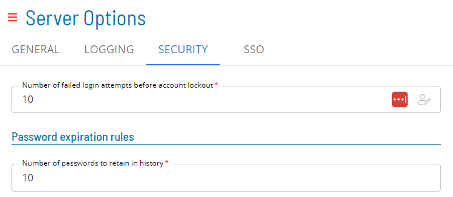
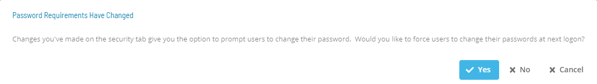

# Managing Security Settings

## Required Privileges

In order to configure the **Security** setting, you must have one of the following:

- **Role**: Role_ocadm.
- **Function Privilege**: Maintian server options.

---

## Configuring Security

To configure Security Settings, go to **Library** > **Server Options** > click on the **SECURITY** tab.

\*_The table below shows default values for each settings. If user changes the default value of a setting,  icon will show next to the field._

### Configuration Options

The Security settings allows administrators to enhance the security of their user's accounts with various options to enforce password rules

| Setting                                                | Default Value | Required | Description                                                                                                                                                                       |
| ------------------------------------------------------ | ------------- | -------- | --------------------------------------------------------------------------------------------------------------------------------------------------------------------------------- |
| Number of failed login attempts before account lockout | 5             | Y        | This parameter determines the number of password attempts before an account is locked.                                                                                            |
| Number of passwords to retain in history               | 10            | Y        | This parameter determines the number of passwords for OpCon to retain in history. When a user changes their password, they will not be able to reuse any of the in the history.   |
| Minimum number of days between password changes        | 0             | Y        | This parameter determines frequency of password changes.                                                                                                                          |
| Number of days a password is valid                     | 365           | Y        | This parameter determines the number of days a password is valid from the time users changes their password.                                                                      |
| Number of days warning before password expiration      | 0             | Y        | This parameter determines the number of days in advance of password expiration that the primary graphical user interfaces will warn users that their password is about to expire. |
| Number of times a character can repeat consecutively   | 2             | Y        | This parameter determines the number of times a character can repeat consecutively in a password. For example, if set to 2, the password "jjj" would be invalid.                  |
| Minimum number of characters                           | 8             | Y        | This parameter defines the minimum number of characters allowed for every user's password in OpCon.                                                                               |
| Minimum number of lowercase characters required        | 0             | Y        | This parameter determines if the password must contain lower-case characters.                                                                                                     |
| Minimum number of uppercase characters required        | 0             | Y        | This parameter determines if the password must contain upper-case characters.                                                                                                     |
| Password must contain numberic characters              | True          | Y        | This parameter determines if the password must contain numeric characters.                                                                                                        |
| Password must contain special characters               | True          | Y        | This parameter determines if the password must contain special characters.                                                                                                        |
| Password must contain alpha characters                 | True          | Y        | This parameter determines if the password must contain alphabetical characters.                                                                                                   |

If user changes one of the following settings: Number of times a character can repeat consecutively, Minimum number of characters, Minimum number of lowercase characters required, Minimum number of uppercase characters required, Password must contain numeric characters, Password must contain special characters or Password must contain alpha characters, the following pop up will show up when trying to save:

.

If the user clicks on 'Yes', the changes will be saved and all users will be required to reset their password at next logon.
If the user clicks on 'No', the changes will be saved and all users will not be required to reset their password at next logon.
If the user clicks on 'Cancel', the changes will not be saved and all users will not be required to reset their password at next logon.
