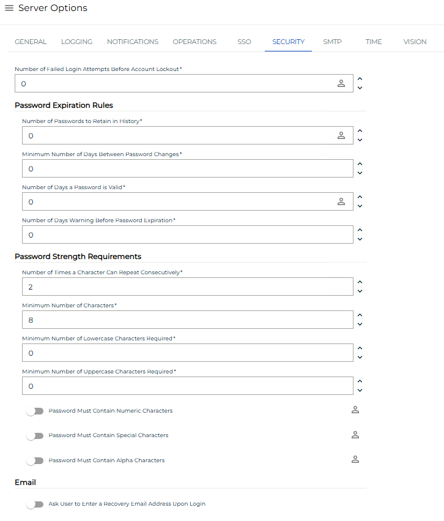
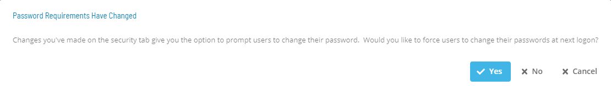
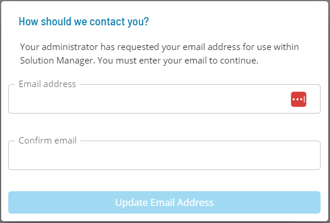

# Managing Security Settings

**Theme:** Configure  
**Who Is It For?** System Administrator, Automation Engineer

## What Is It?

Use this procedure to manage Security Settings in Solution Manager.

## Administration

### Required Privileges

To configure the **Security** setting, you must have one of the following:

- **Role**: Role_ocadm
- **Function Privilege**: Maintian server options

---

## Configuring Security

To configure Security Settings, go to **Library** > **Server Options** > select on the **SECURITY** tab.

\*_The table below shows default values for each settings. If user changes the default value of a setting,  icon will show next to the field._

### Configuration Options

The Security settings allows administrators to enhance the security of their user's accounts with various options to enforce password rules.

| Setting                                                | Default Value | Required | Description                                                                                                                                                                       |
| ------------------------------------------------------ | ------------- | -------- | --------------------------------------------------------------------------------------------------------------------------------------------------------------------------------- |
| Number of failed login attempts before account lockout | 5             | Y        | The number of password attempts before an account is locked.                                                                                                                      |
| Number of passwords to retain in history               | 10            | Y        | The number of passwords OpCon retains in history. Users cannot reuse any password in the history.                                                                                 |
| Minimum number of days between password changes        | 0             | Y        | The minimum frequency of password changes.                                                                                                                                        |
| Number of days a password is valid                     | 365           | Y        | The number of days a password is valid from the time a user changes it.                                                                                                           |
| Number of days warning before password expiration      | 0             | Y        | The number of days in advance of password expiration that the primary graphical user interfaces will warn users.                                                                  |
| Number of times a character can repeat consecutively   | 2             | Y        | The number of times a character can repeat consecutively in a password. For example, if set to 2, the password "jjj" would be invalid.                                            |
| Minimum number of characters                           | 8             | Y        | The minimum number of characters allowed for every user's password.                                                                                                               |
| Minimum number of lowercase characters required        | 0             | Y        | Whether the password must contain lowercase characters.                                                                                                                           |
| Minimum number of uppercase characters required        | 0             | Y        | Whether the password must contain uppercase characters.                                                                                                                           |
| Password must contain numberic characters              | True          | Y        | Whether the password must contain numeric characters.                                                                                                                             |
| Password must contain special characters               | True          | Y        | Whether the password must contain special characters.                                                                                                                             |
| Password must contain alpha characters                 | True          | Y        | Whether the password must contain alphabetical characters.                                                                                                                        |

If any of the following settings change — Number of times a character can repeat consecutively, Minimum number of characters, Minimum number of lowercase characters required, Minimum number of uppercase characters required, Password must contain numeric characters, Password must contain special characters, or Password must contain alpha characters — a pop-up displays when saving:

.

- **Yes**: Saves changes and requires all users to reset their password at next logon
- **No**: Saves changes without requiring a password reset
- **Cancel**: Discards changes without saving

## Email

Ask user to enter a recovery email address upon login.
Enable to allow users to use the password recovery function.

### Enabled

- User email will be required when creating or updating users
- Users will be prompted with the "How can we contact you?" dialog when using Solution Manager
    - Users will not be able to close this dialog until they've set an email

:::note
Users with an email or SSO role will be excluded.
:::

.

## Security Considerations

### Authentication

The Security settings enforce password rules for all OpCon user accounts: minimum character length (default: 8), required character types (numeric, special, and alpha characters are all enabled by default), limits on consecutive repeated characters (default: 2), password history retention (default: 10 passwords), account lockout after failed login attempts (default: 5 attempts), and password expiration (default: 365 days with configurable warning period).

When key password composition rules are changed, administrators are prompted to optionally force all users to reset their passwords at next logon.

The email recovery feature, when enabled, requires users to provide a recovery email address to use the password recovery function. If enabled, users without an email on file are prompted to enter one in Solution Manager. Users with an SSO role are excluded from this prompt.

### Authorization

Configuring Security Settings requires the Role_ocadm role or the Maintain Server Options function privilege.

## FAQs

**Q: What does managing security settings involve?**

Managing security settings includes Required Privileges, Configuring Security, Email. Access security settings through the Enterprise Manager navigation pane.

**Q: Who can manage security settings in OpCon?**

Users with the appropriate privileges assigned through their role can manage security settings. Contact your OpCon system administrator if you do not have access.

**Q: What happens when password complexity rules are changed — are existing users affected?**

When complexity rules such as minimum character counts, required character types, or repeat-character limits are changed, a pop-up prompts the administrator to choose whether to require all users to reset their password at next logon. Selecting Yes enforces the new rules immediately for all accounts.

## Glossary

**Enterprise Manager (EM)**: OpCon's rich client graphical user interface for Windows and Linux, used to define schedules and jobs, manage automation data, and perform operational tasks.

**Solution Manager**: OpCon's browser-based graphical user interface for managing automation data, performing operational actions, and administering the system.

**Frequency**: A set of rules that defines when a job or schedule is eligible to run, based on calendar rules, day-of-week settings, period offsets, and other timing criteria.

**Resource**: A numeric variable in OpCon representing a finite pool. Jobs can be configured to require a set number of resource units to run, limiting concurrent executions and preventing resource contention.

**Role**: A named security profile in OpCon that groups privileges together. Roles are assigned to user accounts to control which features, schedules, jobs, machines, and administrative functions a user can access.

**Privilege**: A specific permission granted through an OpCon role that controls access to a feature, function, or object type. Privileges are organized into categories such as Function Privileges, Machine Privileges, Schedule Privileges, and Access Codes.

**OpCon**: Continuous' workflow automation platform. The OpCon server includes the database, SAM and Supporting Services (SAM-SS), and graphical user interfaces. agents installed on target platforms run jobs and report results.
