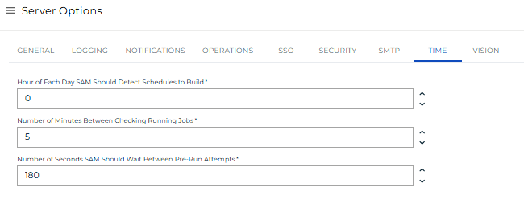

# Managing Time Settings

**Theme:** Configure  
**Who Is It For?** System Administrator, Automation Engineer

## What Is It?

Use this procedure to manage Time Settings in Solution Manager.

## When Would You Use It?

- You need to review or update Time Settings settings in Solution Manager
- Time Settings needs to be reviewed as part of routine system maintenance or a compliance audit

## Why Would You Use It?

- **Reduce administrative overhead**: Centralizing Time Settings management in Solution Manager reduces the time needed to locate and update settings across the environment
- All Time Settings changes are captured in the OpCon audit system, supporting change management and compliance processes

## Administration

### Required Privileges

To configure the **Time** setting, you must have one of the following:

- **Role**: Role_ocadm
- **Function Privilege**: Maintian server options

---

## Configuring Time

To configure Times Settings, go to **Library** > **Server Options** > select on the **TIME** tab.

\*_The table below shows default values for each settings. If user changes the default value of a setting,  icon will show next to the field._

### Configuration Options

The Time settings tab configures intervals that SAM will poll on statuses.

| Setting                                               | Default | Range   | Description                                                                                                                                                                                                                                                                                                                                                                          |
| ----------------------------------------------------- | ------- | ------- | ------------------------------------------------------------------------------------------------------------------------------------------------------------------------------------------------------------------------------------------------------------------------------------------------------------------------------------------------------------------------------------ |
| Hour of each day SAM should detect Schedules to build | 0       | 0-23    | At midnight (default), SAM detects schedules to build. Hours use a 24-hour format (0 = midnight, 23 = 11 p.m.). SAM processes builds once per day; changes to this setting take effect the following day. Set build times for individual schedules in the schedule definitions. To enable notifications for failed builds, define OpCon events on the SMA_SKD_BUILD job on the AdHoc schedule. |
| Minutes between checking running jobs                 | 5       | 1-1440  | The maximum time SAM waits before checking job status.                                                                                                                                                                                                                                                                                                                               |
| Seconds SAM should wait between PreRun attempts       | 180     | 0-32000 | The time in seconds between prerun attempts. SAM retries prerun jobs every 180 seconds (3 minutes) until the job succeeds.                                                                                                                                                                                                                                                           |

## FAQs

**Q: What does managing time settings involve?**

Managing time settings includes Required Privileges, Configuring Time. Access time settings through the Enterprise Manager navigation pane.

**Q: Who can manage time settings in OpCon?**

Users with the appropriate privileges assigned through their role can manage time settings. Contact your OpCon system administrator if you do not have access.

## Glossary

**SAM (Schedule Activity Monitor)**: The logical processor for OpCon workflow automation. SAM monitors schedule and job start times, dependencies, and user commands to determine job execution timing, and processes OpCon events.

**Enterprise Manager (EM)**: OpCon's rich client graphical user interface for Windows and Linux, used to define schedules and jobs, manage automation data, and perform operational tasks.

**OpCon Event**: A command sent to OpCon that triggers an automated action, such as adding a job to a schedule, updating a property value, sending a notification, or changing a job or schedule status.

**Notification**: A message sent by the SMA Notify Handler when a Machine, Schedule, or Job changes to a specific status. Notifications can be delivered as emails, text messages, Windows Event Log entries, SNMP traps, or other formats.

**Resource**: A numeric variable in OpCon representing a finite pool. Jobs can be configured to require a set number of resource units to run, limiting concurrent executions and preventing resource contention.

**Role**: A named security profile in OpCon that groups privileges together. Roles are assigned to user accounts to control which features, schedules, jobs, machines, and administrative functions a user can access.

**Privilege**: A specific permission granted through an OpCon role that controls access to a feature, function, or object type. Privileges are organized into categories such as Function Privileges, Machine Privileges, Schedule Privileges, and Access Codes.

**Schedule**: A named container for jobs in OpCon, built for a specific date to create that day's automation. Schedules define build settings, frequencies, and the jobs that run within them.
