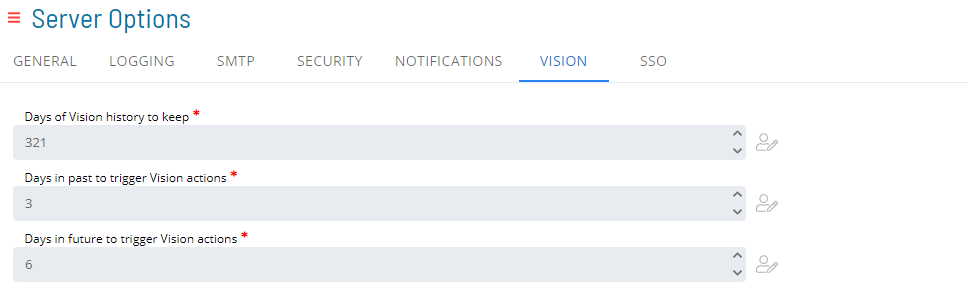

# Managing Vision Settings

## Required Privileges

In order to configure the **Vision** setting, you must have one of the following:

- **Role**: Role_ocadm.
- **Function Privilege**: Maintian server options.

---

## Configuring Vision

To configure Vision Settings, go to **Library** > **Server Options** > click on the **VISION** tab.

\*_The table below shows default values for each settings. If user changes the default value of a setting, the  icon will show next to the field._

### Configuration Options

| Setting                                  | Default Value | Required | Description                                                                                   |
| ---------------------------------------- | ------------- | -------- | --------------------------------------------------------------------------------------------- |
| Days of Vision history to keep           | 3650          | Y        | This parameter defines the number of days Vision data will be retained.                       |
| Days in past to trigger Vision actions   | 1             | Y        | This parameter defines the number of days in the past to use for triggering Vision Actions.   |
| Days in future to trigger Vision actions | 1             | Y        | This parameter defines the number of days in the future to use for triggering Vision Actions. |
