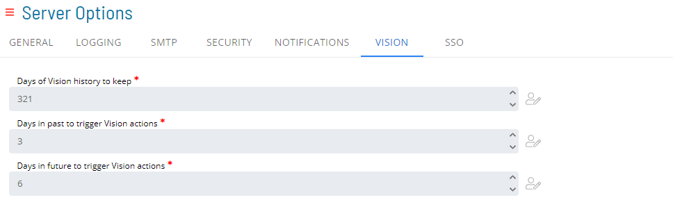

# Managing Vision Settings

**Theme:** Configure  
**Who Is It For?** System Administrator, Automation Engineer

## What Is It?

Use this procedure to manage Vision Settings in Solution Manager.

## Administration

### Required Privileges

To configure the **Vision** setting, you must have one of the following:

- **Role**: Role_ocadm
- **Function Privilege**: Maintian server options

---

## Configuring Vision

To configure Vision Settings, go to **Library** > **Server Options** > select on the **VISION** tab.

\*_The table below shows default values for each settings. If user changes the default value of a setting, the  icon will show next to the field._

### Configuration Options

| Setting                                  | Default Value | Required | Description                                                                                   |
| ---------------------------------------- | ------------- | -------- | --------------------------------------------------------------------------------------------- |
| Days of Vision history to keep           | 3650          | Y        | The number of days Vision data will be retained.                                              |
| Days in past to trigger Vision actions   | 1             | Y        | The number of days in the past to use for triggering Vision Actions.                          |
| Days in future to trigger Vision actions | 1             | Y        | The number of days in the future to use for triggering Vision Actions.                        |

## FAQs

**Q: What does managing vision settings involve?**

Managing vision settings includes Required Privileges, Configuring Vision. Access vision settings through the Enterprise Manager navigation pane.

**Q: Who can manage vision settings in OpCon?**

Users with the appropriate privileges assigned through their role can manage vision settings. Contact your OpCon system administrator if you do not have access.

## Glossary

**Enterprise Manager (EM)**: OpCon's rich client graphical user interface for Windows and Linux, used to define schedules and jobs, manage automation data, and perform operational tasks.

**Resource**: A numeric variable in OpCon representing a finite pool. Jobs can be configured to require a set number of resource units to run, limiting concurrent executions and preventing resource contention.

**Role**: A named security profile in OpCon that groups privileges together. Roles are assigned to user accounts to control which features, schedules, jobs, machines, and administrative functions a user can access.

**Privilege**: A specific permission granted through an OpCon role that controls access to a feature, function, or object type. Privileges are organized into categories such as Function Privileges, Machine Privileges, Schedule Privileges, and Access Codes.

**OpCon**: Continuous' workflow automation platform. The OpCon server includes the database, SAM and Supporting Services (SAM-SS), and graphical user interfaces. agents installed on target platforms run jobs and report results.
