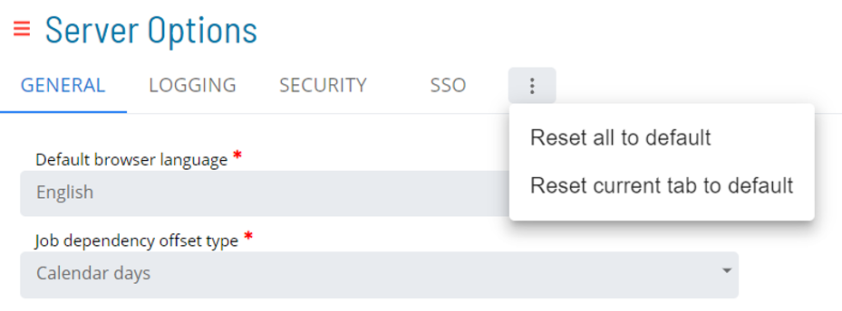

# Reset Settings

## Required Privileges

In order to reset settings, you must have one of the following:

- **Role**: Role_ocadm.
- **Function Privilege**: Maintian server options.

To access reset options click on the vertical ellipsis icon

**Reset all to default**: Reset all changes in server options to system defaut settings  
**Reset current tab to default**: Reset all changes in current tab to system default settings

  
**Save**: Save current changes  
**Undo**: Undo changes made in current session, before saving
