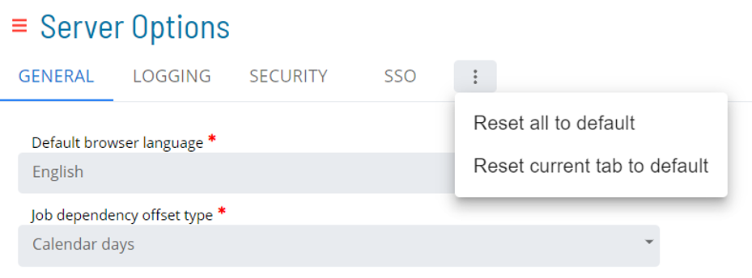

# Reset Settings

**Theme:** Configure  
**Who Is It For?** System Administrator, Automation Engineer

## What Is It?

Reset Settings in Solution Manager's Server Options lets administrators restore server option values to their system defaults — either for all options at once or for just the current tab — without manually reverting each setting individually.

## When Would You Use It?

- You need to configure or manage Reset Settings in OpCon

## Why Would You Use It?

- **Centralized control**: Managing Reset Settings through OpCon provides consistent oversight and a full audit trail for all changes

## Administration

### Required Privileges

To reset settings, you must have one of the following:

- **Role**: Role_ocadm
- **Function Privilege**: Maintian server options

To access reset options, select the vertical ellipsis icon.

- **Reset all to default**: Resets all server options to system default settings
- **Reset current tab to default**: Resets all changes in the current tab to system default settings

- **Save**: Saves current changes
- **Undo**: Undoes changes made in the current session before saving

## Configuration Options

| Setting | What It Does | Default | Notes |
|---|---|---|---|
| Function Privilege | Maintian server options | settings | — |
| Reset all to default | Resets all server options to system default settings | settings | — |
| Reset current tab to default | Resets all changes in the current tab to system default settings | settings | — |
| Undo | Undoes changes made in the current session before saving | — | — |
## FAQs

**Q: What does Reset Settings cover?**

This page covers Required Privileges.

## Glossary

**Resource**: A numeric variable in OpCon representing a finite pool. Jobs can be configured to require a set number of resource units to run, limiting concurrent executions and preventing resource contention.

**Role**: A named security profile in OpCon that groups privileges together. Roles are assigned to user accounts to control which features, schedules, jobs, machines, and administrative functions a user can access.

**Privilege**: A specific permission granted through an OpCon role that controls access to a feature, function, or object type. Privileges are organized into categories such as Function Privileges, Machine Privileges, Schedule Privileges, and Access Codes.
