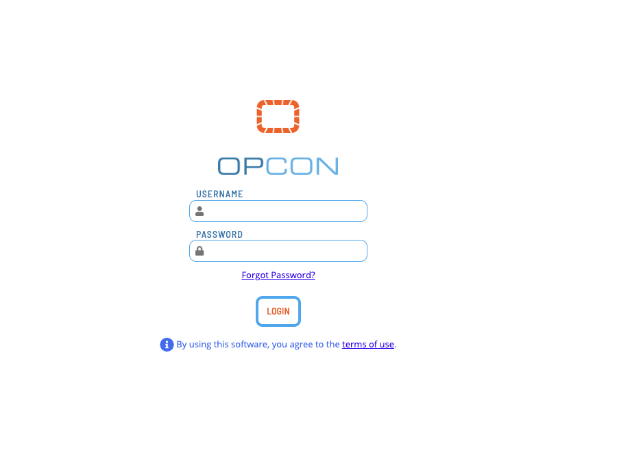
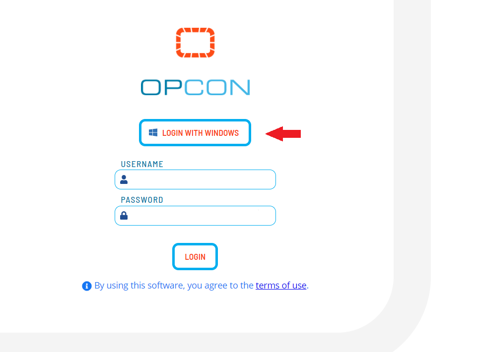
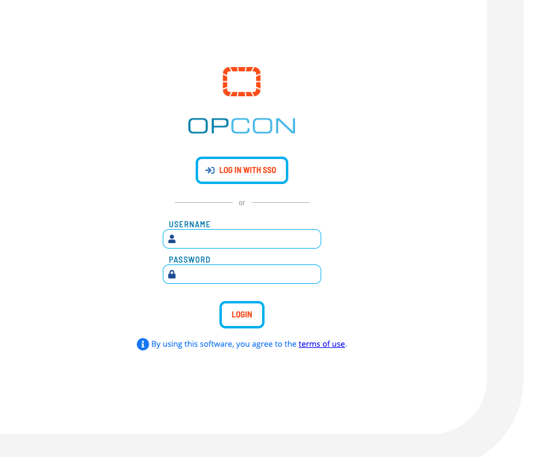
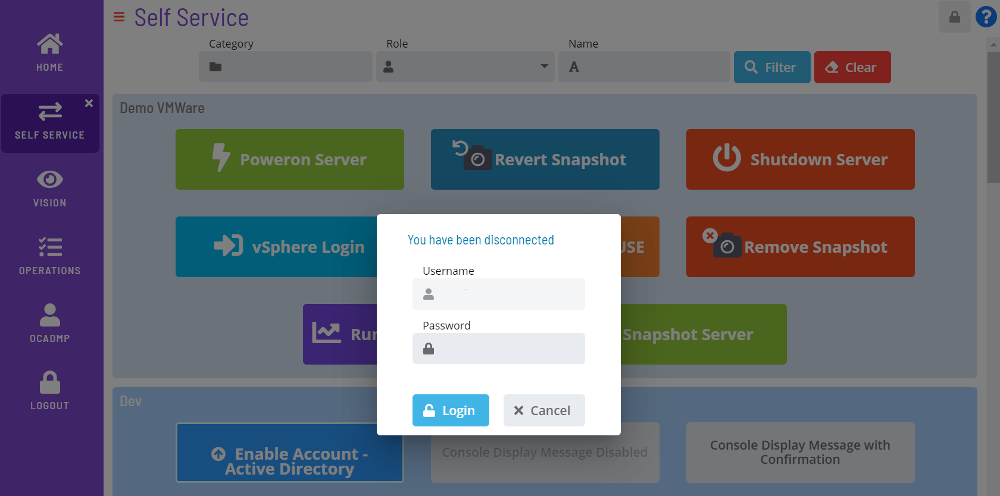

# Logging In/Out

**Theme:** Configure  
**Who Is It For?** System Administrator, Automation Engineer

## What Is It?

Use this procedure to log in in Solution Manager.

## Logging In

Log into the SMA Solution Manager with an OpCon username and password.

:::note
The OpCon password field accepts a maximum of 12 characters.
:::

:::note
If data migration is required, your login may be rejected. A member of the ocadm role must perform [data migration](Migrating-Data.md) before you can access the application.
:::

:::note
Some users may see a Security message after each manual login or automatic login attempt. Users must Accept or Decline this message. If accepted, the user proceeds normally. If declined, the user is returned to the login screen or shown the security message again.

The Security message is configured under the Generals tab of the Server Options editor in the Enterprise Manager. For more information, refer to the [Login Security Message](../../../administration/server-options.md#general) parameter in the Concepts online help.
:::

### Automatic Login

Solution Manager supports automatic login when Windows Authentication is enabled.

First, configure users in OpCon for Automatic Login using the Enterprise Manager.

:::note
The user in the Enterprise Manager must include the Windows Domain and Username.
:::

Google Chrome uses the security settings in **Internet Options**. The **Prompt for user name and password** custom setting should not be selected.

To configure this setting, complete the following steps:

1. Right-click **Start** and select **Control Panel** from the **Windows** menu
2. Go to **Internet Options**
3. Select the **Security** tab and select the **Local intranet** zone
4. Select the **Custom level**... button. The **Security Settings** dialog displays
5. Go to **User Authentication \> Logon** and verify that **Prompt for user name and password** is not selected

Firefox requires configuration. Continuous recommends keeping only one Firefox window open during configuration.

To configure this setting, complete the following steps:

1. Enter **about:config** in the search field and press **Enter** on your keyboard
2. Select **Show All**
3. Enter **network.automatic-ntlm-auth.trusted-uris** in the **Search
   preference name** search field.
4. Select the **Edit** button and enter the Solution Manager URL (e.g., `https://<servername\>:<portnumber\>`) in the text field

5. Select **Save**
6. Enter **network.negotiate-auth.delegation-uris** in the **Search preference name** search field
7. Select the **Edit** button and enter the Solution Manager URL
8. Select **Save**
9. Enter **network.negotiate-auth.trusted-uris** in the **Search preference name** search field

10. Select the **Edit** button and enter the Solution Manager URL
11. Select **Save**

:::note
For more information, refer to <https://developer.mozilla.org/en-US/docs/Mozilla/Integrated_authentication>.
:::

If automatic logon fails, the login screen displays so you can provide OpCon account credentials.

### Windows Authentication Login

The **Login with Windows** button lets you log in using Windows Authentication, bypassing OpCon login credentials. When activated, your Windows credentials are sent to the server for authentication.

For the button to display on the login screen, ensure the following settings are configured:

- Enable the **Enable Windows Authentication** option in the **Server Options** editor in the Enterprise Manager, or via the API
- Enable **Windows Pass-Through Authentication** in the [Application Settings](Configuring-Application-Settings.md) in Solution Manager

### Single Sign On Login

The **Single Sign On (SSO)** button lets you log in using an identity provider (IdP), bypassing OpCon login credentials. The user's IdP credentials are authenticated to grant access to Solution Manager.

For the button to display on the login screen, configure **Enable SSO Authentication** and other required values in the [Server Options](../Solution-Manager/Library/ServerOptions/Managing-SSO-Configurations.md) page in Solution Manager.

### Okta

When configuring SSO with **Okta**, users must have purchased both the **Single Sign-On** and **API Access Management** features from Okta.

### Session Expiration

If the browser session expires, a pop-up displays so you can log back in without returning to the login screen. The pop-up prompts for login credentials or displays the **Login with Windows** button, depending on how you originally logged in.

## Logging Out

Select the **Logout** button in the **Navigation** menu to log out.

## Configuration Options

| Setting | What It Does | Default | Notes |
|---|---|---|---|
## FAQs

**Q: How many steps does the Logging In/Out procedure involve?**

The Logging In/Out procedure involves 16 steps. Complete all steps in order and save your changes.

**Q: What does Logging In/Out cover?**

This page covers Logging In, Logging Out.

## Glossary

**Enterprise Manager (EM)**: OpCon's rich client graphical user interface for Windows and Linux, used to define schedules and jobs, manage automation data, and perform operational tasks.

**Solution Manager**: OpCon's browser-based graphical user interface for managing automation data, performing operational actions, and administering the system.

**Resource**: A numeric variable in OpCon representing a finite pool. Jobs can be configured to require a set number of resource units to run, limiting concurrent executions and preventing resource contention.

**Role**: A named security profile in OpCon that groups privileges together. Roles are assigned to user accounts to control which features, schedules, jobs, machines, and administrative functions a user can access.

**OpCon**: Continuous' workflow automation platform. The OpCon server includes the database, SAM and Supporting Services (SAM-SS), and graphical user interfaces. agents installed on target platforms run jobs and report results.
