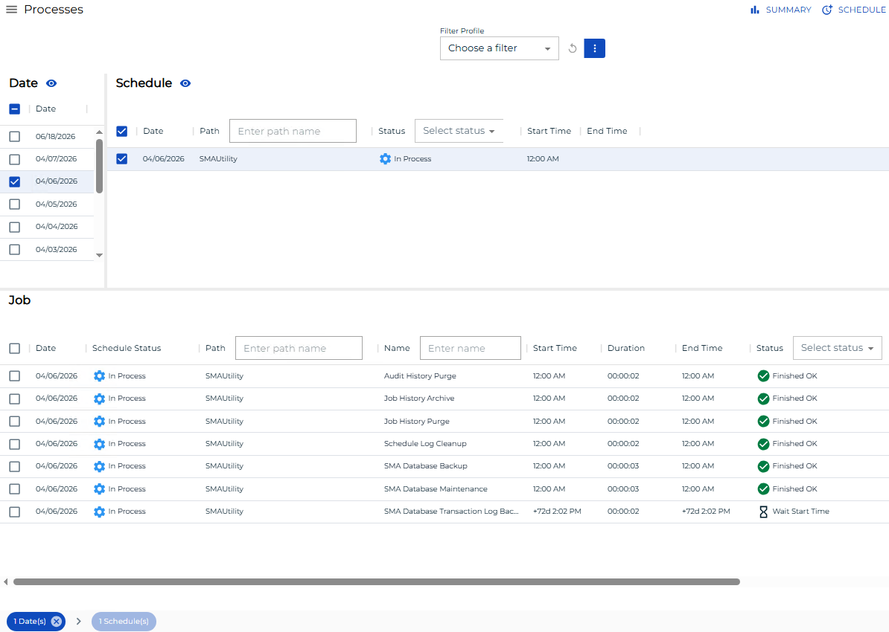
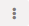
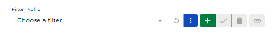
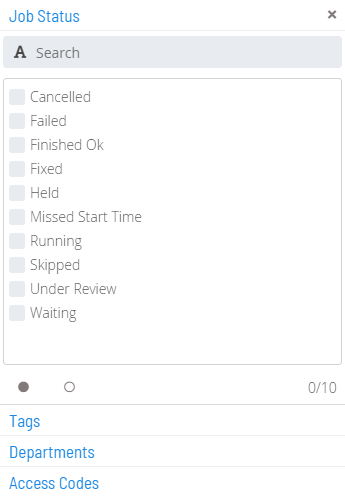
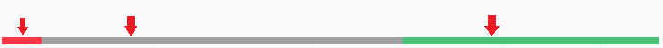

# Managing Daily Processes

**Theme:** Configure  
**Who Is It For?** System Administrator, Automation Engineer

## What Is It?

The 
button on the main **Operations** page takes you to a page where you can
view and manage the Daily processes in operation.

Daily Processes Page

## Toolbar Options

The **Daily Processes** page has the following toolbar options:

- **Back**: Returns to the previous view or page
- **Summary**: Returns to the main **Operations** page
- **Refresh**: Refreshes data on the **Processes** page

## Date/Schedule Selection Enabling/Disabling

The **Date** and **Schedule** toggle switches enable or disable date and schedule selections. A green checkmark indicates enabled; a gray circle indicates disabled.

## Filter Profiles

Filter profiles are user-defined filters in the Operations **Processes** view that can be saved persistently and shared with others.

Filter Profile Bar

### Creating and Sharing Filter Profiles

To create a filter profile:

1. Set the desired filter(s) in the Operations **Processes** view

:::note
Changes that affect column state (e.g., hiding columns) are not stored by the filter profile.
:::

To filter Profiles, complete the following steps:

2. Select the **Advanced** button () to expose the action buttons

3. Select the **Add** button ()

4. Enter a name for the filter set

5. Use the **Share with** list to set the share status. The share detail appears in parentheses next to the name (e.g., Test Filter (Private) or Test Filter (Role_ocadm)):

   - Select a specific role to grant anyone in that role access and the ability to update it
   - Select **Public** to grant everyone access. Only those in the ocadm (or equivalent) role can update it
   - Select **Private** to restrict access to the current user only

6. Select the **Save** button ()

:::note
Private, public, and shared filter profiles are accessible from the **Filter Profile** list on the filter profile bar.
:::

### Modifying Filter Profiles

To modify a filter profile:

1. Select an existing filter profile from the **Filter Profile** list
2. Modify the existing set of filters
3. Select the **Advanced** button ()
4. Select the **Save** button ()

:::note
To save a modified profile as a new profile, select the existing profile, modify the filters, select **Add**, enter a new name, configure sharing, and save.
:::

### Deleting Filter Profiles

To delete a filter profile:

1. Select an existing filter profile from the **Filter Profile** list
2. Select the **Advanced** button ()
3. Select the **Delete** button ()

### Accessing Filter Profiles via Direct URL

To get a direct URL for a filter profile:

1. Select an existing filter profile from the **Filter Profile** list
2. Select the **Advanced** button ()
3. Select the **Link** button (). A **Filter Profile Link** dialog displays

## Filtering

Filtering is available for the **Schedules**, **Jobs**, and **Agents** grids, making it easier to target specific items when many results are returned.

When filtering is applied, the following visual indicators appear:

- Dark yellow is applied to field borders, buttons, controls, and tags to indicate an active filter
- The triple bar button in the top-right corner of grids () turns dark yellow when a hidden column has filter criteria
- A filter tag box showing the filtered field name appears on the tag bar above the grid. Select the **x** on the tag box to remove that filter

Visual Filter Indicators in Operations

### Quick Filtering

Use the **Filter Bar** above the grid to filter by keyword. Enter a keyword in the appropriate field and press **Enter**. Available for the **Schedules**, **Jobs**, and **Agents** grids.

Quick Filtering

:::note
The Schedules filter bar includes a **Status** list with the following options: Waiting, Held, In Progress, Completed, and Completed with Error(s).
:::

### In-depth Filtering

For more detailed filtering in the **Jobs** grid, select the

button to open a **Filter** panel. Filter by job status, tag, department, or access code. Use the  button to select all or the  button to deselect all options. The panel displays the number of active filters per tab.

Filter Panel

The filter button changes to dark yellow and shows the number of active filters (). Select the **x** on the button to remove all filters at once.

### Interactive Filtering

Use the color-coded **Statistics Bar** above the grid to filter by current status. Each color represents a status. Select any color to filter the list by that status. Available for the **Schedules**, **Jobs**, and **Agent** grids.

Interactive Filtering

A filter tag box () appears on the tag bar above the grid, and the **Status** field border changes to dark yellow and shows the active status filter.

## Column Sorting and Display

Column sorting and display is available for the **Schedules**, **Jobs**, and **Agents** grids.

- **Sorting**: Select a column heading to sort ascending (arrow pointing down). Select again to sort descending (arrow pointing up)
- **Display**: Use the triple bar button () to select which columns are displayed

## Right-click Action

Right-click any item in the **Schedules**, **Jobs**, or **Agents** grids to display a **Selection** panel where you can perform actions on the current selection(s).

## Breadcrumb Selection

When a selection is made in the **Date**, **Schedule**, **Job**, or **Agents** list, it appears in the **Status Bar** at the bottom of the page as a breadcrumb trail. Select the record (not available for date records) to display a **Status Update** panel and perform actions on the current selection(s).

Breadcrumb Selection

.png "More Info icon")
Related Topics

- [Performing Schedule Status Changes](Performing-Schedule-Status-Changes.md)
- [Performing Job Status Changes](Performing-Job-Status-Changes.md)
- [Performing Bulk Status Job Updates (Schedule Level)](Performing-Bulk-Job-Status-Updates-Schedule-Level.md)
- [Performing Agent Status Updates](Performing-Agent-Status-Updates.md)
- [Viewing Job Output](Viewing-Job-Output.md)
- [Viewing Job Configuration](Viewing-Job-Configuration.md)
- [Using PERT View](Using-PERT-View.md)

## Configuration Options

| Setting | What It Does | Default | Notes |
|---|---|---|---|
| Summary | Returns to the main **Operations** page | — | — |
| Sorting | Select a column heading to sort ascending (arrow pointing down). | — | — |
| Display | Use the triple bar button (!Column Display Button) to select which columns are displayed | — | — |

## FAQs

**Q: What does managing daily processes involve?**

Managing daily processes includes Toolbar Options, Date/Schedule Selection Enabling/Disabling, Filter Profiles, Filtering. Access daily processes through the Enterprise Manager navigation pane.

**Q: Who can manage daily processes in OpCon?**

Users with the appropriate privileges assigned through their role can manage daily processes. Contact your OpCon system administrator if you do not have access.

## Glossary

**Enterprise Manager (EM)**: OpCon's rich client graphical user interface for Windows and Linux, used to define schedules and jobs, manage automation data, and perform operational tasks.

**Solution Manager**: OpCon's browser-based graphical user interface for managing automation data, performing operational actions, and administering the system.

**Access Code**: A security label applied to jobs and schedules in OpCon. Users must have the matching access code privilege to view or manage items with that label.

**Department**: An organizational grouping in OpCon used to assign jobs to logical divisions. User roles can be scoped to specific departments, controlling which jobs a user can manage.

**Resource**: A numeric variable in OpCon representing a finite pool. Jobs can be configured to require a set number of resource units to run, limiting concurrent executions and preventing resource contention.

**Role**: A named security profile in OpCon that groups privileges together. Roles are assigned to user accounts to control which features, schedules, jobs, machines, and administrative functions a user can access.

**Privilege**: A specific permission granted through an OpCon role that controls access to a feature, function, or object type. Privileges are organized into categories such as Function Privileges, Machine Privileges, Schedule Privileges, and Access Codes.

**Schedule**: A named container for jobs in OpCon, built for a specific date to create that day's automation. Schedules define build settings, frequencies, and the jobs that run within them.
