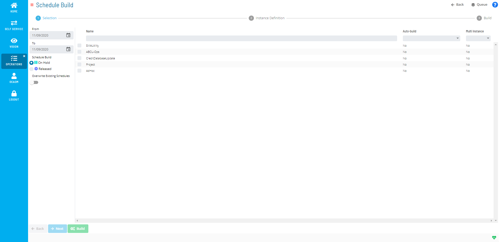
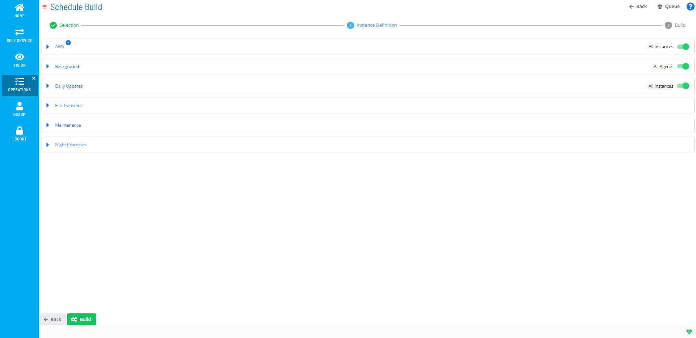
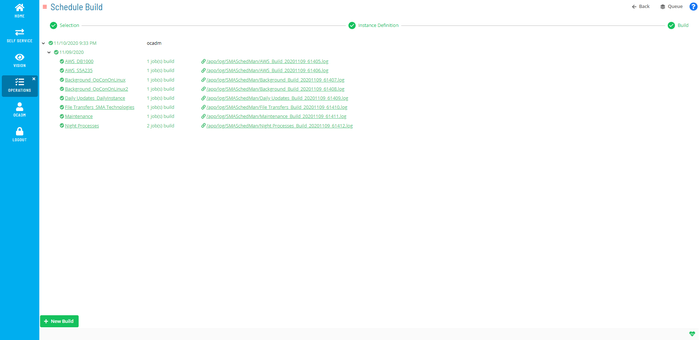
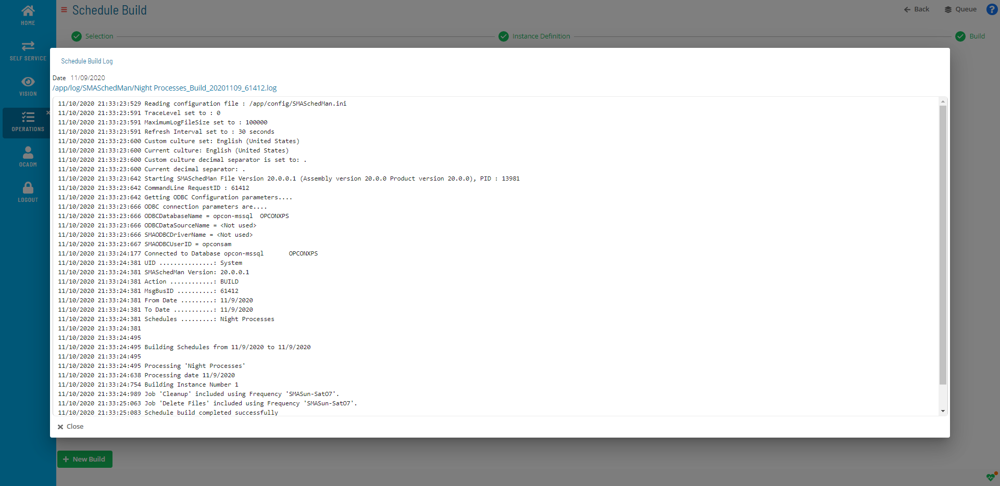

# Managing Schedules

**Theme:** Configure  
**Who Is It For?** System Administrator, Automation Engineer

## What Is It?

The 
button on the main **Operations** page takes you to the **Schedule
Build** page where you can manage building schedules.

Operations Summary Page

## When Would You Use It?

- You need to review or update Schedules settings in Solution Manager
- Schedules needs to be reviewed as part of routine system maintenance or a compliance audit

## Why Would You Use It?

- **Reduce administrative overhead**: Centralizing Schedules management in Solution Manager reduces the time needed to locate and update settings across the environment
- All Schedules changes are captured in the OpCon audit system, supporting change management and compliance processes

## Selection Options

Schedule Build Selection Page

The **Selection** page has the following options for building a master schedule:

- **From**: The earliest date from which to build a schedule
- **To**: The latest date from which to build the schedule
- **Schedule Build**: Radio buttons to select the build state:
  - **On Hold**: The schedule builds with a status of On Hold. SAM will not process it until released manually or through an OpCon event
  - **Released**: The schedule is released at build time
- **Overwrite Existing Schedules**: When enabled (toggle appears red ), OpCon overwrites a schedule in Completed status on the target date. Schedules In Process are not overwritten
- **Name**: The schedule name. Select the option  next to each schedule to build. Use the **Filter Bar** above the list to filter by keyword
- **Auto-build**: Filters results by auto-build setting (**Yes** or **No**). If **Yes**, shows the days-in-advance value
- **Multi Instance**: Filters results by multi-instance setting (**Yes** or **No**)
- **Back (bottom-left)**: Returns to the previous page. Disabled on the Selection page
- **Next**: Advances to the next page
- **Build**: Builds the selected schedule(s)
- **Back (top-right)**: Returns to the **Operations Summary** page
- **Queue**: Opens the [Schedule Build Queue](Using-Schedule-Build-Queue.md) page

## Instance Definition Options

Schedule Build Instance Definition Page

The **Instance Definition** page has the following options:

- For non-multi-instance schedules:
  - **Name**: The property name for an instance of the schedule. See [Instance Definition](../../../job-components/instances.md) and [Properties](../../../objects/properties.md#)
  - **Value**: The property value
- For multi-instance schedules:
  - **All Instances (Properties/Named Instance)**: Select or define properties or named instances. When enabled, the All Instances toggle appears green . A white number in a blue circle () appears next to the schedule name when multiple instances are defined
    - **Name**: The instance name or property. See [Instance Definition](../../../job-components/instances.md) and [Properties](../../../objects/properties.md#)
    - **Value**: The property value
  - **All Agents (Machine Group)**: Select or define a machine group. When enabled, the All Agents toggle appears green . A white number in a blue circle appears next to the schedule name when multiple instances are defined
    - **Machine**: Select the machine group
- **Back (bottom-left)**: Returns to the previous page
- **Build**: Builds the selected schedule(s)
- **Back (top-right)**: Returns to the **Operations Summary** page
- **Queue**: Opens the [Schedule Build Queue](Using-Schedule-Build-Queue.md) page

## Build Options

Schedule Build Page

The **Build** page displays schedules during and after building. Select the schedule name to open the [Processes](Managing-Daily-Processes.md) page. Select the .log path following the link icon () to view the build log.

## Schedule Build Log

Schedule Build Log

The **Schedule Build Log** window displays the log file path and build log information.

### Building Schedules

To build a schedule, complete the following steps:

1. Select the **Schedule Build** button () on the **Operations Summary** page
2. Enter or select a start date in the **From** field
3. Enter or select an end date in the **To** field
4. Select either the **On Hold** or **Released** option to define the build state
5. Toggle **Overwrite Existing Schedules** to define whether to overwrite existing built schedules. Disabled by default
6. Select the _check box_  next to all schedules to be built
7. Select one of the following:
   a. _(Optional)_ Select **Next** to go to the **Instance Definition** page (then proceed to step 8), **- or -**
   b. Select **Build** to build the schedule(s) (then proceed to step 18).
8. Select the green plus (**Add**) button in the expanded frame to define an instance
9. Enter a _name_ and _value_ for the property. Use the following buttons as needed:
   a. _(Optional)_ Select the blue check mark (**OK**) button to add the instance property.
   b. _(Optional)_ Select the reverse arrow (**Undo**) button to clear the fields.
   c. _(Optional)_ Select the green plus (**Add**) button to add an additional instance property.
   d. _(Optional)_ Select the blue pencil (**Edit**) button or select in the **Name** or **Value** fields to edit an instance property.
   e. _(Optional)_ Select the red trash can (**Delete**) button to delete an instance property.
10. _(Optional)_ Edit an existing instance definition using the blue pencil (**Edit**) button or by selecting in the **Name** or **Value** fields
11. _(Optional)_ Select the green plus (**Add**) button to define an additional instance property, then repeat sub-steps from step 9
12. _(Optional)_ Toggle **All Instance** to define whether to build all instances of the properties
13. _(Optional)_ Edit an existing instance definition using the blue pencil (**Edit**) button or by selecting in the **Name** or **Value** fields
14. _(Optional)_ Select the green plus (**Add**) button to define an additional instance property, then repeat sub-steps from step 9
15. _(Optional)_ Toggle **All Instance** to define whether to build all instances of the properties
16. Select a _machine_ in the **Machine** list
17. _(Optional)_ Toggle **All Agents** to define whether to build all agents
18. Select **Build** to build the schedule(s)
19. _(Optional)_ Select the _schedule name_ to view the **Processes** information
20. _(Optional)_ Select the _.log file link_ to view the job log

.png> "More Info icon")
Related Topics

- [Using Schedule Build Queue](Using-Schedule-Build-Queue.md)
  :::

## Configuration Options

| Setting | What It Does | Default | Notes |
|---|---|---|---|
| Schedule Build | Radio buttons to select the build state: | — | — |
| Overwrite Existing Schedules | When enabled (toggle appears red !Schedule Build Overwrite Existing Schedules), OpCon overwrites a schedule in Completed status on the target date. | — | — |
| Name | The schedule name. | — | — |
| Auto-build | Filters results by auto-build setting (**Yes** or **No**). | — | — |
| Multi Instance | Filters results by multi-instance setting (**Yes** or **No**) | — | — |
| Back (bottom-left) | Returns to the previous page. | — | — |
| Back (top-right) | Returns to the **Operations Summary** page | — | — |
| Queue | Opens the Schedule Build Queue page | — | — |

## FAQs

**Q: What does managing schedules involve?**

Managing schedules includes Selection Options, Instance Definition Options, Build Options, Schedule Build Log. Access schedules through the Enterprise Manager navigation pane.

**Q: Who can manage schedules in OpCon?**

Users with the appropriate privileges assigned through their role can manage schedules. Contact your OpCon system administrator if you do not have access.

## Glossary

**SAM (Schedule Activity Monitor)**: The logical processor for OpCon workflow automation. SAM monitors schedule and job start times, dependencies, and user commands to determine job execution timing, and processes OpCon events.

**Enterprise Manager (EM)**: OpCon's rich client graphical user interface for Windows and Linux, used to define schedules and jobs, manage automation data, and perform operational tasks.

**Solution Manager**: OpCon's browser-based graphical user interface for managing automation data, performing operational actions, and administering the system.

**OpCon Event**: A command sent to OpCon that triggers an automated action, such as adding a job to a schedule, updating a property value, sending a notification, or changing a job or schedule status.

**Resource**: A numeric variable in OpCon representing a finite pool. Jobs can be configured to require a set number of resource units to run, limiting concurrent executions and preventing resource contention.

**Role**: A named security profile in OpCon that groups privileges together. Roles are assigned to user accounts to control which features, schedules, jobs, machines, and administrative functions a user can access.

**Privilege**: A specific permission granted through an OpCon role that controls access to a feature, function, or object type. Privileges are organized into categories such as Function Privileges, Machine Privileges, Schedule Privileges, and Access Codes.

**Machine**: A platform defined in the OpCon database that has an agent installed. OpCon routes job execution requests to machines via SMANetCom, and machines report job completion status back to SAM.
