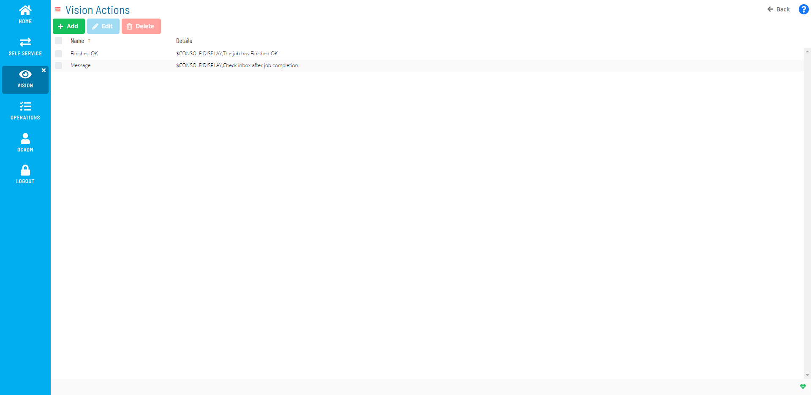

# Managing Vision Actions

**Theme:** Configure  
**Who Is It For?** System Administrator, Automation Engineer

## What Is It?

Vision Actions are OpCon Events defined for a Vision Frequency Trigger.

The following fields apply for setting Vision Actions:

- **Name**: The event name
- **Events:** A list of Events defined for the Action. Select the Add button to open the **Create new Event** window
  - **Event Template**: Select an event template. The page updates dynamically to assist with filling out event details

## Using the Vision Action Admin Page

The **Vision Actions** page is where you can view, add, edit, and delete actions.

Vision Actions Admin Page

:::note
A Vision license is required to define Actions. See [License File Request and Storing](Working-with-Vision.md#License) in the **Solution Manager** online help.
:::

:::note
A user must be in the «ocadm» role or have the «Maintain Vision Actions» privilege to define Actions. See [Function Privileges](../../../administration/privileges.md#function-privileges) in the **Concepts** online help.
:::

.png "More Info icon")
Related Topics

- [Adding Vision Actions](Adding-Vision-Actions.md)
- [Editing Vision Actions](Editing-Vision-Actions.md)
- [Deleting Vision Actions](Deleting-Vision-Actions.md)

## Configuration Options

| Setting | What It Does | Default | Notes |
|---|---|---|---|
| Name | The event name | — | — |

## FAQs

**Q: What does managing vision actions involve?**

Managing vision actions includes Using the Vision Action Admin Page. Access vision actions through the Enterprise Manager navigation pane.

**Q: Who can manage vision actions in OpCon?**

Users with the appropriate privileges assigned through their role can manage vision actions. Contact your OpCon system administrator if you do not have access.

## Glossary

**Enterprise Manager (EM)**: OpCon's rich client graphical user interface for Windows and Linux, used to define schedules and jobs, manage automation data, and perform operational tasks.

**Solution Manager**: OpCon's browser-based graphical user interface for managing automation data, performing operational actions, and administering the system.

**Frequency**: A set of rules that defines when a job or schedule is eligible to run, based on calendar rules, day-of-week settings, period offsets, and other timing criteria.

**OpCon Event**: A command sent to OpCon that triggers an automated action, such as adding a job to a schedule, updating a property value, sending a notification, or changing a job or schedule status.

**Resource**: A numeric variable in OpCon representing a finite pool. Jobs can be configured to require a set number of resource units to run, limiting concurrent executions and preventing resource contention.

**Role**: A named security profile in OpCon that groups privileges together. Roles are assigned to user accounts to control which features, schedules, jobs, machines, and administrative functions a user can access.

**Privilege**: A specific permission granted through an OpCon role that controls access to a feature, function, or object type. Privileges are organized into categories such as Function Privileges, Machine Privileges, Schedule Privileges, and Access Codes.

**OpCon**: Continuous' workflow automation platform. The OpCon server includes the database, SAM and Supporting Services (SAM-SS), and graphical user interfaces. agents installed on target platforms run jobs and report results.
