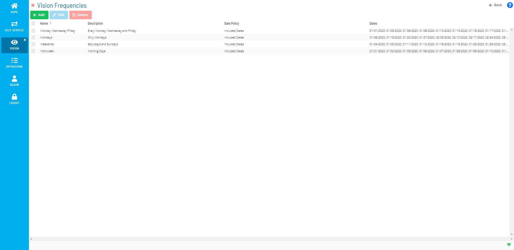

# Managing Vision Frequencies

**Theme:** Configure  
**Who Is It For?** System Administrator, Automation Engineer

## What Is It?

Vision Frequencies define which days cards are displayed in the Vision module. Tag cards require at least one frequency; group cards inherit frequencies from their children and do not require one. Multiple frequencies can be associated with a card. If multiple frequencies match a given day, the first match in priority order applies SLAs and Triggers.

The following fields apply for setting Vision Frequencies:

**Frequency**: Select an existing frequency or define a new one. Creating a new frequency opens the Vision Frequency page where you can configure it.

- **Name**: The frequency name
- **Description**: *(Optional)* A description for the frequency
- **Date Policy**: Whether to include or exclude dates:
  - **Include Selected Dates**: Specifies dates the card is displayed (shown with green highlight)
    - Use the  button to add dates
    - Use the  button to remove dates
  - **Exclude Selected Dates**: Specifies dates the card is not displayed (shown with red highlight)
    - Use the  button to add dates
    - Use the  button to remove dates

**SLA**: Defines the SLA (service level agreement) for a frequency, specifying which days to monitor the expected start or end time. When an SLA requirement is defined, a triangular icon may appear next to the Start Time or End Time on a card to indicate the SLA is broken or at risk. For more on the SLA icon, refer to [Vision Card Colors](Viewing-Cards-in-Vision-Live.md#Vision) in the **Solution Manager** online help.

- **Requirement**: The time expectation to monitor:
  - **Expected Start Time**: The SLA monitors the expected start time
  - **Expected End Time**: The SLA monitors the expected end time

**Time**: The time the SLA will monitor.

**Day**: The day offset for SLA monitoring. Options:

- **-5** through **-2**: Apply the SLA 5–2 days before the current day
- **Previous**: One day before the current day
- **Current**: The current day
- **Next**: One day after the current day
- **+2** through **+5**: Apply the SLA 2–5 days after the current day

While the frequency defines which day a card is visible, the SLA Day determines which day is monitored for the SLA.

:::tip Example
You want to monitor a card that starts at 8:00 a.m. one day and finishes at 1:00 a.m. the next day.

Define two SLAs:

- One SLA with the following settings:
  - **Requirement**: Expected Start Time
  - **Time**: 08:00
  - **Day**: Current
- Another SLA with the following settings:
  - **Requirement**: Expected End Time
  - **Time**: 01:00
  - **Day**: Next
:::

**Trigger(s)**: Defines settings for triggering the action(s) to be run.

- **Status**: The card state that triggers the action(s):
  - **Unknown**: Card status is unknown
  - **Calculating**: Card status is calculating
  - **Failed**: Completed card status is failed
  - **Partial Failed**: Card is running but at least one child card is failed
  - **Finished OK**: Completed card status is Finished OK
  - **Started Late (SLA)**: Card started late based on the SLA Start Time Requirement defined for the frequency
  - **Finished Late (SLA)**: Card finished late based on the SLA End Time Requirement defined for the frequency
  - **Estimated Late to Start (SLA)**: Vision estimates the card will be late to start based on the SLA Start Time Requirement. Estimation uses the same mechanism as the Estimated Start Time calculation of jobs
  - **Estimated Late to Finish (SLA)**: Vision estimates the card will be late to finish based on the SLA End Time Requirement. Estimation uses the same mechanism as the Estimated Start Time and Estimated Run Time calculation of jobs
- **Runnable(s)**: The action to perform when the trigger is launched
  - **Action**: Select an existing action or define a new one. For more information, refer to [Managing Vision Actions](Managing-Vision-Actions.md) in the **Solution Manager** online help
  - **Repeat After**: *(Optional)* Minutes between repeated action runs until the problem is resolved. Options: 1, 2, 3, 4, 5, 10, 15, 20, 30, 45, or 60 min
  - **Instance**: The remote instance used when triggering the action. The action is submitted using the Vision Action User. For more information, refer to [Managing Vision Remote Instances](Managing-Vision-Remote-Instances.md) in the **Solution Manager** online help

## When Would You Use It?

- You need to review or update Vision Frequencies settings in Solution Manager
- Vision Frequencies needs to be reviewed as part of routine system maintenance or a compliance audit

## Why Would You Use It?

- **Reduce administrative overhead**: Centralizing Vision Frequencies management in Solution Manager reduces the time needed to locate and update settings across the environment
- All Vision Frequencies changes are captured in the OpCon audit system, supporting change management and compliance processes

## Using the Vision Frequencies Admin Page

The **Vision Frequencies** page lists all existing frequencies and provides a central location for adding, editing, and deleting frequencies.

Vision Frequencies Admin Page

The following procedures cover how to add, edit, and delete frequencies from the Vision Frequencies page. For steps at the card level, refer to the [Related Topics](#Related_Topics) at the bottom of this page.

To add a Vision Frequency, complete the following steps:

1. Select the **Frequencies** button on the **Vision Live** page or the **Vision Settings** page
2. Select the **Add** button
3. Enter a *Name* for the frequency
4. *(Optional)* Enter a *Description* for the frequency
5. Select a *dates option* from the **Date Policy** list

6. Select the **+** or **−** button to define which dates to include or exclude. You can also select individual dates directly on the calendars
7. Select the **Save** button

To edit a Vision Frequency, complete the following steps:

1. Select the **Frequencies** button on the **Vision Live** page or the **Vision Settings** page
2. Select the existing **Frequency** you wish to edit
3. Select the **Edit** button
4. Modify the existing information or settings
5. Select the **Save** button

To delete a Vision Frequency, complete the following steps:

1. Select the **Frequencies** button
2. Select the existing **Frequency** you wish to delete
3. Select the **Delete** button
4. Select the **Yes** button

.png "More Info icon")

Related Topics

- [Adding Vision Frequencies](Adding-Vision-Frequencies.md)
- [Editing Vision Frequencies](Editing-Vision-Frequencies.md)
- [Deleting Vision Frequencies](Deleting-Vision-Frequencies.md)
:::

## Configuration Options

| Setting | What It Does | Default | Notes |
|---|---|---|---|
| Name | The frequency name | — | — |
| Description | *(Optional)* A description for the frequency | — | — |
| Date Policy | Whether to include or exclude dates: | — | — |
| SLA | Defines the SLA (service level agreement) for a frequency, specifying which days to monitor the expected start or end time. | — | — |
| Requirement | The time expectation to monitor: | — | — |
| Time | The time the SLA will monitor | — | — |
| Day | The day offset for SLA monitoring. | — | — |
| Current | The current day | — | — |
| Trigger(s) | Defines settings for triggering the action(s) to be run | — | — |
| Status | The card state that triggers the action(s): | — | — |
| Runnable(s) | The action to perform when the trigger is launched | — | — |

## FAQs

**Q: What does managing vision frequencies involve?**

Managing vision frequencies includes Using the Vision Frequencies Admin Page. Access vision frequencies through the Enterprise Manager navigation pane.

**Q: Who can manage vision frequencies in OpCon?**

Users with the appropriate privileges assigned through their role can manage vision frequencies. Contact your OpCon system administrator if you do not have access.

## Glossary

**Enterprise Manager (EM)**: OpCon's rich client graphical user interface for Windows and Linux, used to define schedules and jobs, manage automation data, and perform operational tasks.

**Solution Manager**: OpCon's browser-based graphical user interface for managing automation data, performing operational actions, and administering the system.

**Frequency**: A set of rules that defines when a job or schedule is eligible to run, based on calendar rules, day-of-week settings, period offsets, and other timing criteria.

**Calendar**: A named collection of dates in OpCon used by schedules and frequencies to determine when automation runs or is excluded. Calendars can represent holidays, working days, or any custom date set.

**Resource**: A numeric variable in OpCon representing a finite pool. Jobs can be configured to require a set number of resource units to run, limiting concurrent executions and preventing resource contention.

**Role**: A named security profile in OpCon that groups privileges together. Roles are assigned to user accounts to control which features, schedules, jobs, machines, and administrative functions a user can access.

**Privilege**: A specific permission granted through an OpCon role that controls access to a feature, function, or object type. Privileges are organized into categories such as Function Privileges, Machine Privileges, Schedule Privileges, and Access Codes.

**Job**: The fundamental unit of work in OpCon. A job defines what to run, on which machine, when to start, and what conditions must be met. Job results are tracked and can trigger events and notifications.
