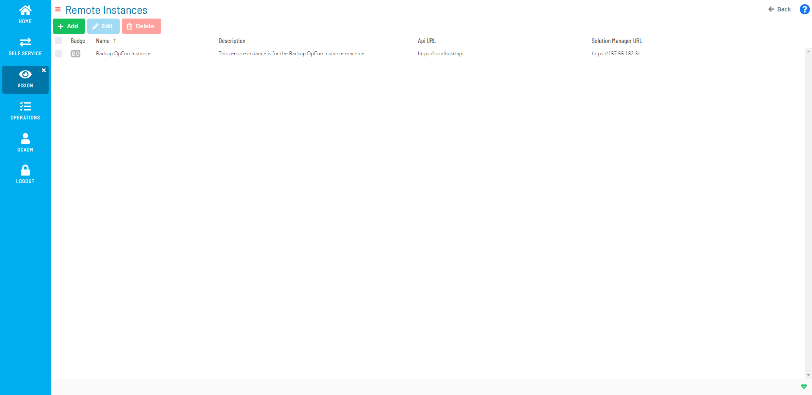

# Managing Vision Remote Instances

**Theme:** Configure  
**Who Is It For?** System Administrator, Automation Engineer

## What Is It?

Vision Remote Instances define instances of OpCon to be monitored that run and are accessed on a remote server. For more information, refer to [Remote Instances](../../../objects/remote-instances.md) in the **Concepts** online help.

The following fields apply for setting Vision Remote Instances:

- **Name**: The remote instance name
- **Badge(Auto Gen.)**: An auto-generated two-character description based on the Name field. The badge icon appears on cards assigned to a remote instance
- **Description**: *(Optional)* Descriptions, explanations, and notes for the remote instance
- **Vision Instance Connection**: API and Solution Manager credentials for the remote OpCon instance
  - **Api URL**: The API URL for the remote instance
  - **Api User**: The API username for connecting to the database
  - **Api Password**: The corresponding API password for the API user
  - **Solution Manager URL**: The Solution Manager URL for the remote instance
  - **Vision Action User**: The user for submitting Vision actions
- **Complex Expression Connection**: Connection information enabling the remote instance to be used in OpCon properties. (By default, OpCon expressions point to local properties.)
  - **SQL Server**: The name of the server where the database resides
  - **Database**: The name of the database to connect to
  - **Windows Auth**: Use Windows Authentication to connect to the database. If selected, the SMA Service Manager must run as a user with privileges to the OpCon database. For more information, refer to [Add the OpConxps Active Directory Group to the SQL Server](../../../installation/configuration.md#Add_the_OpConxps_Active_Directory_Group_to_the_SQL_Server) in the **OpCon Installation** online help
  - **User**: The authorized SQL Server username for connecting to the database
  - **Password**: The corresponding password for the authorized SQL Server user
  - **Mirroring**: Enables or disables mirroring, which ensures the proper connection string is used when the instance uses mirroring
  - **Transparent Network Ip Resolution**: Specifies how to resolve the IP address when issues occur. Options:
    - **Disabled**: No transparent Network IP resolution
    - **Enabled**: Transparent Network IP resolution is active
    - **Auto**: Network IP resolution is automatically detected. This is the default setting

## Using the Vision Remote Instances Admin Page

The **Vision Remote Instances** page is the central location for viewing, adding, editing, and deleting remote instances.

Vision Remote Instances Admin Page

:::note
A user must be in the «ocadm» role to define remote instances. For more on Function Privileges including those pertaining to Vision, refer to [Function Privileges](../../../administration/privileges.md#function-privileges) in the **Concepts** online help.
:::

.png "More Info icon")
Related Topics

- [Adding Vision Remote Instances](Adding-Vision-Remote-Instances.md)
- [Editing Vision Remote Instances](Editing-Vision-Remote-Instances.md)
- [Deleting Vision Remote Instances](Deleting-Vision-Remote-Instances.md)

## Configuration Options

| Setting | What It Does | Default | Notes |
|---|---|---|---|
| Name | The remote instance name | — | — |
| Badge(Auto Gen.) | An auto-generated two-character description based on the Name field. | — | — |
| Description | *(Optional)* Descriptions, explanations, and notes for the remote instance | — | — |
| Vision Instance Connection | API and Solution Manager credentials for the remote OpCon instance | — | — |
| Complex Expression Connection | Connection information enabling the remote instance to be used in OpCon properties. | — | — |

## FAQs

**Q: What does managing vision remote instances involve?**

Managing vision remote instances includes Using the Vision Remote Instances Admin Page. Access vision remote instances through the Enterprise Manager navigation pane.

**Q: Who can manage vision remote instances in OpCon?**

Users with the appropriate privileges assigned through their role can manage vision remote instances. Contact your OpCon system administrator if you do not have access.

## Glossary

**SMAServMan (SMA Service Manager)**: Manages the starting, stopping, and restarting of all OpCon server programs. Monitors configured applications and restarts them automatically if they fail unexpectedly.

**Enterprise Manager (EM)**: OpCon's rich client graphical user interface for Windows and Linux, used to define schedules and jobs, manage automation data, and perform operational tasks.

**Solution Manager**: OpCon's browser-based graphical user interface for managing automation data, performing operational actions, and administering the system.

**OpConxps**: The standard installation directory name for OpCon program files, configuration files, and output data on Windows machines.

**Resource**: A numeric variable in OpCon representing a finite pool. Jobs can be configured to require a set number of resource units to run, limiting concurrent executions and preventing resource contention.

**Role**: A named security profile in OpCon that groups privileges together. Roles are assigned to user accounts to control which features, schedules, jobs, machines, and administrative functions a user can access.

**Privilege**: A specific permission granted through an OpCon role that controls access to a feature, function, or object type. Privileges are organized into categories such as Function Privileges, Machine Privileges, Schedule Privileges, and Access Codes.

**OpCon**: Continuous' workflow automation platform. The OpCon server includes the database, SAM and Supporting Services (SAM-SS), and graphical user interfaces. agents installed on target platforms run jobs and report results.
