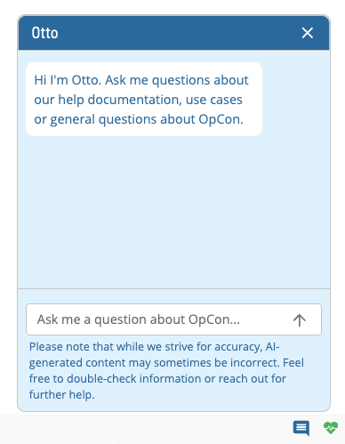
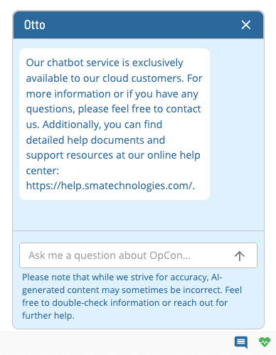
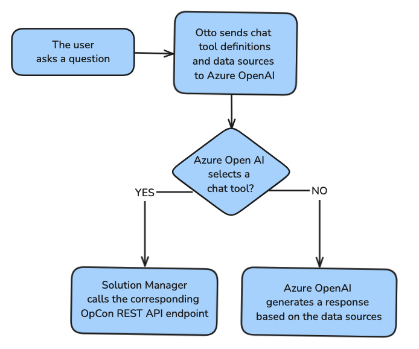

# Otto Chatbot Overview

Otto is the name of the AI chatbot that is available in Solution Manager. Otto can understand and respond to natural language questions. It is designed to help users answer questions about all things OpCon and help with executing specific skills. Otto is available at the bottom-right corner of the screen and can be accessed by clicking on the chat icon.

Otto is exclusively available to our cloud customers. Non-cloud customers will see the following chatbot:

## Data and Privacy

Otto uses Azure OpenAI Services. The Azure OpenAI Service is a cloud-based service that provides an API for generating human-like responses to text-based prompts. The service uses OpenAI's GPT-4o model to generate responses. The Azure OpenAI Service is fully controlled by Microsoft and is designed to provide a secure and private environment for generating responses to text-based prompts.

Your prompts (inputs) and completions (outputs):

- are NOT available to other customers.
- are NOT available to OpenAI.
- are NOT used to improve OpenAI models.
- are NOT used to improve any Microsoft or 3rd party products or services.
- are NOT used for automatically improving Azure OpenAI models for your use in your resource.
- are NOT used to fine-tune any models.

The Azure OpenAI Service is fully controlled by Microsoft; Microsoft hosts the OpenAI models in Microsoft’s Azure environment and the Service does NOT interact with any services operated by OpenAI (e.g. ChatGPT, or the OpenAI API). To reduce the risk of harmful use of the Azure OpenAI Service, the Azure OpenAI Service includes both content filtering and abuse monitoring features.

### Data Flow

The diagram below illustrates how your data is processed.

#### Chat Tool Definitions

Chat tool definitions are provided by the OpCon REST API. These definitions are used to provide context to the chatbot and to help the chatbot to determine if the user is asking a question about OpCon or if they would like to execute a skill.

#### Data Sources

The data sources used by the chatbot include OpCon help documentation. The chatbot uses the OpCon documentation to provide answers to questions about OpCon.

## Features

Otto has the following features:

- **Search**: Otto can search the OpCon documentation for answers to your questions.
- **Skills**: Otto can perform certain tasks in OpCon for you:
  - [Add a Daily Job](./Skills/Skill-Add-Daily-Job.md)
  - [Build a Schedule](./Skills/Skill-Build-Schedule.md)
  - [Delete a Daily Job](./Skills/Skill-Delete-Daily-Job.md)
  - [Get Failed Daily Jobs](./Skills/Skill-Get-Failed-Jobs.md)
  - [Get Failed Daily Schedules](./Skills/Skill-Get-Failed-Schedules.md)
  - [Perform a Fast Schedule Check](./Skills/Skill-Perform-A-Fast-Schedule-Check.md)
  - [Restart Failed Jobs](./Skills/Skill-Restart-Failed-Jobs.md)
  - [Update a Job Status](./Skills/Skill-Update-Job-Status.md)
  - [Update a Machine Status](./Skills/Skill-Update-Machine-Status.md)
  - [Update a Schedule Status](./Skills/Skill-Update-Schedule-Status.md)
