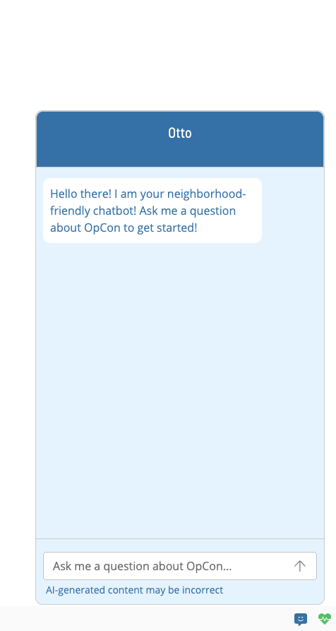

# Overview

Otto is the name of the AI chatbot that is available in Solution Manager. It is designed to help users answer questions about all things OpCon. Coming soon, Otto will be available in the bottom-right corner of the screen and can be accessed by clicking on the chat icon.

