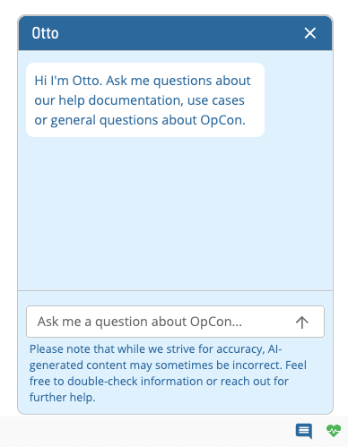
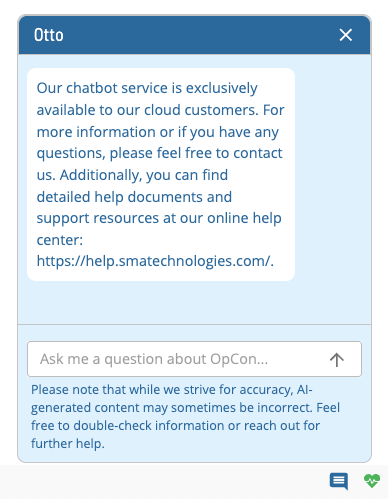
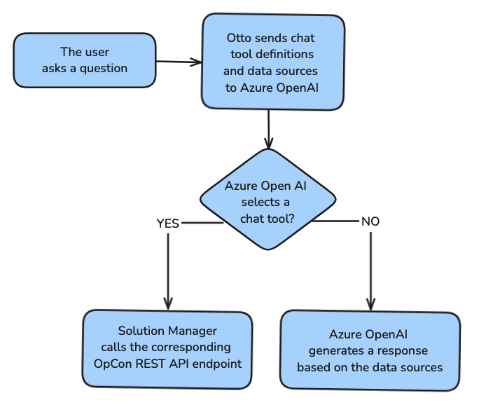

# Otto Chatbot Overview

**Theme:** Configure  
**Who Is It For?** System Administrator, Automation Engineer

## What Is It?

Otto is the AI chatbot available in Solution Manager. It understands and responds to natural language questions, helps users find answers about OpCon, and runs specific skills. Otto is available at the bottom-right corner of the screen via the chat icon.

Otto is exclusively available to cloud customers. Non-cloud customers will see the following chatbot:

## Data and Privacy

Otto uses Azure OpenAI Services, which uses OpenAI's GPT-4o model to generate responses. The service is fully controlled by Microsoft and provides a secure, private environment for processing prompts.

Your prompts (inputs) and completions (outputs):

- are NOT available to other customers
- are NOT available to OpenAI
- are NOT used to improve OpenAI models
- are NOT used to improve any Microsoft or 3rd party products or services
- are NOT used for automatically improving Azure OpenAI models for your use in your resource
- are NOT used to fine-tune any models

Microsoft hosts the OpenAI models in its Azure environment. The service does not interact with any services operated by OpenAI (e.g., ChatGPT or the OpenAI API). The Azure OpenAI Service includes content filtering and abuse monitoring to reduce the risk of harmful use.

### Data Flow

The diagram below illustrates how your data is processed.

#### Chat Tool Definitions

Chat tool definitions are provided by the OpCon REST API. They give the chatbot context to determine whether a user is asking a question about OpCon or requesting a skill.

#### Data Sources

The chatbot uses OpCon help documentation to answer questions about OpCon.

## Features

Otto has the following features:

- **Search**: Otto can search the OpCon documentation for answers to your questions
- **Skills**: Otto can perform certain tasks in OpCon for you:
  - [Add a Daily Job](./Skills/Skill-Add-Daily-Job.md)
  - [Build a Schedule](./Skills/Skill-Build-Schedule.md)
  - [Delete a Daily Job](./Skills/Skill-Delete-Daily-Job.md)
  - [Get Failed Daily Jobs](./Skills/Skill-Get-Failed-Jobs.md)
  - [Get Failed Daily Schedules](./Skills/Skill-Get-Failed-Schedules.md)
  - [Perform a Fast Schedule Check](./Skills/Skill-Perform-A-Fast-Schedule-Check.md)
  - [Restart Failed Jobs](./Skills/Skill-Restart-Failed-Jobs.md)
  - [Summarize Schedule Build](./Skills/Skill-Summarize-Schedule-Build.md)
  - [Retrieve Application Log](./Skills/Skill-Retrieve-Application-Log.md)
  - [Update a Job Status](./Skills/Skill-Update-Job-Status.md)
  - [Update a Machine Status](./Skills/Skill-Update-Machine-Status.md)
  - [Update a Schedule Status](./Skills/Skill-Update-Schedule-Status.md)
  - [Retrieve Job Output](./Skills/Skill-Retrieve-Job-Output.md)

## Configuration Options

| Setting | What It Does | Default | Notes |
|---|---|---|---|
| Skills | Otto can perform certain tasks in OpCon for you: | — | — |
## FAQs

**Q: What does Otto Chatbot Overview cover?**

This page covers Data and Privacy, Features.

## Glossary

**Solution Manager**: OpCon's browser-based graphical user interface for managing automation data, performing operational actions, and administering the system.

**Resource**: A numeric variable in OpCon representing a finite pool. Jobs can be configured to require a set number of resource units to run, limiting concurrent executions and preventing resource contention.

**Machine**: A platform defined in the OpCon database that has an agent installed. OpCon routes job execution requests to machines via SMANetCom, and machines report job completion status back to SAM.

**Schedule**: A named container for jobs in OpCon, built for a specific date to create that day's automation. Schedules define build settings, frequencies, and the jobs that run within them.

**Job**: The fundamental unit of work in OpCon. A job defines what to run, on which machine, when to start, and what conditions must be met. Job results are tracked and can trigger events and notifications.

**OpCon**: Continuous' workflow automation platform. The OpCon server includes the database, SAM and Supporting Services (SAM-SS), and graphical user interfaces. agents installed on target platforms run jobs and report results.
