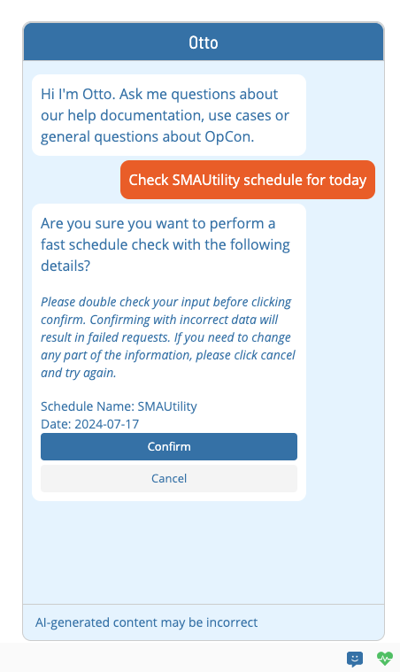

# Overview

**Theme:** Overview  
**Who Is It For?** System Administrator, Automation Engineer

## What Is It?

Skills perform specific tasks in OpCon directly via the Otto chatbot, without navigating through the OpCon UI. Each skill maps to a specific API endpoint in OpCon and is defined in the OpCon API documentation.

## Accessing Skills

to run a skill, ask Otto to perform the task. If the skill is available and enabled, Otto responds with a confirmation message before running. If the skill is unavailable or fails, Otto responds with an error message.

## FAQs

**Q: What does Overview cover?**

This page covers Accessing Skills.

## Glossary

**Resource**: A numeric variable in OpCon representing a finite pool. Jobs can be configured to require a set number of resource units to run, limiting concurrent executions and preventing resource contention.

**OpCon**: Continuous' workflow automation platform. The OpCon server includes the database, SAM and Supporting Services (SAM-SS), and graphical user interfaces. agents installed on target platforms run jobs and report results.
