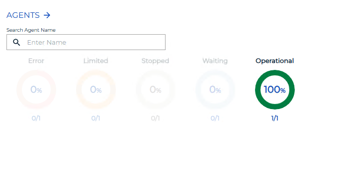
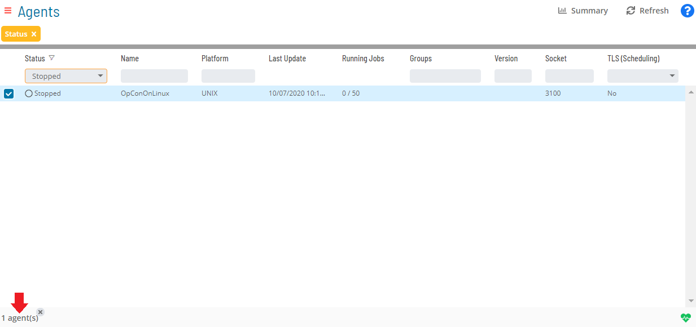
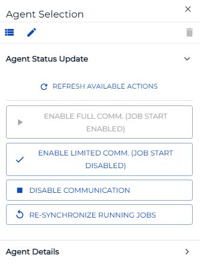

# Performing Agent Status Updates

**Theme:** Configure  
**Who Is It For?** System Administrator, Automation Engineer

## What Is It?

The **Operations** module allows you to perform Agent status updates.

To perform agent status updates:

Select one of the five operation dials (Error, Limited, Stopped, Waiting, or Operational) or use the **Quick Search** field in the **Agents** section on the **Operations Summary** page.

The **Agents** page will display.

*(Optional)* Use the **Filter Bar** to filter the list of Agent machines.

:::note
As an [alternative filtering option](Managing-Daily-Processes.md#Interactive), you can use the interactive color-coded **Statistics Bar** above the list to filter by status.
:::

:::note
Select a column heading to sort ascending (arrow pointing down) or descending (arrow pointing up).
:::

Select any **Agent(s)** in the list. Your selections display in the [status bar](SM-UI-Layout.md#Status) at the bottom of the page as a breadcrumb trail.

Select the Agent record in the status bar to display the **Action** panel.

:::note
As an alternative, you can right-click any selected Agent machine to display the **Action** panel.
:::

*(Optional)* Select the **Refresh available actions** button to verify which status update actions are available for the current selection. This is helpful when more than one Agent is selected, since all status update buttons are enabled by default.

Select one of the following actions (if enabled):

- **Enable Full Communication (Job Start Enabled)**: Allows the Agent to send job execution results to OpCon and OpCon to send job start/execution requests to the Agent
- **Enable Limited Communication (Job Start Disabled)**: Prevents OpCon from sending new job start/execution requests to the Agent. Completion status of tasks already running on the Agent is still reported to OpCon
- **Disable Communication**: Disables all communication between the Agent and OpCon in both directions

*(Optional)* When a single Agent is selected, the **View Active Jobs** button navigates to the **Processes** page filtered to show jobs in a Waiting, Held, or Running status for that machine.

Close the **Action** panel when done.

.png "More Info icon")
Related Topics

- [Performing Schedule Status Changes](Performing-Schedule-Status-Changes.md)
- [Performing Job Status Changes](Performing-Job-Status-Changes.md)
- [Performing Bulk Status Job Updates (Schedule Level)](Performing-Bulk-Job-Status-Updates-Schedule-Level.md)
- [Viewing Job Output](Viewing-Job-Output.md)
- [Viewing Job Configuration](Viewing-Job-Configuration.md)
- [Using PERT View](Using-PERT-View.md)
- [Managing Daily Processes](Managing-Daily-Processes.md)

## When Would You Use It?

- A Agent Status Updates action needs to be carried out in Solution Manager

## Why Would You Use It?

- **Ensure consistent operations**: Performing Agent Status Updates actions through OpCon creates a centralized, auditable record of all operational changes

## Configuration Options

| Setting | What It Does | Default | Notes |
|---|---|---|---|
| Enable Full Communication (Job Start Enabled) | Allows the Agent to send job execution results to OpCon and OpCon to send job start/execution requests to the Agent | — | — |
| Enable Limited Communication (Job Start Disabled) | Prevents OpCon from sending new job start/execution requests to the Agent. | — | — |
| Disable Communication | Disables all communication between the Agent and OpCon in both directions | — | — |
## FAQs

**Q: What are the three communication states available for an Agent?**

Full Communication allows the Agent to send and receive job execution data in both directions. Limited Communication prevents new job starts but still reports completion of already-running jobs. Disable Communication stops all communication between the Agent and OpCon in both directions.

**Q: How do you access the Action panel for an Agent status update?**

Select an Agent from the list, then select the Agent record in the status bar at the bottom of the page. Alternatively, right-click any selected Agent machine to display the Action panel.

**Q: What does the Refresh available actions button do when updating Agent status?**

It verifies which status update actions are currently valid for the selected Agent(s). This is especially useful when multiple Agents are selected, since all buttons are enabled by default regardless of actual availability.

## Glossary

**Resource**: A numeric variable in OpCon representing a finite pool. Jobs can be configured to require a set number of resource units to run, limiting concurrent executions and preventing resource contention.

**Machine**: A platform defined in the OpCon database that has an agent installed. OpCon routes job execution requests to machines via SMANetCom, and machines report job completion status back to SAM.

**Schedule**: A named container for jobs in OpCon, built for a specific date to create that day's automation. Schedules define build settings, frequencies, and the jobs that run within them.

**Job**: The fundamental unit of work in OpCon. A job defines what to run, on which machine, when to start, and what conditions must be met. Job results are tracked and can trigger events and notifications.

**OpCon**: Continuous' workflow automation platform. The OpCon server includes the database, SAM and Supporting Services (SAM-SS), and graphical user interfaces. agents installed on target platforms run jobs and report results.
