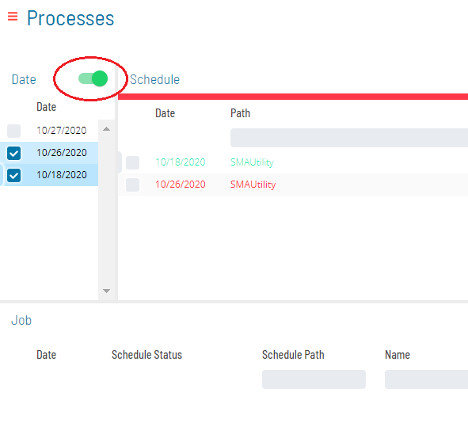
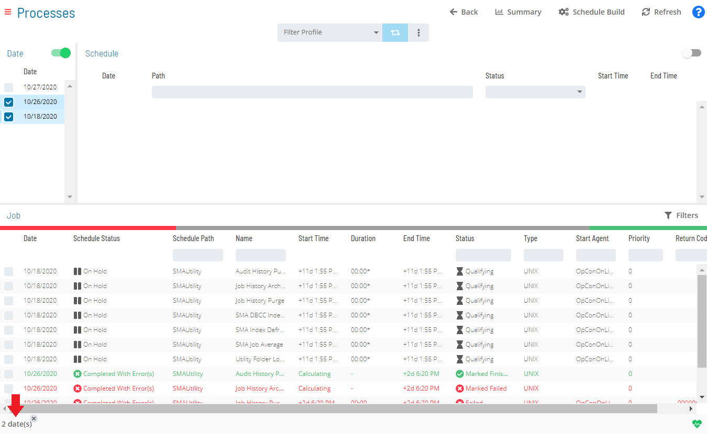
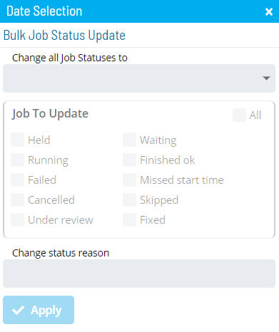

# Performing Bulk Job Status Updates (Date Level)

**Theme:** Configure  
**Who Is It For?** System Administrator, Automation Engineer

## What Is It?

The **Operations** module allows you to perform mass job status updates at the date level.

To perform bulk job status updates:

Select the **Processes** button at the top-right of the **Operations Summary** page.

Ensure the **Date** toggle switch is enabled (appears green) to allow date selection.

Select the desired **date(s)** in the list. Your selections display in the [status bar](SM-UI-Layout.md#Status) at the bottom of the page as a breadcrumb trail.

Select the date record in the status bar to display the **Selection** panel with the **Bulk Job Status Update** tab in focus.

:::note
As an alternative, you can right-click any selected date to display the **Selection** panel.
:::

Select one of the following options from the **Change all Job Statuses to** list:

- **Cancel**: Cancels all jobs for the selected date(s). Dependent jobs do not have those dependencies met
- **Hold**: Suspends processing of all jobs for the selected date(s)
- **Mark Failed**: Marks all jobs for the selected date(s) as Failed
- **Mark Finished OK**: Marks all jobs for the selected date(s) as Finished OK
- **Mark Fixed**: Marks all jobs for the selected date(s) as Fixed
- **Mark Under Review**: Marks all jobs for the selected date(s) as Under Review
- **Release**: Places all held jobs back into a Qualifying state. Jobs start as soon as all dependencies are met
- **Restart**: Places all jobs back in a Qualifying state. Jobs start as soon as all dependencies are met
- **Restart on Hold**: Places all jobs in an On Hold state on restart
- **Skip**: Places all jobs in a Job to be Skipped state until they qualify to start. When jobs qualify, they are skipped and dependencies of subsequent jobs are met

For Container jobs, **Restart** offers additional options:

- **Restart**: Restarts the Container job and its subschedule jobs one level deep. Nested Container jobs are not affected
- **Rebuild**: Restarts the Container job and deletes the associated subschedule. SAM rebuilds the subschedule and restarts all its jobs
- **None**: Restarts the Container job only; the subschedule is untouched. The Container job closes immediately

Keep the following scenarios in mind for bulk Restart operations on Container jobs:

**Scenario 1**: Single date, single Container job — select **Restart** from the list, then:

a. Select the **option(es)** in the **Job To Update** frame for the job status(es) to change.
b. Select **Restart**, **Rebuild**, or **None**.
c. Enter or select the change status reason and select **Apply**.

**Scenario 2**: Single date, multiple Container jobs — select **Restart** from the list, then select the **option(es)** in the **Job To Update** frame and follow either option:

- (Option 1) Select **Restart**, **Rebuild**, or **None** in the **Job Containers Action** frame to apply that action to all Container jobs for the date
- (Option 2) Select **Custom** in the **Job Containers Action** frame to assign an action to each Container job individually

Enter or select the change status reason and select **Apply**.

**Scenario 3**: Multiple dates, multiple Container jobs — follow steps a–c of Scenario 2. Selecting **Custom** displays each date with its associated Container jobs.

:::note
To hide Container jobs in the **Job Containers Action** frame, select any of the other three Job Container Actions (Restart, Rebuild, or None).
:::

:::note
For more on job status changes, refer to [Schedule and Job Status Change Commands](../../../operations/status-change-commands.md) in the **Concepts** online help.
:::

Select the **option(es)** for the job status(es) that will undergo the status change. Selections in the **Jobs To Update** frame serve as a status filter.

:::note
For more on job statuses and allowed changes, refer to [Schedule and Job Status Descriptions and Allowed Status Changes](../../../operations/status-descriptions.md) in the **Concepts** online help.
:::

*(Optional)* Enter or select a change status reason.

:::note
Depending on application configuration, the **Change Status Reason** list may store previously entered reasons.
:::

Select **Apply** to apply the job status change.

Close the **Selection** panel when done.

.png "More Info icon")
Related Topics

- [Performing Schedule Status Changes](Performing-Schedule-Status-Changes.md)
- [Performing Job Status Changes](Performing-Job-Status-Changes.md)
- [Performing Agent Status Updates](Performing-Agent-Status-Updates.md)
- [Viewing Job Output](Viewing-Job-Output.md)
- [Viewing Job Configuration](Viewing-Job-Configuration.md)
- [Using PERT View](Using-PERT-View.md)
- [Managing Daily Processes](Managing-Daily-Processes.md)

## When Would You Use It?

- A Bulk Job Status Updates (Date Level) action needs to be carried out in Solution Manager

## Why Would You Use It?

- **Ensure consistent operations**: Performing Bulk Job Status Updates (Date Level) actions through OpCon creates a centralized, auditable record of all operational changes

## Configuration Options

| Setting | What It Does | Default | Notes |
|---|---|---|---|
| Hold | Suspends processing of all jobs for the selected date(s) | — | — |
| Mark Failed | Marks all jobs for the selected date(s) as Failed | — | — |
| Mark Finished OK | Marks all jobs for the selected date(s) as Finished OK | — | — |
| Mark Fixed | Marks all jobs for the selected date(s) as Fixed | — | — |
| Mark Under Review | Marks all jobs for the selected date(s) as Under Review | — | — |
| Release | Places all held jobs back into a Qualifying state. | — | — |
| Restart | Places all jobs back in a Qualifying state. | — | — |
| Restart on Hold | Places all jobs in an On Hold state on restart | — | — |
| None | Restarts the Container job only; the subschedule is untouched. | — | — |
| Scenario 1 | Single date, single Container job — select **Restart** from the list, then: | — | — |
| Scenario 2 | Single date, multiple Container jobs — select **Restart** from the list, then select the **option(es)** in the **Job To Update** frame and follow ei... | — | — |
| Scenario 3 | Multiple dates, multiple Container jobs — follow steps a–c of Scenario 2. | — | — |
## FAQs

**Q: What is the difference between Restart and Rebuild for Container jobs in a bulk date-level update?**

Restart restarts the Container job and its subschedule jobs one level deep, leaving nested Container jobs unaffected. Rebuild restarts the Container job and deletes the associated subschedule entirely — SAM rebuilds the subschedule and restarts all its jobs from scratch.

**Q: What does the Jobs To Update option selection do during a bulk status update?**

Selections in the Jobs To Update frame act as a status filter, limiting the bulk action to only jobs currently in the selected status(es). This prevents unintended changes to jobs in other states.

**Q: How do you apply different Container job restart actions to individual jobs when multiple Container jobs exist on a single date?**

Select Custom in the Job Containers Action frame. This allows you to assign a separate action — Restart, Rebuild, or None — to each Container job individually rather than applying the same action to all.

## Glossary

**SAM (Schedule Activity Monitor)**: The logical processor for OpCon workflow automation. SAM monitors schedule and job start times, dependencies, and user commands to determine job execution timing, and processes OpCon events.

**Subschedule**: A schedule that runs as a child process within a Container job, allowing hierarchical, nested workflow automation where a parent schedule can trigger and monitor an entire child schedule.

**Container Job**: A job type that runs a subschedule. Container jobs enable hierarchical schedule structures and support properties and events just like standard jobs.

**Resource**: A numeric variable in OpCon representing a finite pool. Jobs can be configured to require a set number of resource units to run, limiting concurrent executions and preventing resource contention.

**Schedule**: A named container for jobs in OpCon, built for a specific date to create that day's automation. Schedules define build settings, frequencies, and the jobs that run within them.

**Job**: The fundamental unit of work in OpCon. A job defines what to run, on which machine, when to start, and what conditions must be met. Job results are tracked and can trigger events and notifications.
