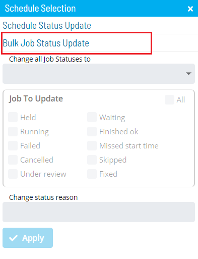

# Performing Bulk Job Status Updates (Schedule Level)

**Theme:** Configure  
**Who Is It For?** System Administrator, Automation Engineer

## What Is It?

The **Operations** module supports mass job status updates at the schedule level.

To perform bulk job status updates:

Select one of the five operation dials (Failed, Blocked, Waiting, Running, or Completed) or use the **Quick Search** field in the **Schedules** section on the **Operations Summary** page.

The **Processes** page will display.

Ensure that both the **Date** and **Schedule** toggle switches are enabled so you can make date and schedule selections. Each switch appears green when enabled.

Select the desired **date(s)** and **schedule(s)** in each respective list. Your selections appear in the [status bar](SM-UI-Layout.md#Status) at the bottom of the page as a breadcrumb trail.

:::note
Use the **Filter Bar** above the schedule list to filter by keyword. Select a column heading to sort ascending; select it again to sort descending.
:::

Select the schedule record (e.g., 3 schedule(s)) in the status bar to display the **Selection** panel.

:::note
As an alternative, right-click any selected schedule to display the **Selection** panel.
:::

Select the **Bulk Job Status Update** accordion-style tab in the panel.

Select one of the following options in the **Change all Job Statuses to** list:

- **Cancel**: Cancels all jobs for the selected schedule(s) based on a filter. Dependent jobs do not have those dependencies met
- **Hold**: Suspends processing of all jobs for the selected schedule(s) based on a filter
- **Mark Failed**: Marks all jobs on the selected schedule(s) as Failed based on a filter
- **Mark Finished OK**: Marks all jobs on the selected schedule(s) as Finished OK based on a filter
- **Mark Under Review**: Marks all jobs on the selected schedule(s) as Under Review based on a filter
- **Mark Fixed**: Marks all jobs on the selected schedule(s) as Fixed based on a filter
- **Release**: Places all held jobs on the selected schedule(s) back into a Qualifying state based on a filter. Jobs start as soon as all dependencies are met
- **Restart**: Places all jobs on the selected schedule(s) back in a Qualifying state based on a filter. Jobs start as soon as all dependencies are met
- **Restart on Hold**: Places all jobs on the selected schedule(s) in an On Hold state on restart, based on a filter
- **Skip**: Places all jobs on the selected schedule(s) in a Job to be Skipped state until they qualify to start. When jobs qualify, they are skipped and dependencies of subsequent jobs are met

:::note
For more on job status changes, refer to [Schedule and Job Status Change Commands](../../../operations/status-change-commands.md) in the **Concepts** online help.
:::

Select the **option(es)** for the current job status(es) that will undergo the status change. Any selection in the **Jobs To Update** frame serves as a status filter.

:::note
For more on job statuses and allowed changes, refer to [Schedule and Job Status Descriptions and Allowed Status Changes](../../../operations/status-descriptions.md) in the **Concepts** online help.
:::

*(Optional)* Enter or select a change status reason.

:::note
Depending on application configuration, the **Change Status Reason** list may store previous reasons entered for job or schedule status updates.
:::

Select **Apply** to apply the job status change.

Close the **Selection** panel when done.

.png "More Info icon")
Related Topics

- [Performing Schedule Status Changes](Performing-Schedule-Status-Changes.md)
- [Performing Job Status Changes](Performing-Job-Status-Changes.md)
- [Performing Agent Status Updates](Performing-Agent-Status-Updates.md)
- [Viewing Job Output](Viewing-Job-Output.md)
- [Viewing Job Configuration](Viewing-Job-Configuration.md)
- [Using PERT View](Using-PERT-View.md)
- [Managing Daily Processes](Managing-Daily-Processes.md)

## When Would You Use It?

- A Bulk Job Status Updates (Schedule Level) action needs to be carried out in Solution Manager

## Why Would You Use It?

- **Ensure consistent operations**: Performing Bulk Job Status Updates (Schedule Level) actions through OpCon creates a centralized, auditable record of all operational changes

## Configuration Options

| Setting | What It Does | Default | Notes |
|---|---|---|---|
| Hold | Suspends processing of all jobs for the selected schedule(s) based on a filter | — | — |
| Mark Failed | Marks all jobs on the selected schedule(s) as Failed based on a filter | — | — |
| Mark Finished OK | Marks all jobs on the selected schedule(s) as Finished OK based on a filter | — | — |
| Mark Under Review | Marks all jobs on the selected schedule(s) as Under Review based on a filter | — | — |
| Mark Fixed | Marks all jobs on the selected schedule(s) as Fixed based on a filter | — | — |
| Release | Places all held jobs on the selected schedule(s) back into a Qualifying state based on a filter. | — | — |
| Restart | Places all jobs on the selected schedule(s) back in a Qualifying state based on a filter. | — | — |
| Restart on Hold | Places all jobs on the selected schedule(s) in an On Hold state on restart, based on a filter | — | — |
## FAQs

**Q: What does the Jobs To Update selection do in a schedule-level bulk update?**

Selections in the Jobs To Update frame act as a status filter, so only jobs currently in the selected status(es) are affected by the bulk action. Jobs in other statuses are left unchanged.

**Q: What is the difference between Restart and Restart on Hold in a bulk schedule-level update?**

Restart places all matching jobs back in a Qualifying state so they start as soon as dependencies are met. Restart on Hold places those same jobs in an On Hold state on restart, requiring a manual release before they can proceed.

**Q: How do you start a bulk job status update at the schedule level?**

Enable both the Date and Schedule toggle switches on the Processes page, select the desired date(s) and schedule(s), then select the schedule record in the status bar and open the Bulk Job Status Update tab.

## Glossary

**Resource**: A numeric variable in OpCon representing a finite pool. Jobs can be configured to require a set number of resource units to run, limiting concurrent executions and preventing resource contention.

**Schedule**: A named container for jobs in OpCon, built for a specific date to create that day's automation. Schedules define build settings, frequencies, and the jobs that run within them.

**Job**: The fundamental unit of work in OpCon. A job defines what to run, on which machine, when to start, and what conditions must be met. Job results are tracked and can trigger events and notifications.
