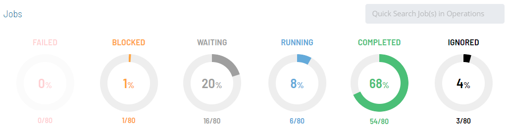
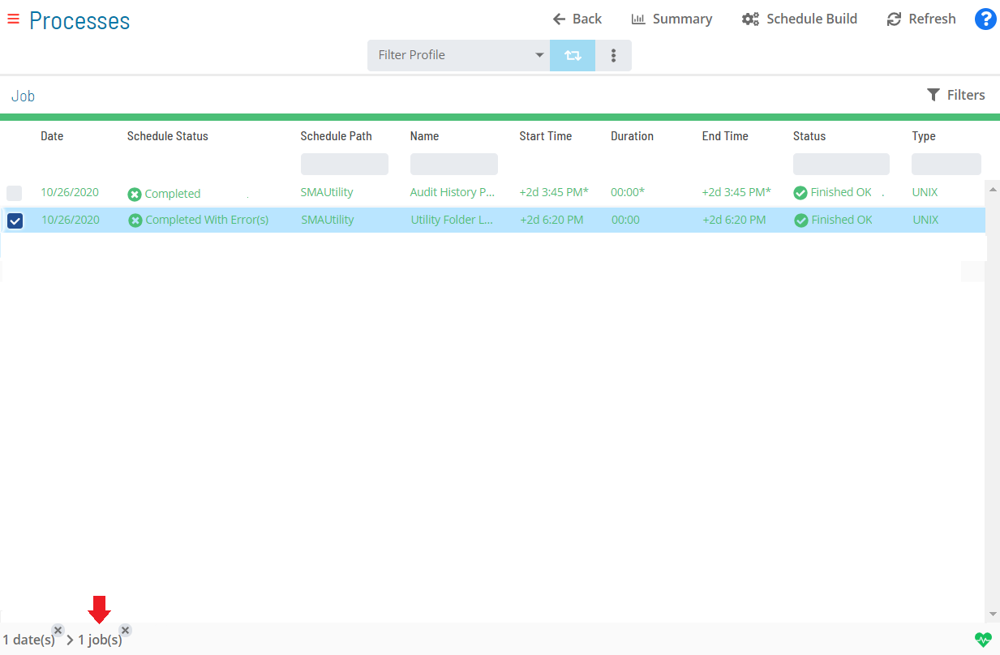
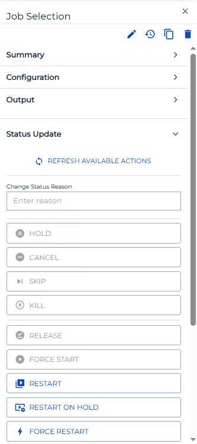

# Performing Job Status Changes

**Theme:** Configure  
**Who Is It For?** System Administrator, Automation Engineer

## What Is It?

The **Operations** module allows you to perform job status changes using a few simple steps.

To perform job status changes:

Select one of the six operation dials (Failed, Blocked, Waiting, Running, Completed, or Ignored) or use the **Quick Search** field in the **Jobs** section on the **Operations Summary** page.

:::note
The "Ignored" operation dial groups any job with a job status of Cancelled or Skipped.
:::

The **Processes** page will display.

*(Optional)* Filter and/or sort the list of jobs displayed.

Filtering:

a.  For [quick filtering](Managing-Daily-Processes.md#Quick), use the **Filter Bar** above the job list. Type the keyword in the appropriate field and press **Enter**.
b.  For [alternative filtering](Managing-Daily-Processes.md#Interactive), use the interactive color-coded **Statistics Bar** above the job list to filter by status. Select any color to filter by that job status.
c.  For [in-depth filtering](Managing-Daily-Processes.md#In-depth), select the  button to display the **Filter** panel, then filter by job status, tag, department, or access code. The button turns dark yellow and shows the number of active filters (). Select **x** at the top-right corner to remove all filters at once.

Sorting:

Select a column heading to sort ascending (small arrow pointing down); select it again to sort descending (small arrow pointing up).

Select any **job(s)** in the list. Your selections appear in the [status bar](SM-UI-Layout.md#Status) at the bottom of the page as a breadcrumb trail.

Select the job record (e.g., 1 job(s)) in the status bar to display the **Selection** panel.

:::note
As an alternative, right-click any selected job to display the **Selection** panel.
:::

Select the **Job Status Update** accordion-style tab in the panel.

*(Optional)* Select **Refresh available actions** to verify which status update actions are available for the current selection. This is helpful when more than one job is selected, since all status update buttons are enabled by default.

*(Optional)* Enter or select a change status reason.

:::note
Depending on application configuration, the **Change Status Reason** list may store previous reasons entered for job or schedule status updates.
:::

Select one of the following status updates to apply to the selected job(s):

- **Hold**: Places the selected job(s) on hold
- **Cancel**: Cancels the selected job(s). The job does not process unless manually started by a user or an event
- **Skip**: Places the selected job(s) in a Job to be Skipped state until they qualify to start. When jobs qualify, they are skipped and dependencies of all subsequent jobs are met
- **Kill**: Sends a request to abort one or more jobs on an Agent machine. If successful, the application reports the job as Failed. If unsuccessful, the job continues to show a Running status
- **Release**: Releases the selected job(s) from a Held state
- **Force Start**: Forces the selected job(s) to start immediately, ignoring all dependencies
- **Restart**: Places the selected job(s) back in a Qualifying state. All dependencies must be met before jobs are submitted
- **Restart on Hold**: Places the selected job(s) back in a Qualifying state; jobs process when all dependencies are met
- **Force Restart**: Force restarts the selected job(s), ignoring start time and all dependencies. Jobs restart as soon as a machine is available
- **Restart On Step**: Restarts a job at a selected step. Available only if the job type supports this feature and the Agent returned an available list of steps during runtime
- **Mark Finished OK**: Changes the selected job(s) to Finished OK regardless of current status. All events are processed as if the job(s) finished normally. If marked before starting, both start and finish times in history equal the time of marking
- **Mark Failed**: Changes the selected job(s) to Failed regardless of current status. All events are processed as if the job(s) failed without intervention. If marked before starting, both start and finish times in history equal the time of marking
- **Mark Under Review**: Changes the selected job(s) to Under Review when in a Failed, Marked Failed, or Initialization Error state
- **Mark Fixed**: Changes the selected job(s) to Fixed when in a Failed, Marked Failed, Initialization Error, or Under Review state

:::note
For more on job status changes, refer to [Schedule and Job Status Change Commands](../../../operations/status-change-commands.md) in the **Concepts** online help.
:::

Close the **Selection** panel when done.

.png "More Info icon")
Related Topics

- [Performing Schedule Status Changes](Performing-Schedule-Status-Changes.md)
- [Performing Bulk Status Job Updates (Schedule Level)](Performing-Bulk-Job-Status-Updates-Schedule-Level.md)
- [Performing Bulk Status Job Updates (Date Level)](Performing-Bulk-Job-Status-Updates-Date-Level.md)
- [Performing Agent Status Updates](Performing-Agent-Status-Updates.md)
- [Viewing Job Output](Viewing-Job-Output.md)
- [Viewing Job Configuration](Viewing-Job-Configuration.md)
- [Using PERT View](Using-PERT-View.md)
- [Managing Daily Processes](Managing-Daily-Processes.md)

## Configuration Options

| Setting | What It Does | Default | Notes |
|---|---|---|---|
| Hold | Places the selected job(s) on hold | — | — |
| Kill | Sends a request to abort one or more jobs on an Agent machine. | — | — |
| Release | Releases the selected job(s) from a Held state | — | — |
| Force Start | Forces the selected job(s) to start immediately, ignoring all dependencies | — | — |
| Restart | Places the selected job(s) back in a Qualifying state. | — | — |
| Restart on Hold | Places the selected job(s) back in a Qualifying state; jobs process when all dependencies are met | — | — |
| Force Restart | Force restarts the selected job(s), ignoring start time and all dependencies. | — | — |
| Restart On Step | Restarts a job at a selected step. | — | — |
| Mark Finished OK | Changes the selected job(s) to Finished OK regardless of current status. | — | — |
| Mark Failed | Changes the selected job(s) to Failed regardless of current status. | — | — |
| Mark Under Review | Changes the selected job(s) to Under Review when in a Failed, Marked Failed, or Initialization Error state | — | — |
| Mark Fixed | Changes the selected job(s) to Fixed when in a Failed, Marked Failed, Initialization Error, or Under Review state | — | — |
## FAQs

**Q: What does the Kill action do when applied to a running job?**

Kill sends a request to abort the job on the Agent machine. If successful, the job is reported as Failed. If unsuccessful, the job continues to show a Running status.

**Q: What is the difference between Restart and Force Restart?**

Restart places the job back in a Qualifying state and requires all dependencies to be met before the job starts. Force Restart ignores start time and all dependencies, restarting the job as soon as a machine is available.

**Q: What does the Ignored operation dial display on the Operations Summary page?**

The Ignored dial groups any job with a status of Cancelled or Skipped, providing a single view of all jobs that were intentionally bypassed during processing.

## Glossary

**Access Code**: A security label applied to jobs and schedules in OpCon. Users must have the matching access code privilege to view or manage items with that label.

**Department**: An organizational grouping in OpCon used to assign jobs to logical divisions. User roles can be scoped to specific departments, controlling which jobs a user can manage.

**Resource**: A numeric variable in OpCon representing a finite pool. Jobs can be configured to require a set number of resource units to run, limiting concurrent executions and preventing resource contention.

**Machine**: A platform defined in the OpCon database that has an agent installed. OpCon routes job execution requests to machines via SMANetCom, and machines report job completion status back to SAM.

**Schedule**: A named container for jobs in OpCon, built for a specific date to create that day's automation. Schedules define build settings, frequencies, and the jobs that run within them.

**Job**: The fundamental unit of work in OpCon. A job defines what to run, on which machine, when to start, and what conditions must be met. Job results are tracked and can trigger events and notifications.
