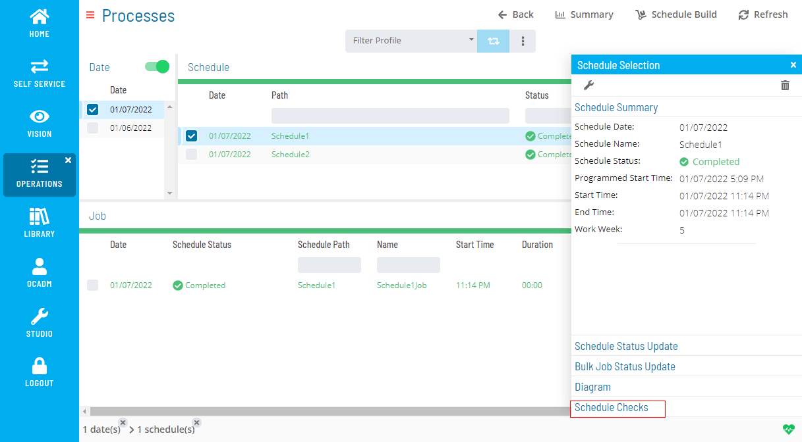
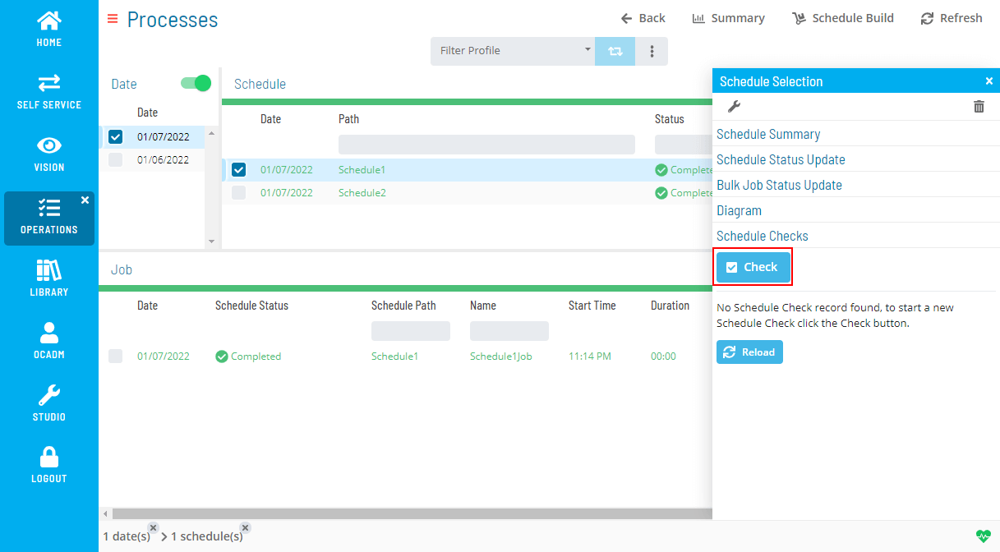
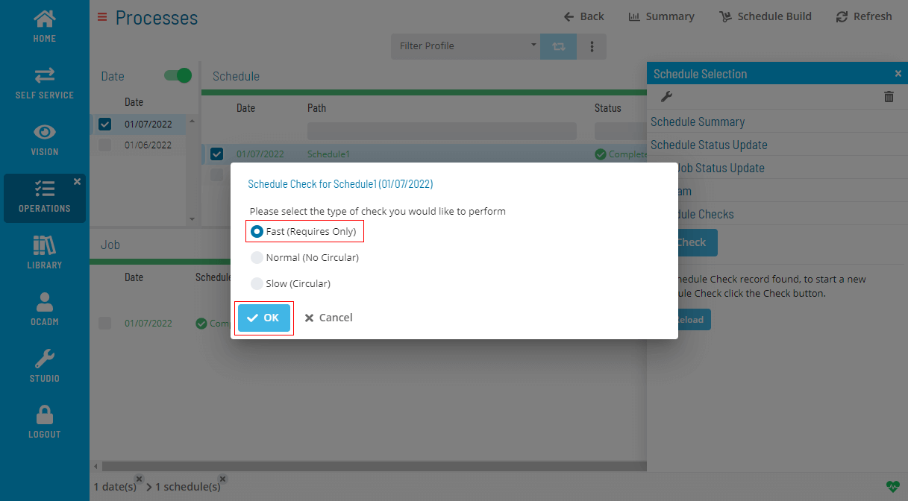
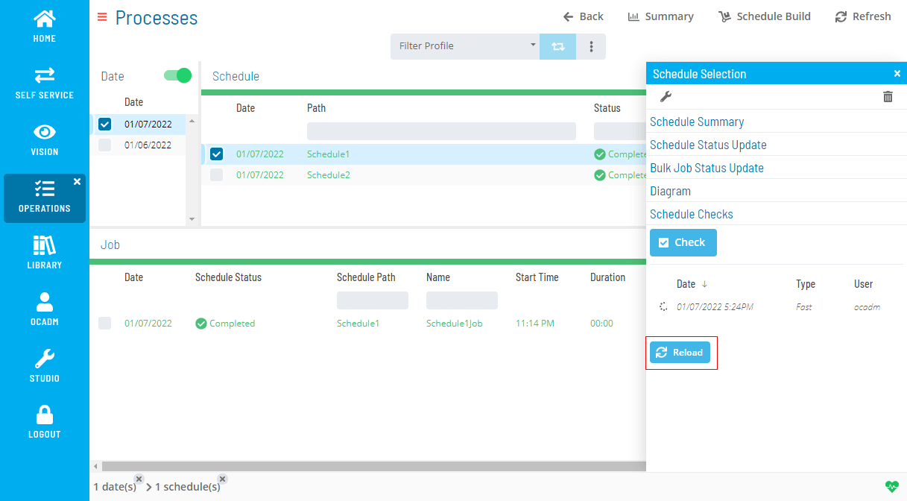
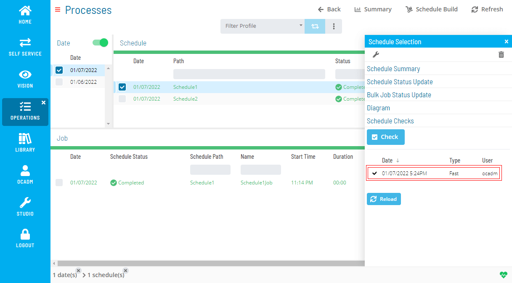
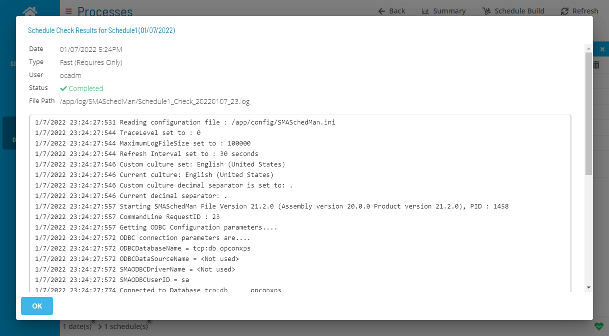

# Performing Schedule Checks

The **Operations** module allows you to perform schedule checks using a few simple steps.

To perform schedule check:

1. Right-click on Date or a Schedule record

2. On the right-side panel click the **Schedule Check** section

   

3. Click the **Check** button to open a Schedule Check dialog

   

4. Select a type of check you want to perform and click OK

   
:::note
Please be aware that the Slow (Circular) option activates a very intensive process to check for circular dependencies and depending on the number of jobs, schedules, and schedule dates to be checked, this process may take hours.
:::

5. You will see a list of Schedule Checks inside the Schedule Check section on the right-side panel. You can click **Reload** button to refresh the status of Schedule Checks

   

6. After the Schedule Check is completed, the processing icon will change to **✓**

   

7. Double click the **Schedule Check** to see the Schedule Check details

   

.png "More Info icon")
Related Topics

- [Deleting Schedules and Jobs](Deleting-Schedules-and-Jobs.md)
- [Adding Jobs to Daily Schedules](Adding-Jobs-to-Daily-Schedules.md)