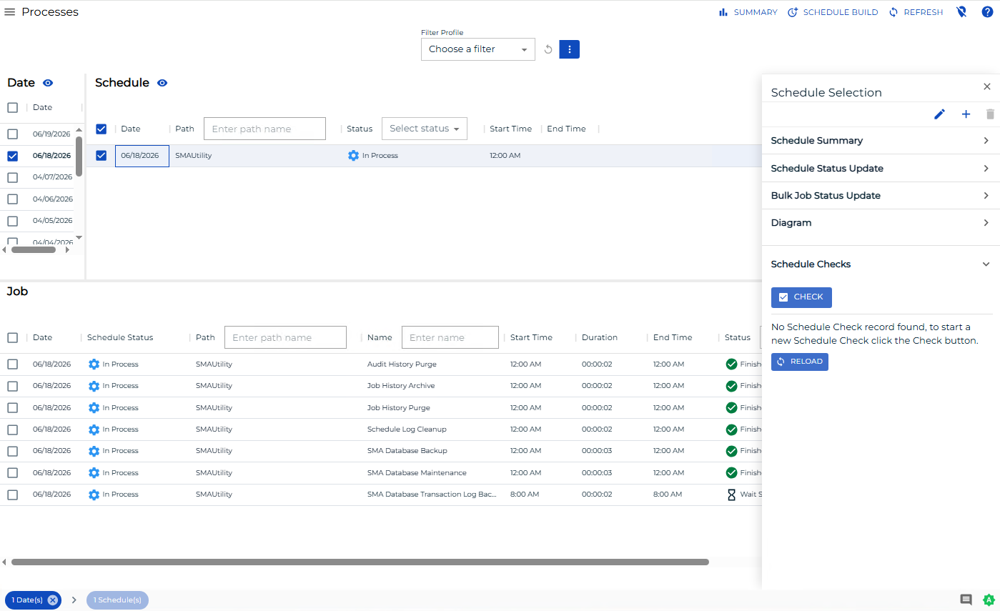
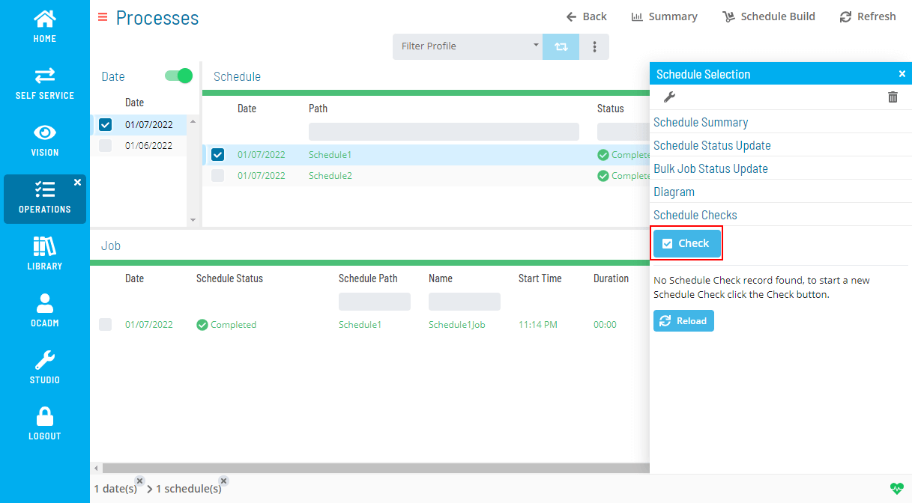
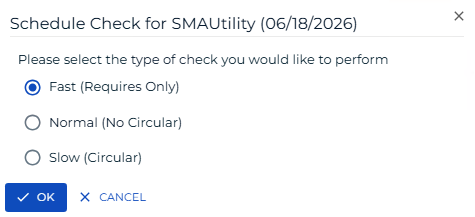
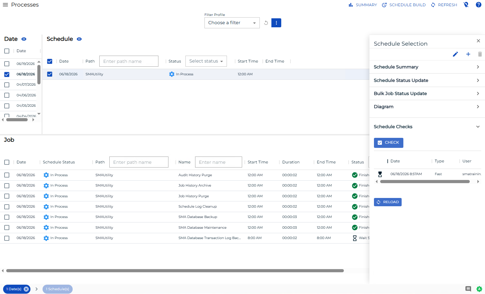
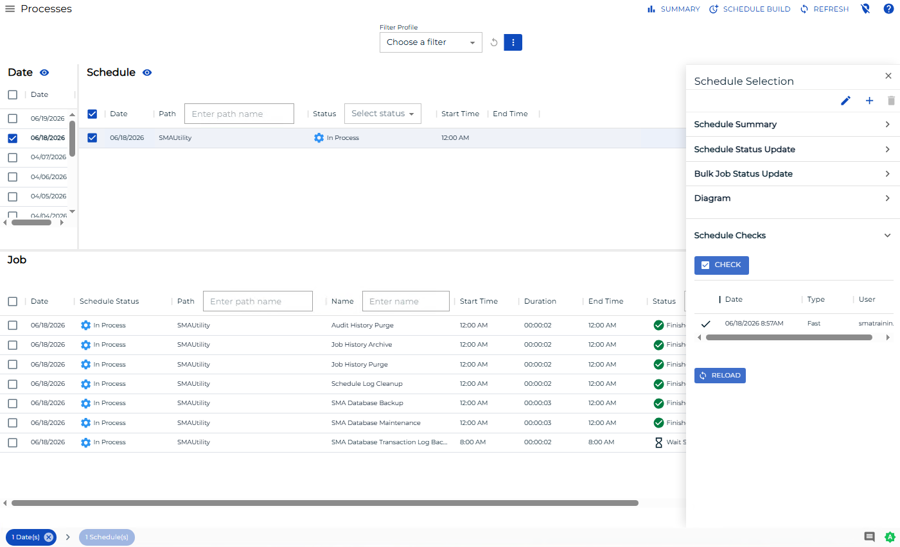
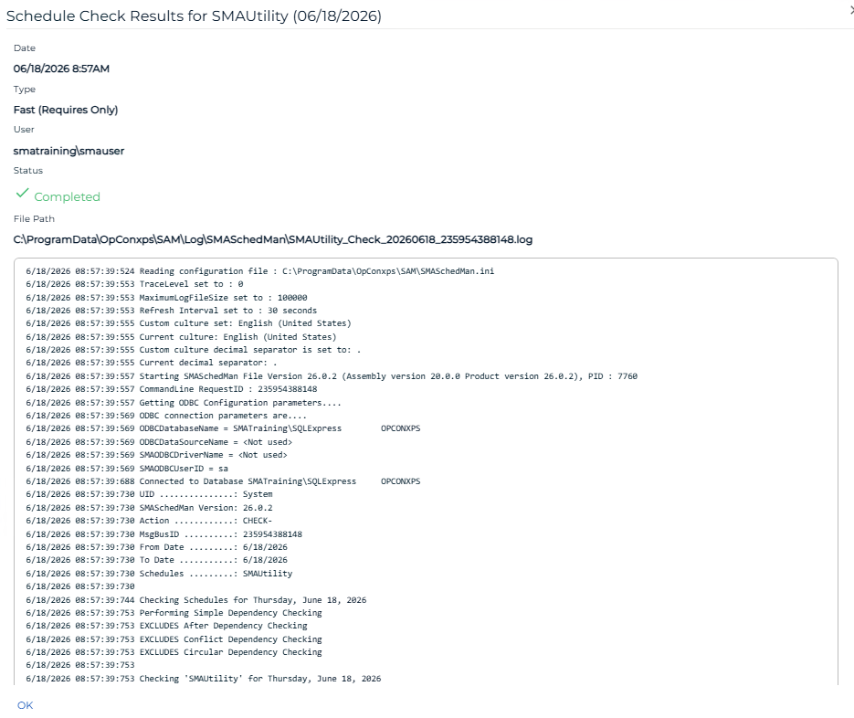

# Performing Schedule Checks

**Theme:** Configure  
**Who Is It For?** System Administrator, Automation Engineer

## What Is It?

The **Operations** module allows you to perform schedule checks using a few simple steps.

To perform schedule check, complete the following steps:

1. Right-click on Date or a Schedule record

2. On the right-side panel, select the **Schedule Check** section

   

3. Select the **Check** button to open a Schedule Check dialog

   

4. Select a type of check and select **OK**

   

:::note
The Slow (Circular) option runs an intensive circular dependency check. Depending on the number of jobs, schedules, and schedule dates, this process may take hours.
:::

5. A list of Schedule Checks appears in the Schedule Check section on the right-side panel. Select **Reload** to refresh the status

   

6. When the Schedule Check is complete, the processing icon changes to **✓**

   

7. Select the **Schedule Check** to view its details

   

.png "More Info icon")
Related Topics

- [Deleting Schedules and Jobs](Deleting-Schedules-and-Jobs.md)
- [Adding Jobs to Daily Schedules](Adding-Jobs-to-Daily-Schedules.md)

## When Would You Use It?

- A Schedule Checks action needs to be carried out in Solution Manager

## Why Would You Use It?

- **Ensure consistent operations**: Performing Schedule Checks actions through OpCon creates a centralized, auditable record of all operational changes

## Configuration Options

| Setting | What It Does | Default | Notes |
|---|---|---|---|
## FAQs

**Q: How many steps does the Performing Schedule Checks procedure involve?**

The Performing Schedule Checks procedure involves 7 steps. Complete all steps in order and save your changes.

## Glossary

**Resource**: A numeric variable in OpCon representing a finite pool. Jobs can be configured to require a set number of resource units to run, limiting concurrent executions and preventing resource contention.

**Schedule**: A named container for jobs in OpCon, built for a specific date to create that day's automation. Schedules define build settings, frequencies, and the jobs that run within them.

**Job**: The fundamental unit of work in OpCon. A job defines what to run, on which machine, when to start, and what conditions must be met. Job results are tracked and can trigger events and notifications.
