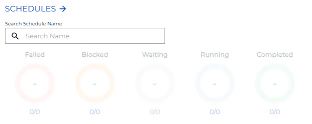
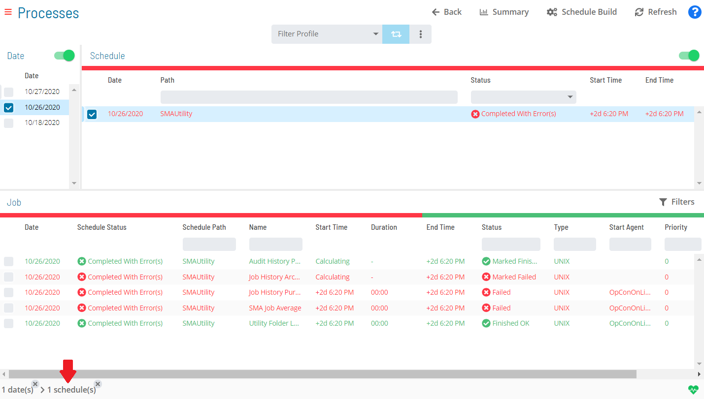
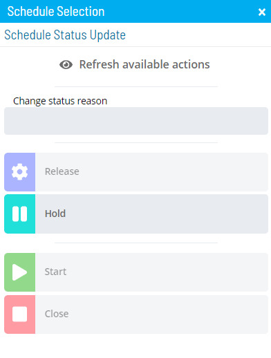

# Performing Schedule Status Changes

**Theme:** Configure  
**Who Is It For?** System Administrator, Automation Engineer

## What Is It?

The **Operations** module allows you to perform schedule status changes.

To perform schedule status changes:

Select one of the five operation dials (Failed, Blocked, Waiting, Running, or Completed) or use the **Quick Search** field (type the keyword and press **Enter**) in the **Schedules** section on the **Operations Summary** page.

The **Processes** page will display.

Ensure that both the **Date** and **Schedule** toggle switches are enabled. Each switch appears green when enabled.

Select the desired **date(s)** and **schedule(s)**. Your selection(s) display in the [status bar](SM-UI-Layout.md#Status) at the bottom of the page as a breadcrumb trail.

:::note
You may wish to filter and/or sort the schedule list:

- **Filter**: Use the **Filter Bar** above the list. Type a keyword in the appropriate field and press **Enter**
- **Sort**: Select a column heading to sort ascending (arrow pointing down); select again to sort descending (arrow pointing up)
:::

Select the schedule record (e.g., 3 schedule(s)) in the status bar to display the **Selection** panel with the **Schedule Status Update** tab in focus.

:::note
As an alternative, right-click any selected schedule in the list to display the **Selection** panel.
:::

*(Optional)* Select **Refresh available actions** to verify which status update actions are available for the current selection. This is helpful when multiple schedules are selected, since all status update buttons are enabled by default.

*(Optional)* Enter or select a change status reason.

:::note
Depending on application configuration, the **Change Status Reason** list may store previous reasons entered for job or schedule status updates.
:::

Select one of the following status updates to apply to the selected schedule(s):

:::note
Status updates applied to selected Schedule Names affect ALL jobs scheduled to run on that date, not only those visible in the current scope.
:::

- **Release**: Releases the selected schedule(s) from a Held state. Jobs continue processing from where they stopped. Subschedules in Parent Hold status are also released
- **Hold**: Suspends processing of the selected schedule(s). Running jobs complete, but no new jobs start. Subschedules in Waiting or In Process status are placed in Parent Hold
- **Start**: Overrides the selected schedule's start date(s) and time(s) and runs them immediately. SAM begins processing as soon as this option is selected. Subschedules in Parent Hold status are also started
- **Close**: Marks the selected schedule(s) as Completed when they are still In Process only because they contain failed jobs

:::note
For more on job status changes, refer to [Schedule and Job Status Change Commands](../../../operations/status-change-commands.md) in the **Concepts** online help.
:::

Close the **Selection** panel when done.

.png "More Info icon")
Related Topics

- [Performing Job Status Changes](Performing-Job-Status-Changes.md)
- [Performing Bulk Status Job Updates (Schedule Level)](Performing-Bulk-Job-Status-Updates-Schedule-Level.md)
- [Performing Agent Status Updates](Performing-Agent-Status-Updates.md)
- [Viewing Job Output](Viewing-Job-Output.md)
- [Viewing Job Configuration](Viewing-Job-Configuration.md)
- [Using PERT View](Using-PERT-View.md)
- [Managing Daily Processes](Managing-Daily-Processes.md)

## Configuration Options

| Setting | What It Does | Default | Notes |
|---|---|---|---|
| Sort | Select a column heading to sort ascending (arrow pointing down); select again to sort descending (arrow pointing up) | — | — |
| Release | Releases the selected schedule(s) from a Held state. | — | — |
| Hold | Suspends processing of the selected schedule(s). | — | — |
## FAQs

**Q: What happens to subschedules when a parent schedule is placed on Hold?**

Subschedules that are in Waiting or In Process status are placed in Parent Hold. Running jobs within those schedules complete, but no new jobs start until the schedule is released.

**Q: What does the Close status update do for a schedule?**

Close marks a schedule as Completed when it is still showing as In Process only because it contains failed jobs. It does not resolve the failed jobs — it simply closes the schedule.

**Q: What prerequisite toggle settings are required before performing a schedule status change?**

Both the Date and Schedule toggle switches on the Processes page must be enabled (appearing green) so that date and schedule selections can be made together.

## Glossary

**SAM (Schedule Activity Monitor)**: The logical processor for OpCon workflow automation. SAM monitors schedule and job start times, dependencies, and user commands to determine job execution timing, and processes OpCon events.

**Resource**: A numeric variable in OpCon representing a finite pool. Jobs can be configured to require a set number of resource units to run, limiting concurrent executions and preventing resource contention.

**Schedule**: A named container for jobs in OpCon, built for a specific date to create that day's automation. Schedules define build settings, frequencies, and the jobs that run within them.

**Job**: The fundamental unit of work in OpCon. A job defines what to run, on which machine, when to start, and what conditions must be met. Job results are tracked and can trigger events and notifications.
