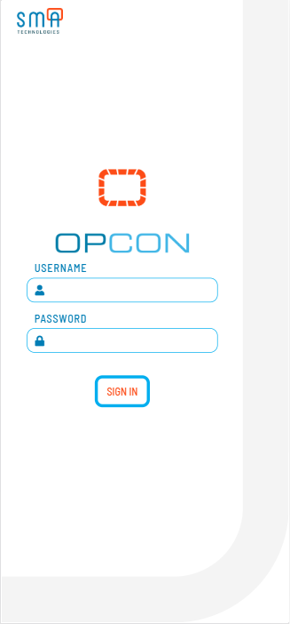
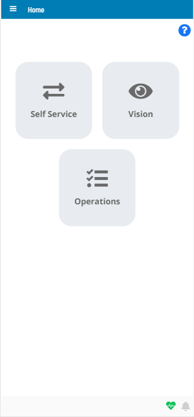
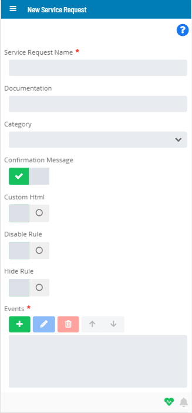
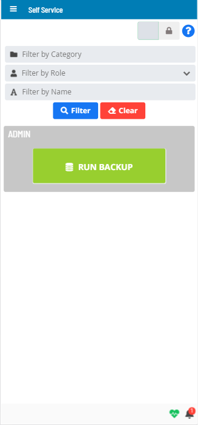

# Responsive Platform

**Theme:** Configure  
**Who Is It For?** System Administrator, Automation Engineer

## What Is It?

SMA Solution Manager works on all form factors (smartphone, tablet, desktop). Its responsive design adapts the page layout to the device or browser window size.

The following images show how the application appears on a smartphone.

## Configuration Options

| Setting | What It Does | Default | Notes |
|---|---|---|---|
## FAQs

**Q: What does Responsive Platform do?**

SMA Solution Manager works on all form factors (smartphone, tablet, desktop). Its responsive design adapts the page layout to the device or browser window size.

**Q: Where can you find Responsive Platform in OpCon?**

Access Responsive Platform through the appropriate section in the Enterprise Manager or Solution Manager navigation.

## Glossary

**Enterprise Manager (EM)**: OpCon's rich client graphical user interface for Windows and Linux, used to define schedules and jobs, manage automation data, and perform operational tasks.

**Solution Manager**: OpCon's browser-based graphical user interface for managing automation data, performing operational actions, and administering the system.

**Service Request**: A Solution Manager feature that lets operators trigger predefined automation workflows using a simple form. Service Requests encapsulate schedule builds, job submissions, or events without requiring direct access to schedule definitions.

**Resource**: A numeric variable in OpCon representing a finite pool. Jobs can be configured to require a set number of resource units to run, limiting concurrent executions and preventing resource contention.

**OpCon**: Continuous' workflow automation platform. The OpCon server includes the database, SAM and Supporting Services (SAM-SS), and graphical user interfaces. agents installed on target platforms run jobs and report results.
