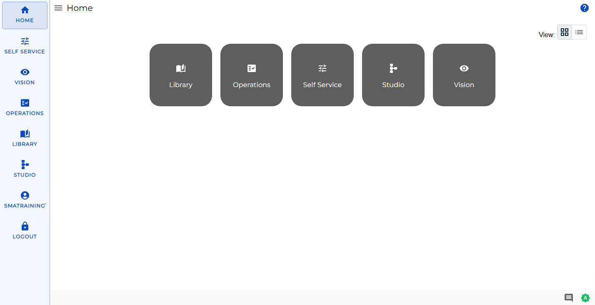

# Understanding the User Interface Layout

**Theme:** Overview  
**Who Is It For?** System Administrator, Automation Engineer

## What Is It?

Once logged in, you will see the **Home** page from the desktop layout.

## Navigation Menu

The **Navigation menu** is located to the left of the page. It allows you to log out, navigate through the available Solution(s), and update your OpCon user profile. In desktop mode, toggle the menu by selecting the menu display button () at the top of the page.

## Solutions

The **Solution(s)** are located to the right of the Navigation menu. Solutions are the OpCon modules to which users have access privileges.

## Status Bar

The **Status Bar** is located at the footer of the page and contains icons and indicators described in the following sections.

### Heartbeat Indicator

The **Heartbeat indicator** identifies the status of the SAM and/or Agents:

-  - Communication between Solution Manager and OpCon Rest API is broken
-  - SAM is DOWN
-  - SAM is DOWN and at least one Agent is waiting on communication
-  - SAM is UP and all started Agents are communicating (whether limited or not)
-  - SAM is UP, but at least one Agent is waiting on communication (and none is in error)
-  - SAM is UP, but at least one started Agent does not respond (and at least one is started or waiting)
-  - SAM is UP, but all started Agents do not respond (in error)

### Notification Indicator

The **Notification indicator**  provides access to the Notification Acknowledgment page, which lists escalated notifications received. Refer to [Viewing Notification Acknowledgement](Viewing-Notification-Acknowledgement.md) for more information.

### InstantLog Mode

**InstantLog Mode** captures logs temporarily to send to Continuous Customer Support. Use it when you can reproduce the issue in the application.

To activate this mode, complete the following steps:

1. Start from a fresh login and Go to the **Home** page
2. Press **Ctrl+Alt+L**. A red bug icon  appears in the bottom-right of the status bar
3. Reproduce your issue by navigating to the page where it occurs
4. Press **Ctrl+Alt+L** again to generate the **debug.log** file
5. Send the generated file to Continuous Customer Support

:::note
For all buttons in the Solution Manager, you only have to select once to trigger the action.
:::

## Configuration Options

| Setting | What It Does | Default | Notes |
|---|---|---|---|
## FAQs

**Q: How many steps does the Understanding the User Interface Layout procedure involve?**

The Understanding the User Interface Layout procedure involves 5 steps. Complete all steps in order and save your changes.

**Q: What does Understanding the User Interface Layout cover?**

This page covers Navigation Menu, Solutions, Status Bar.

## Glossary

**SAM (Schedule Activity Monitor)**: The logical processor for OpCon workflow automation. SAM monitors schedule and job start times, dependencies, and user commands to determine job execution timing, and processes OpCon events.

**Solution Manager**: OpCon's browser-based graphical user interface for managing automation data, performing operational actions, and administering the system.

**Notification**: A message sent by the SMA Notify Handler when a Machine, Schedule, or Job changes to a specific status. Notifications can be delivered as emails, text messages, Windows Event Log entries, SNMP traps, or other formats.

**Resource**: A numeric variable in OpCon representing a finite pool. Jobs can be configured to require a set number of resource units to run, limiting concurrent executions and preventing resource contention.

**Privilege**: A specific permission granted through an OpCon role that controls access to a feature, function, or object type. Privileges are organized into categories such as Function Privileges, Machine Privileges, Schedule Privileges, and Access Codes.

**OpCon**: Continuous' workflow automation platform. The OpCon server includes the database, SAM and Supporting Services (SAM-SS), and graphical user interfaces. agents installed on target platforms run jobs and report results.
