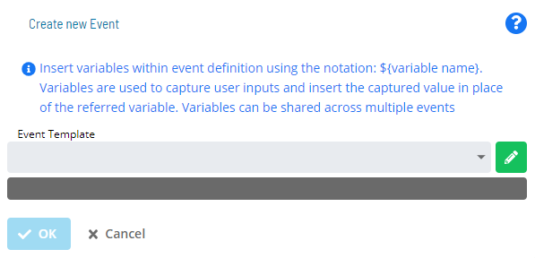
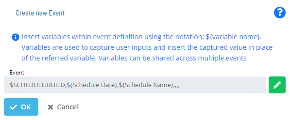

# Setting up OpCon Events

**Theme:** Build  
**Who Is It For?** System Administrator, Automation Engineer

## What Is It?

#### To add an OpCon event to the Service Request

To add an OpCon event to the Service Request, complete the following steps:

1. Select the green **Add** button below the **Events** label on the **New Service Request** page

2. The **Create New Event** window displays

3. Select an OpCon **Event Template** to start defining event details
:::note
The **Event Template** list contains several Administrative Events for advanced operations. For more information, refer to [Administrative Events](../../../events/types.md#Administ) in the **OpCon Events** online help.
:::
   - Once you choose a template, the screen dynamically updates to assist with filling out event details
   - A preview of the defined Event displays below the **Event Template** list in the dark grey box
   - Variables are resolved before the Event is sent to OpCon
:::note
Use the **Manual Edit** button (pencil icon) to define or edit an Event manually.

:::
4. Complete the **Event definition**
5. Select **OK** to apply your changes and return to the **Service Request definition** page, or select **Cancel** to discard the Event changes

### Using Variables

- Specify variables in Events using the syntax `${variable name}`
- The same variable can be used multiple times in the same Event or across Events for the same Service Request. Each reuse maps to a single User Input, so the value the user supplies applies to every instance
- The following system variables are available in Solution Manager:
  - **${SM.USER.LOGIN}** - Resolves to the Name defined for the OpCon user who selected the Service Request button
  - **${SM.USER.NAME}** - Resolves to the Full User Name defined for the OpCon user who selected the Service Request button
  - **${SM.USER.EMAIL}** - Resolves to the Email Address defined for the OpCon user who selected the Service Request button
  - **${SM.USER.COMMENTS}** - Resolves to the Comments defined for the OpCon user who selected the Service Request button

## When Would You Use It?

- You need to prepare and initialize OpCon Events in Solution Manager

## Why Would You Use It?

- **Centralized control**: Managing Setting up OpCon Events through OpCon provides consistent oversight and a full audit trail for all changes

## Configuration Options

| Setting | What It Does | Default | Notes |
|---|---|---|---|
## FAQs

**Q: How many steps does the Setting up OpCon Events procedure involve?**

The Setting up OpCon Events procedure involves 5 steps. Complete all steps in order and save your changes.

## Glossary

**Solution Manager**: OpCon's browser-based graphical user interface for managing automation data, performing operational actions, and administering the system.

**OpCon Event**: A command sent to OpCon that triggers an automated action, such as adding a job to a schedule, updating a property value, sending a notification, or changing a job or schedule status.

**Service Request**: A Solution Manager feature that lets operators trigger predefined automation workflows using a simple form. Service Requests encapsulate schedule builds, job submissions, or events without requiring direct access to schedule definitions.

**Resource**: A numeric variable in OpCon representing a finite pool. Jobs can be configured to require a set number of resource units to run, limiting concurrent executions and preventing resource contention.

**OpCon**: Continuous' workflow automation platform. The OpCon server includes the database, SAM and Supporting Services (SAM-SS), and graphical user interfaces. agents installed on target platforms run jobs and report results.
