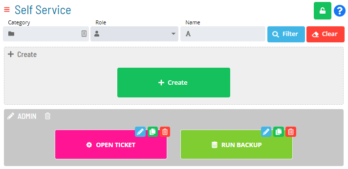

# Setting up Privileges

**Theme:** Build  
**Who Is It For?** System Administrator, Automation Engineer

## What Is It?

The last step is to assign which OpCon role(s) can see and run the Service Request buttons from the Service Request page.

- Users in the **ocadm role** have access to all Service Requests; **ocadm** does not appear in the Granted list
- Non-ocadm users must grant at least one role access to the Service Request
- You can only view and grant access to your own roles
- If a role that does not belong to you is assigned to one of your Service Requests, it displays as "Unauthorized Role."

Select **Save** to save the changes to the database and return to the main Self Service page. The newly-created Service Request button now displays.

:::note
For more on roles and granting roles privileges, refer to [Roles](../../../administration/roles.md) in the **Concepts** online help.
:::

## Configuration Options

| Setting | What It Does | Default | Notes |
|---|---|---|---|
## FAQs

**Q: What does setting up privileges configure?**

Setting up privileges defines the preferences or options that control how this feature behaves in OpCon.

## Glossary

**Service Request**: A Solution Manager feature that lets operators trigger predefined automation workflows using a simple form. Service Requests encapsulate schedule builds, job submissions, or events without requiring direct access to schedule definitions.

**Resource**: A numeric variable in OpCon representing a finite pool. Jobs can be configured to require a set number of resource units to run, limiting concurrent executions and preventing resource contention.

**Role**: A named security profile in OpCon that groups privileges together. Roles are assigned to user accounts to control which features, schedules, jobs, machines, and administrative functions a user can access.

**Privilege**: A specific permission granted through an OpCon role that controls access to a feature, function, or object type. Privileges are organized into categories such as Function Privileges, Machine Privileges, Schedule Privileges, and Access Codes.

**OpCon**: Continuous' workflow automation platform. The OpCon server includes the database, SAM and Supporting Services (SAM-SS), and graphical user interfaces. agents installed on target platforms run jobs and report results.
