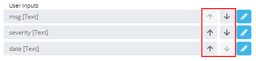

# Setting up User Inputs

**Theme:** Build  
**Who Is It For?** System Administrator, Automation Engineer

## What Is It?

When a Variable is defined within the OpCon Event definition, it becomes available as a User Input. User Input fields display to users when they select the Service Request button.

By default, the system sets a new Variable as User Input of type **Text** with no validation, allowing users to type any value. That text is placed in the OpCon Event just before SAM receives it.

To change the order of the User Inputs, use the up/down arrows in the User Input list. The order shown here is the order fields display to users when they select the Service Request button.

### User Inputs Reordering Buttons

### .png "More Info icon") Related Topics

- [Configuring Text User Inputs](Configuring-Text-User-Inputs.md)
- [Configuring Number User Inputs](Configuring-Number-User-Inputs.md)
- [Configuring Date User Inputs](Configuring-Date-User-Inputs.md)
- [Configuring Text Collection User Inputs](Configuring-Text-Collection-User-Inputs.md)
- [Configuring Master Schedule User Inputs](Configuring-Master-Schedule-User-Inputs.md)
- [Configuring Master Job User Inputs](Configuring-Master-Job-User-Inputs.md)
- [Configuring Choice User Inputs](Configuring-Choice-User-Inputs.md)

## When Would You Use It?

- You need to prepare and initialize User Inputs in Solution Manager

## Why Would You Use It?

- **Setting up**: When a Variable is defined within the OpCon Event definition, it becomes available as a User Input

## Configuration Options

| Setting | What It Does | Default | Notes |
|---|---|---|---|
## FAQs

**Q: What does setting up user inputs configure?**

Setting up user inputs defines the preferences or options that control how this feature behaves in OpCon.

## Glossary

**SAM (Schedule Activity Monitor)**: The logical processor for OpCon workflow automation. SAM monitors schedule and job start times, dependencies, and user commands to determine job execution timing, and processes OpCon events.

**OpCon Event**: A command sent to OpCon that triggers an automated action, such as adding a job to a schedule, updating a property value, sending a notification, or changing a job or schedule status.

**Service Request**: A Solution Manager feature that lets operators trigger predefined automation workflows using a simple form. Service Requests encapsulate schedule builds, job submissions, or events without requiring direct access to schedule definitions.

**Resource**: A numeric variable in OpCon representing a finite pool. Jobs can be configured to require a set number of resource units to run, limiting concurrent executions and preventing resource contention.

**Schedule**: A named container for jobs in OpCon, built for a specific date to create that day's automation. Schedules define build settings, frequencies, and the jobs that run within them.

**Job**: The fundamental unit of work in OpCon. A job defines what to run, on which machine, when to start, and what conditions must be met. Job results are tracked and can trigger events and notifications.

**OpCon**: Continuous' workflow automation platform. The OpCon server includes the database, SAM and Supporting Services (SAM-SS), and graphical user interfaces. agents installed on target platforms run jobs and report results.
