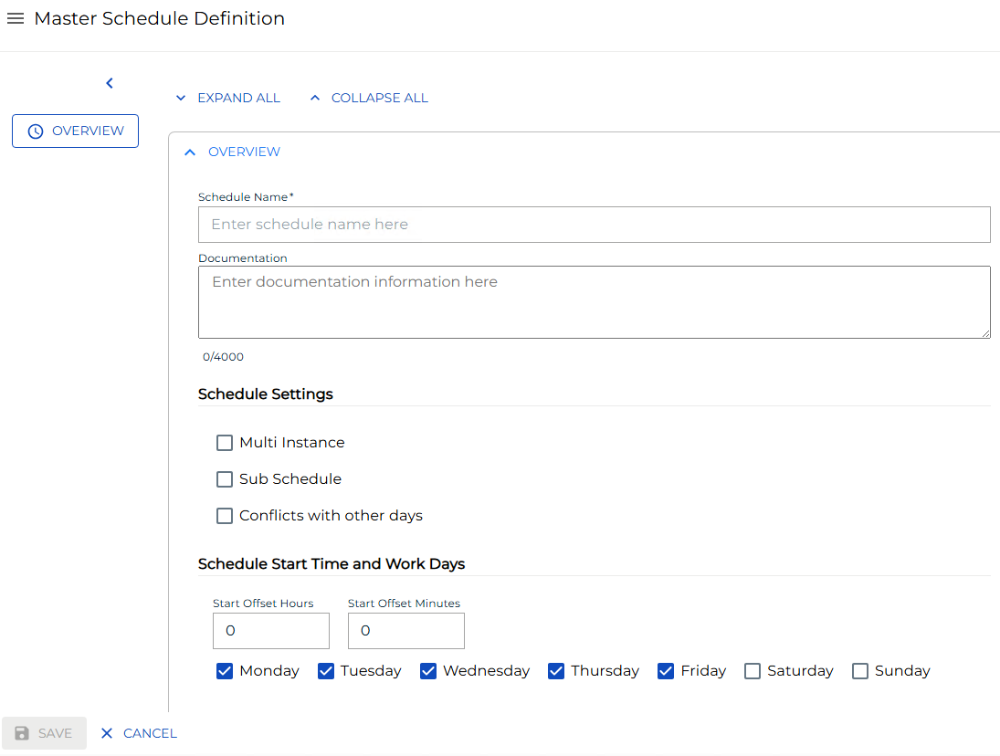

# Adding Master Schedules

**Theme:** Configure  
**Who Is It For?** System Administrator, Automation Engineer

## What Is It?

Use this procedure to add Master Schedules in Solution Manager.

## When Would You Use It?

- You need to add Master Schedules in Solution Manager
- The environment is expanding and requires additional Master Schedules to support new automation workflows

## Why Would You Use It?

- **Extend automation scope**: Adding Master Schedules to OpCon brings additional resources under centralized scheduling, monitoring, and event processing
- All additions are tracked in the OpCon audit log, recording who added the Master Schedules and when

## Administration

### Required Privileges

n/a

## Adding a Schedule

To add a Master Schedule, go to **Studio** and select **Add**. The Create Master Schedule page displays:

### Adding Schedule Name and Documentation

To add Schedule Name and Documentation, complete the following steps:

1. Select a **Schedule Name**. For more information, refer to [Schedules](../../../../../objects/schedules.md) in the **Concepts** online help
1. _(Optional)_ Enter the **Documentation** details. For more information, refer to [Schedule Details](../../../../../objects/schedules.md#schedule-details) in the **Concepts** online help

### Adding Schedule Settings

To add Schedule Settings, complete the following steps:

1. _(Optional)_ Select the **Multi Instance** option
1. _(Optional)_ Select the **Sub Schedule** option. *Note: Selecting this option resets and disables all autobuild settings (auto build and auto delete).*
1. _(Optional)_ Select the **Conflicts with other days** option

### Adding Schedule Start Time and Work Days

To add Schedule Start Time and Work Days, complete the following steps:

1. Enter the **Start Offset Hour**
1. Enter the **Start Offset Minutes**

1. Select the **Workdays**

### Holiday Calendar Settings

1. _(Optional)_ Select **Additional Holidays**

1. _(Optional)_ Select the **Use Master Holiday** option

### Schedule Build and Maintenance

For more information, refer to [Schedule Maintenance](../../../../../objects/schedules.md#schedule-maintenance) in the **Concepts** online help.

*Note: All autobuild settings reset and become disabled when the Sub Schedule option is selected.*

1. _(Optional)_ Select the **Auto Build** option. For more information, refer to [Build Settings](../../../../../objects/schedules.md#build-settings) in the **Concepts** online help
1. Enter the # of **Days in Advance**
1. Enter the # of **Days to build for**
1. Enter the **Build Offset Hours**
1. Enter the **Build Offset Minute**
1. _(Optional)_ Select the **Overwrite** option
1. _(Optional)_ Select the **Build on Hold** option
1. Select **Save** to create the schedule or **Cancel** to cancel the operation

## FAQs

**Q: How do you save a new master schedules record?**

After completing the required fields, select the **Save** button on the toolbar to save the master schedules record.

**Q: Can you add master schedules for multiple platforms?**

Yes. This page covers master schedules for multiple platforms or contexts: Required Privileges, Adding a Schedule.

## Glossary

**Calendar**: A named collection of dates in OpCon used by schedules and frequencies to determine when automation runs or is excluded. Calendars can represent holidays, working days, or any custom date set.

**Resource**: A numeric variable in OpCon representing a finite pool. Jobs can be configured to require a set number of resource units to run, limiting concurrent executions and preventing resource contention.

**Privilege**: A specific permission granted through an OpCon role that controls access to a feature, function, or object type. Privileges are organized into categories such as Function Privileges, Machine Privileges, Schedule Privileges, and Access Codes.

**Schedule**: A named container for jobs in OpCon, built for a specific date to create that day's automation. Schedules define build settings, frequencies, and the jobs that run within them.
