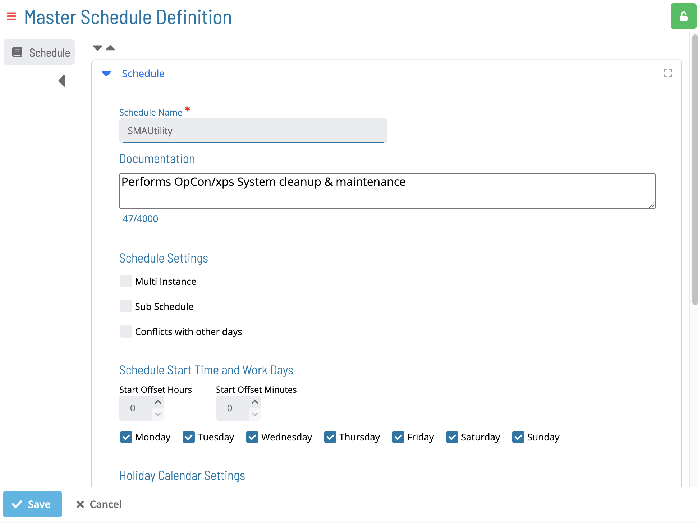

# Copying Master Schedules

## Required Privileges

n/a
## Copying a Schedule

To copy a schedule, go to **Studio**.

Select a schedule and select **Copy**. The Create Master Schedule page is displayed with form values copied from the selected schedule:

1. Enter a *new* **Schedule Name**.

1. Select **Save** to copy the schedule or **Cancel** to cancel the operation.
