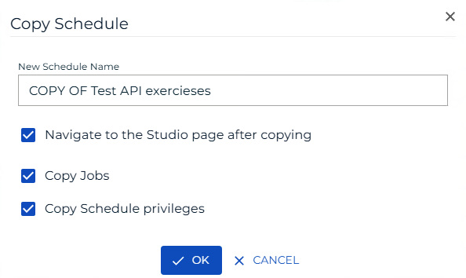

# Copying Master Schedules

**Theme:** Configure  
**Who Is It For?** System Administrator, Automation Engineer

## What Is It?

Use this procedure to copy Master Schedules in Solution Manager.

## When Would You Use It?

- An existing Master Schedules definition needs to be duplicated in Solution Manager
- A new Master Schedules with similar settings to an existing one needs to be created quickly

## Why Would You Use It?

- **Save configuration time**: Duplicating an existing Master Schedules eliminates redundant data entry and ensures the new definition inherits proven settings

## Administration

### Required Privileges

To copy a master schedule, the user must be in a role with at least one of the following privileges:

- All Function Privileges
- Maintain Schedules

## Copying a Schedule

To copy a schedule, go to **Studio**.

Select a schedule and select **Copy**.

A dialog opens to define a new **Schedule Name** with options to **Copy Master Jobs** and **Copy Schedule Privileges**.

1. Enter a new **Schedule Name**
1. Select **Save** to copy the schedule or **Cancel** to cancel

## FAQs

**Q: Why would you copy master schedules instead of creating a new one?**

Copying master schedules is useful when you want to reuse an existing configuration as a starting point. All settings from the original are duplicated, and you can then modify the copy as needed.

**Q: Does copying master schedules require a new unique name?**

Yes. The copy must be saved with a new unique name to distinguish it from the original master schedules record.

## Glossary

**Resource**: A numeric variable in OpCon representing a finite pool. Jobs can be configured to require a set number of resource units to run, limiting concurrent executions and preventing resource contention.

**Role**: A named security profile in OpCon that groups privileges together. Roles are assigned to user accounts to control which features, schedules, jobs, machines, and administrative functions a user can access.

**Privilege**: A specific permission granted through an OpCon role that controls access to a feature, function, or object type. Privileges are organized into categories such as Function Privileges, Machine Privileges, Schedule Privileges, and Access Codes.

**Schedule**: A named container for jobs in OpCon, built for a specific date to create that day's automation. Schedules define build settings, frequencies, and the jobs that run within them.

**Job**: The fundamental unit of work in OpCon. A job defines what to run, on which machine, when to start, and what conditions must be met. Job results are tracked and can trigger events and notifications.
