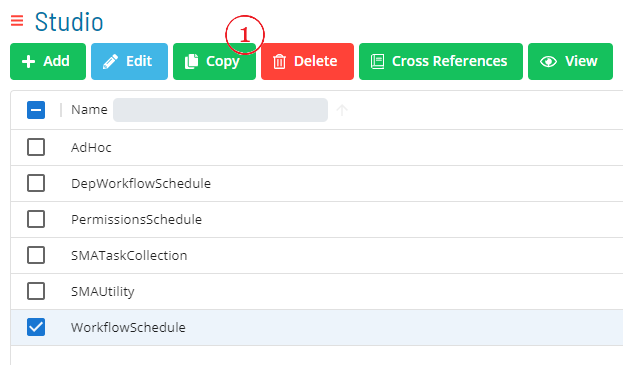
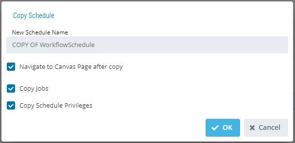

# Copying Master Schedules

## Required Privileges

In order to copy a master schedule, you must have at least all of the following privileges:

- **Function Privilege**: User must be in a role
  with at least one of these privileges
     - All Function Privileges 
     - Maintain Schedules

## Copying a Schedule

To copy a schedule, go to **Studio**.

Select a schedule and select **Copy**. 

A dialog will open to define *new* **Schedule Name** with options to **Copy Master Jobs** and **Copy Schedule Privileges**.  

1. Enter a *new* **Schedule Name**.  

1. Select **Save** to copy the schedule or **Cancel** to cancel the operation.