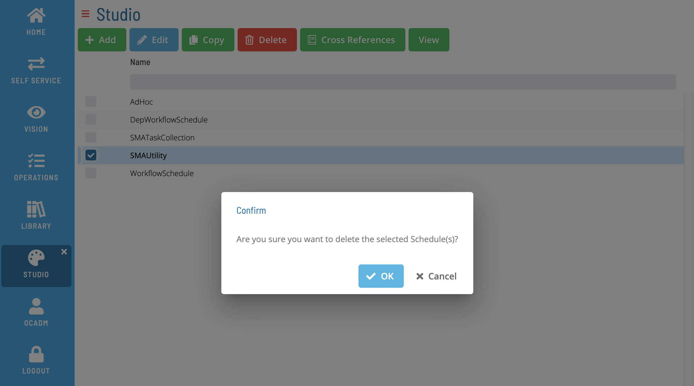

# Deleting Master Schedules

**Theme:** Configure  
**Who Is It For?** System Administrator, Automation Engineer

## What Is It?

Use this procedure to delete Master Schedules in Solution Manager.

## When Would You Use It?

- An existing Master Schedules in Solution Manager is no longer needed
- The Master Schedules has been decommissioned or replaced and should be removed to keep the configuration clean

## Why Would You Use It?

- **Maintain a clean environment**: Removing unused Master Schedules definitions reduces clutter and prevents accidental use of outdated or obsolete configurations
- Deletions are recorded in the OpCon audit log, providing traceability for compliance and change management reviews

## Administration

### Required Privileges

n/a

## Deleting a Schedule

To delete one or more Master Schedules, go to **Studio**.

Select a schedule or schedules and select **Delete**. A confirmation dialog is displayed:

Select **Yes** to delete the schedule(s) or **No** to cancel.

## FAQs

**Q: Can a master schedules record be recovered after deletion?**

No. Deleting a master schedules record permanently removes it from OpCon. Verify the record is no longer needed before deleting it.

**Q: How many master schedules records can you delete at once?**

Select the specific master schedules record you want to delete, then select the **Delete** button on the toolbar. Confirm the deletion when prompted.

## Glossary

**Resource**: A numeric variable in OpCon representing a finite pool. Jobs can be configured to require a set number of resource units to run, limiting concurrent executions and preventing resource contention.

**Privilege**: A specific permission granted through an OpCon role that controls access to a feature, function, or object type. Privileges are organized into categories such as Function Privileges, Machine Privileges, Schedule Privileges, and Access Codes.

**Schedule**: A named container for jobs in OpCon, built for a specific date to create that day's automation. Schedules define build settings, frequencies, and the jobs that run within them.

**OpCon**: Continuous' workflow automation platform. The OpCon server includes the database, SAM and Supporting Services (SAM-SS), and graphical user interfaces. agents installed on target platforms run jobs and report results.
