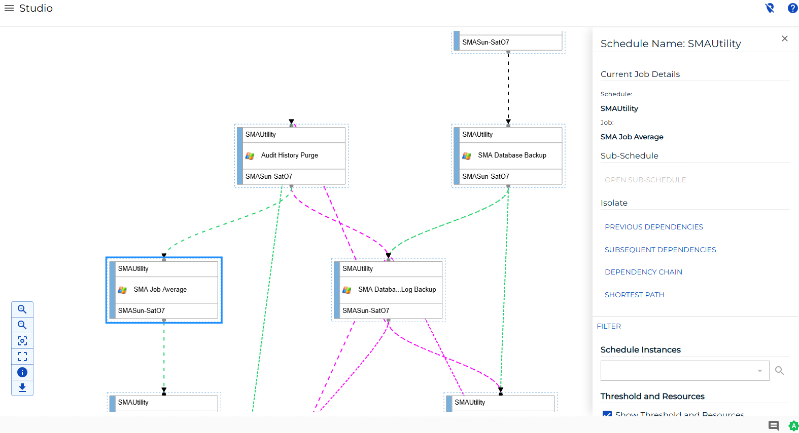
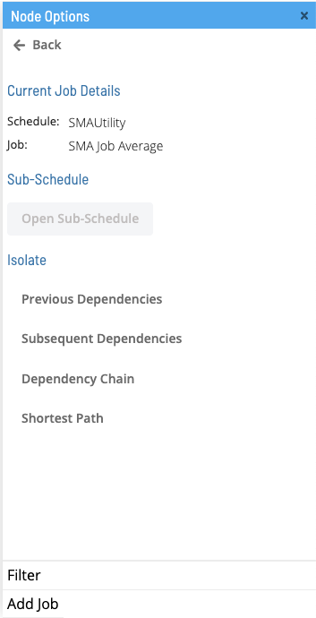
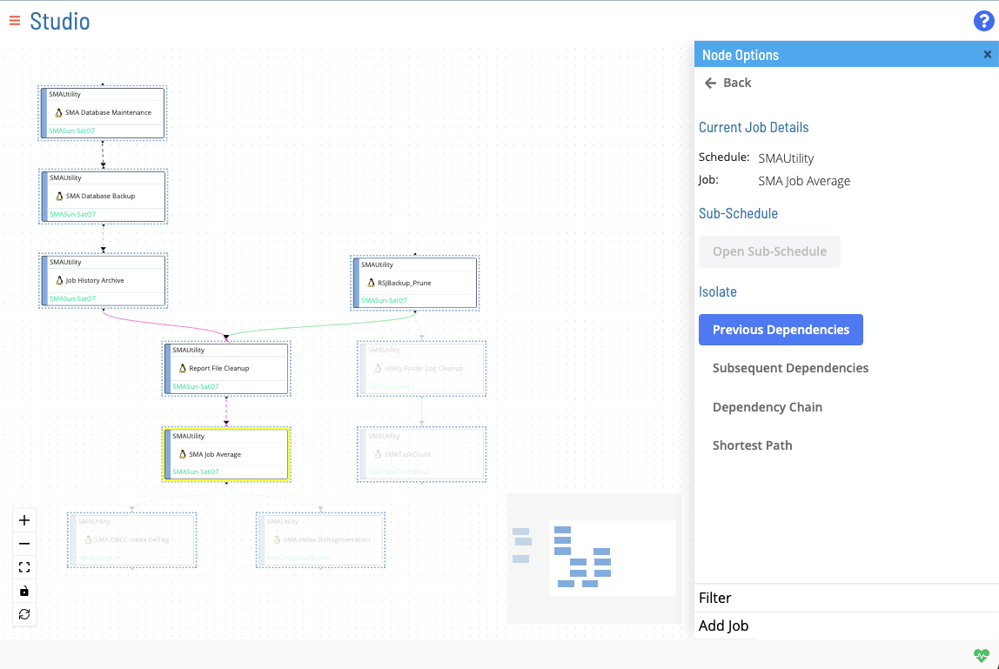
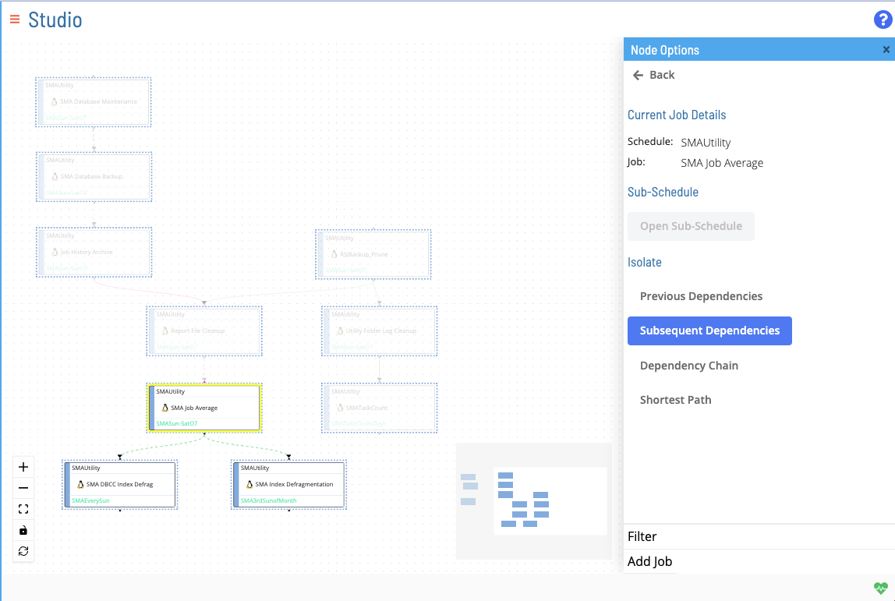
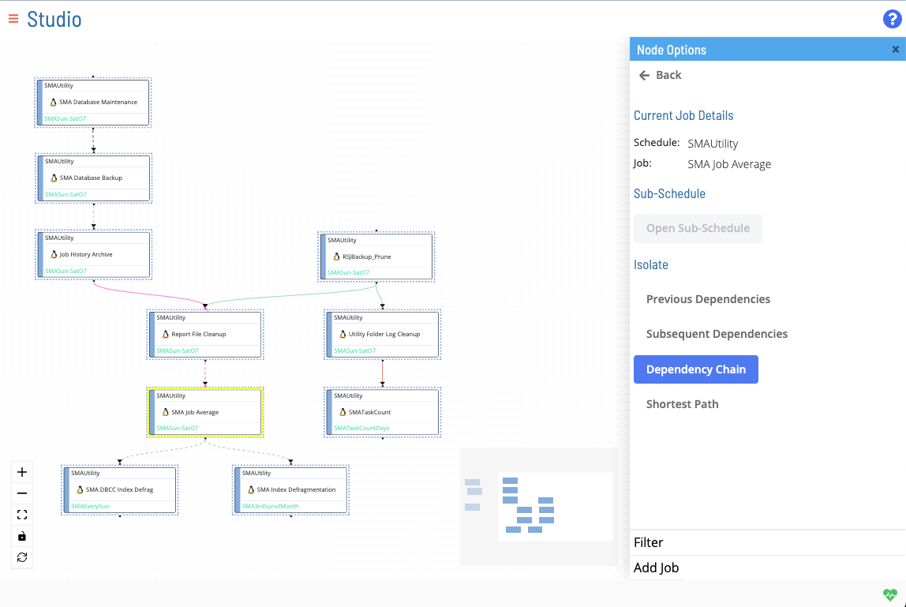
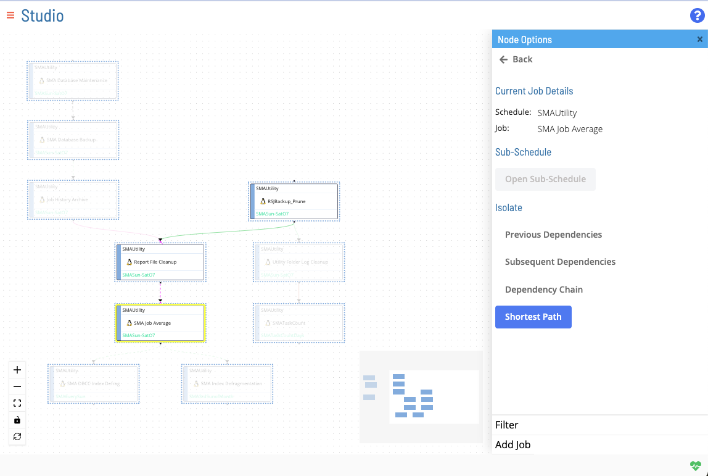

# Isolate Dependency Chain

**Theme:** Configure  
**Who Is It For?** System Administrator, Automation Engineer

## What Is It?

right-clicking a node opens the **Node Options** menu in the right panel. The isolation options allow you to configure the display of nodes and dependencies from a given start node.

## Previous Dependencies

Displays all preceding jobs in a dependent chain.

## Subsequent Dependencies

Displays all subsequent jobs in a dependent chain.

## Dependency Chain

Displays an entire dependency chain (preceding and subsequent jobs).

## Shortest Path

Shows the shortest path among all dependency chains to the selected job (its shortest terminal previous dependency path).

## FAQs

**Q: What does Isolate Dependency Chain cover?**

This page covers Previous Dependencies, Subsequent Dependencies, Dependency Chain.

## Glossary

**Resource**: A numeric variable in OpCon representing a finite pool. Jobs can be configured to require a set number of resource units to run, limiting concurrent executions and preventing resource contention.

**Job**: The fundamental unit of work in OpCon. A job defines what to run, on which machine, when to start, and what conditions must be met. Job results are tracked and can trigger events and notifications.
