# Viewing Master Schedule

**Theme:** Configure  
**Who Is It For?** System Administrator, Automation Engineer

## What Is It?

Studio Canvas renders on-demand diagrams showing job nodes and job dependency relationships. Access these visualizations from the **Studio** page by selecting a schedule and selecting **View**.

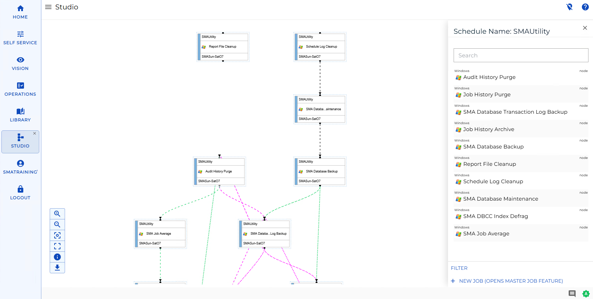

## Studio Concepts

### Nodes

Nodes represent job, threshold, resource, or expression entities. The color on the left side of the node indicates the node type:

- Light Blue: Job Node
- Dark/Royal Blue: Threshold Node
- Yellow: Resource Node
- Orange: Expression Node

Hovering over a node highlights it with a solid yellow border. Selecting a node highlights it with a solid blue border.

Node positions are saved when Studio opens and updated when a node is moved. Newly added nodes are placed at coordinate (0,0) and displayed with a green border.

 Node")

Each node has two handles: a target handle (incoming edge dependencies) and a source handle (outgoing edge dependencies).

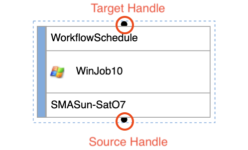

#### Job Nodes

Job nodes represent a [Master Job](../../../../../../objects/jobs.md). Jobs associated with the selected schedule (not Cross-Schedule Jobs) have a blue dotted border. Jobs from a separate schedule have no dotted border and are displayed with a transparency effect.

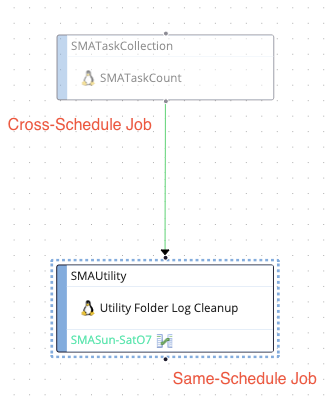

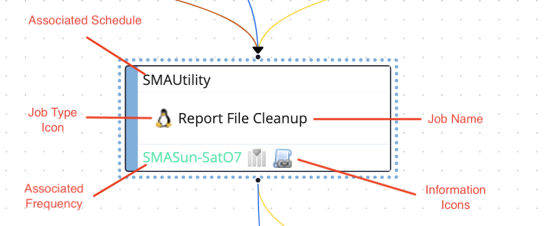

#### Threshold Nodes

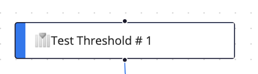

#### Resource Nodes

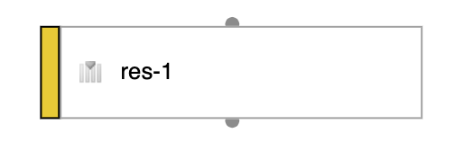

#### Expression Nodes

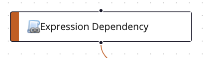

### Edges

Edges represent dependencies: job dependencies, threshold dependencies and updates, resource dependencies and updates, and expression dependencies. Edge color and style (dotted vs. solid) indicate the dependency type:

Job Dependencies:

    required: solid light green
    requiredOnFailure solid red
    requiredIgnoreEC: solid black
    after: dotted light green
    afterOnFailure: dotted red
    afterIgnoreEC: dotted black
    excludes: pink
    conflict: dotted magenta

Threshold (Dependencies and Updates):

    solid dark blue

Resource (Dependencies and Updates):

    solid gold

Job Name Like Dependencies:

    solid magenta

Expression Dependencies:

    orange

#### Cross Schedule Dependencies

Dependencies can exist between jobs from different schedules, creating a cross-schedule dependency. These are represented like normal dependency lines; the nodes themselves indicate which job belongs to the selected schedule. See [Job Nodes](./Viewing-Master-Schedules.md#job-nodes) for details.

#### Dependency Disambiguator

When multiple dependencies exist between two nodes (e.g., threshold and resource updates), the edge displays a numerical indicator showing the total number of dependencies. Selecting that edge opens the right panel with a list of those dependencies for individual selection. See [Selecting an Edge with disambiguator](./Viewing-Master-Schedules.md#selecting-an-edge-with-disambiguator) for details.

### Right Panel

The right panel (action container) is a context-sensitive drawer that changes based on the current canvas selection. From here you can add, edit, and delete jobs and dependencies, view node and dependency details, filter, search, and more.

#### Default Selection (null)

When nothing is selected in the canvas, the default right panel opens.

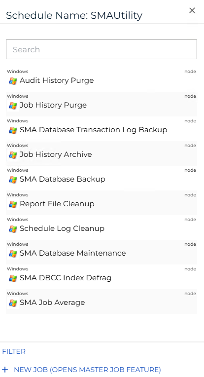

Available actions:

- Select the **Back** button to return to the studio schedule list
- Search the canvas. See [Search](./Viewing-Master-Schedules.md#search) for details
- Select a node from the list
- Filter the canvas. See [Filter](./Viewing-Master-Schedules.md#filter) for details
- Select the **Add Job** button to Go to `/library/masterjobs/` to add a new master job

#### Selecting a Node

Left-clicking a node selects it. The right panel updates to show details for the selected node.

##### Selecting a Job Node:

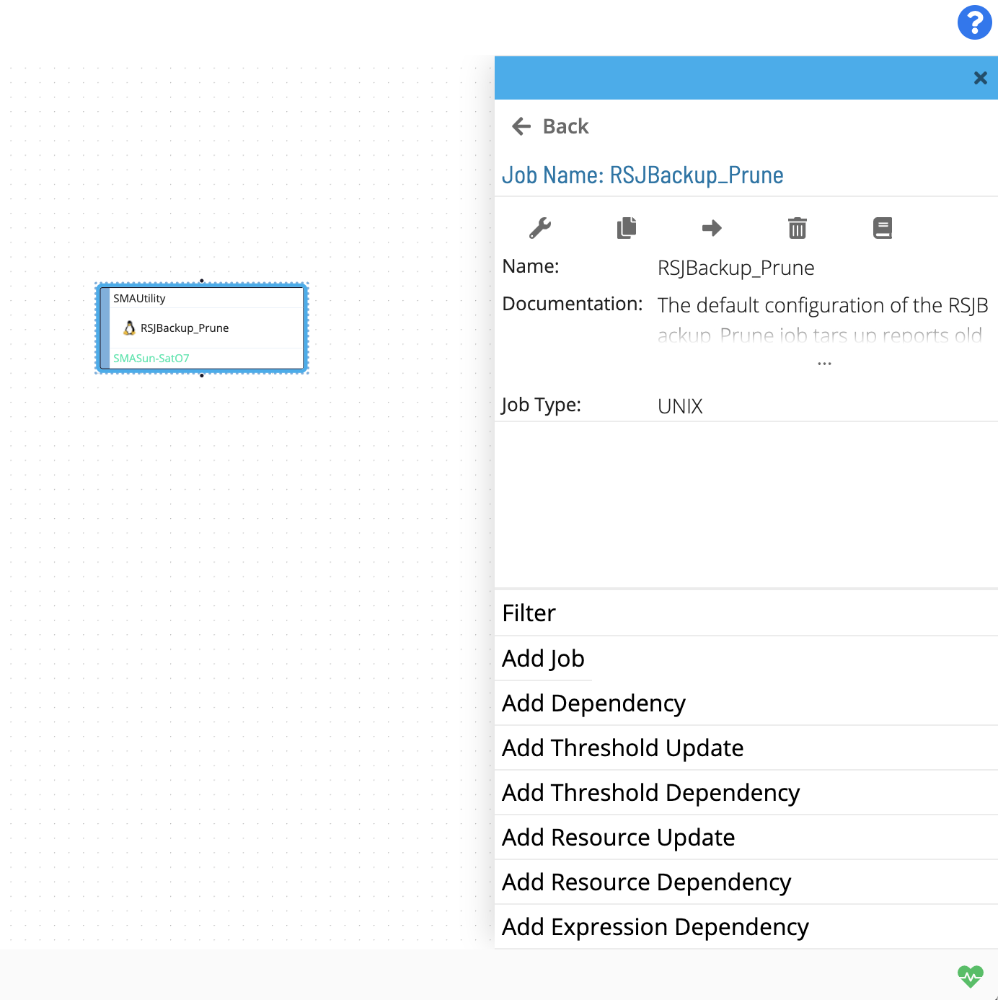

When a job node is selected, the right panel provides the following actions.

In the upper header container:

- Select **Back** to return to the default right panel view
- Edit, copy, move, or delete the selected Master Job
- Check cross references on the selected Master Job
- Reset the selected Master Job type to the default null job type

In the lower footer container:

- Filter the canvas. See [Filter](./Viewing-Master-Schedules.md#filter) for details
- Select **Add Job** to Go to `/library/masterjobs/` to add a new master job
- Select **Add Dependency** to add a new Job Dependency. See [Job Dependencies](../../../../../../job-components/job-dependencies.md)
- Select **Add Threshold Update** to add a new Threshold Update Dependency. See [Threshold Updates](../../../../../../job-components/threshold-resource-updates.md#threshold-updates)
- Select **Add Threshold Dependency** to add a new Threshold Dependency. See [Threshold Dependencies](../../../../../../job-components/threshold-resource-dependencies.md#threshold-dependencies)
- Select **Add Resource Update** to add a new Resource Update. See [Resource Updates](../../../../../../job-components/threshold-resource-updates.md#resource-updates)
- Select **Add Resource Dependency** to add a new Resource Dependency. See [Resource Dependencies](../../../../../../job-components/threshold-resource-dependencies.md#resource-dependencies)
- Select **Add Expression Dependency** to add a new Expression Dependency. See [Expression Dependencies](../../../../../../job-components/expression-dependencies.md)

##### Selecting a Threshold/Resource Node:

Selecting a threshold or resource node updates the right panel to list all jobs with threshold/resource connections (dependencies or updates), since a threshold or resource can be designated as either.

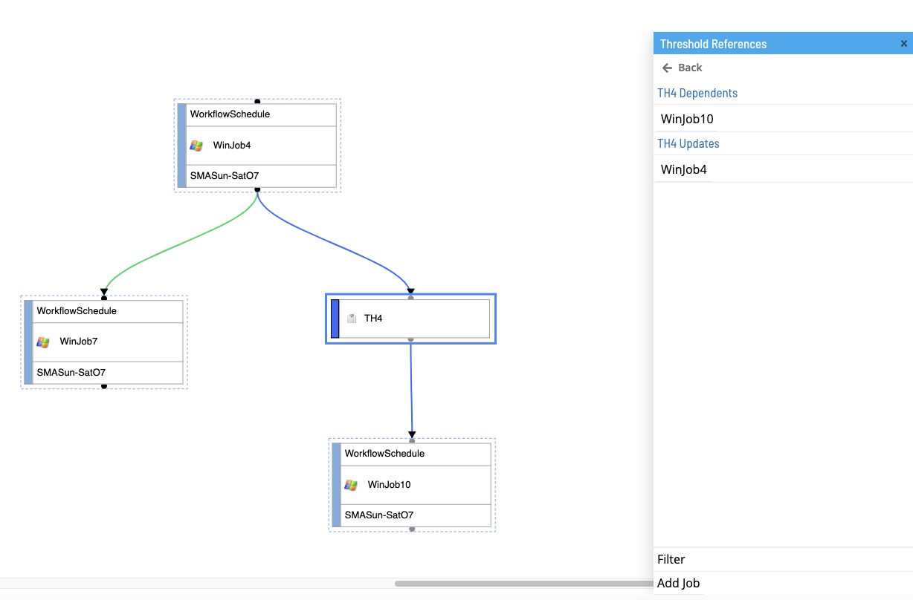

##### Selecting an Expression Node:

Selecting an expression node updates the right panel. Expression dependencies are unique to specific master jobs, so expression nodes are unique to their corresponding job nodes in the canvas.

#### Selecting an Edge

Left-clicking an edge selects it. The right panel updates to show details for the selected edge.

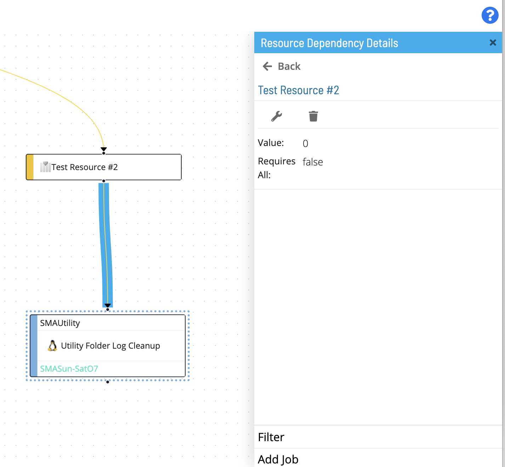

#### Selecting an Edge with Disambiguator

Selecting an edge with a numerical indicator opens the right panel with a list of associated dependencies. Select a specific dependency from the list to load its details in the right panel.

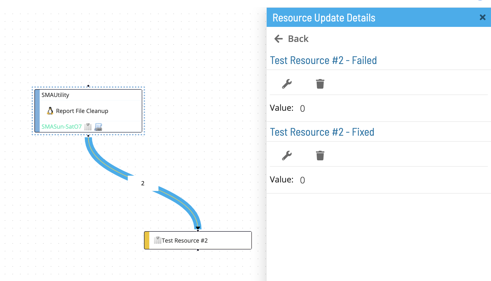

#### Search

The search feature is a text input field that locates specific nodes or edges on the canvas. Results appear in the right panel. Selecting a result centers the canvas on the selection and actively selects it.

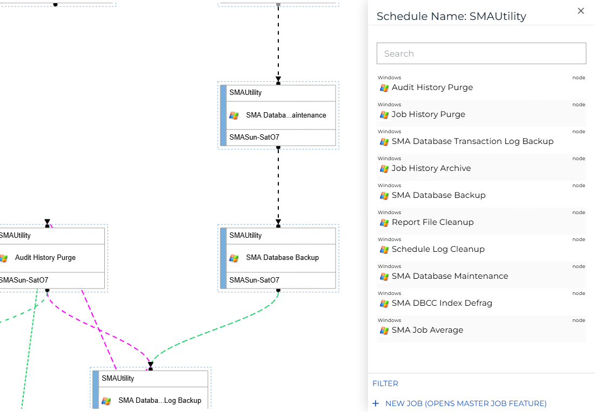

#### Filter

The filter feature narrows rendered nodes, edges, and search results. Filter by schedule instances, threshold and resources, job-related dependencies, frequency-related dependencies, or specific frequencies. By default, all nodes and dependencies are displayed with no active filters.

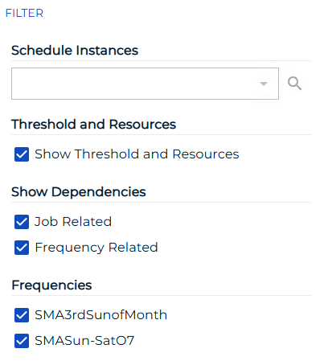

### Subschedules

Container jobs can represent subschedules as nodes in the canvas. If the selected schedule is itself a subschedule, relevant parent schedule information appears in the bottom bar.

#### Breadcrumbs

If the selected schedule is a subschedule, the bottom bar renders a breadcrumbs component in the lower-left corner showing:

1. All parent schedules that reference the selected schedule
1. The selected schedule (shown as a subschedule of each listed parent)

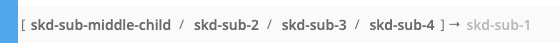

#### Selecting a Parent Schedule

Parent schedules in the breadcrumbs are selectable (the selected schedule itself is not). Selecting a parent schedule redirects to that schedule's view. By default, only one parent schedule is shown; if there are more, a collapsed list with an ellipsis (...) appears, which expands when selected.

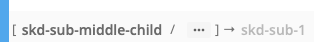

#### Selecting a Subschedule from a Container Job

right-clicking a container job in the canvas opens the right panel with its contained subschedule. Selecting the subschedule redirects to that subschedule's view.

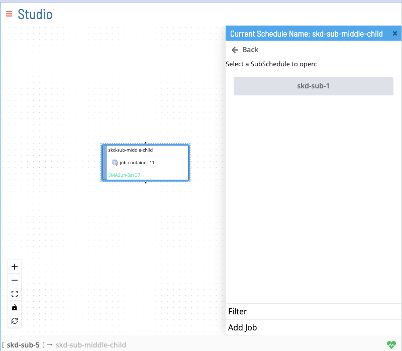

### Controls

The controls are in the lower-left corner of the canvas. Use them to zoom in, zoom out, center to the root node, fit to screen, or download the canvas image.

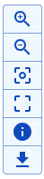

### Legend

Select the info button in the controls to open or close the legend, which shows details for each dependency line. The legend appears in the lower-left corner next to the controls.

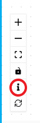

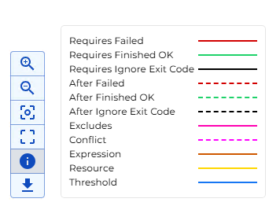

### Mini-Map

The minimap is in the lower-right corner of the canvas. Use it to view and move the current viewport.

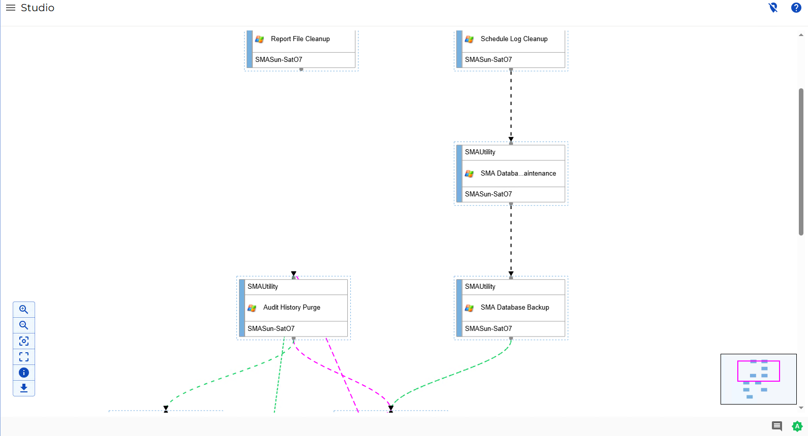

## FAQs

**Q: How many steps does the Viewing Master Schedule procedure involve?**

The Viewing Master Schedule procedure involves 2 steps. Complete all steps in order and save your changes.

**Q: What does Viewing Master Schedule cover?**

This page covers Studio Concepts.

## Glossary

**Solution Manager**: OpCon's browser-based graphical user interface for managing automation data, performing operational actions, and administering the system.

**Subschedule**: A schedule that runs as a child process within a Container job, allowing hierarchical, nested workflow automation where a parent schedule can trigger and monitor an entire child schedule.

**Container Job**: A job type that runs a subschedule. Container jobs enable hierarchical schedule structures and support properties and events just like standard jobs.

**Frequency**: A set of rules that defines when a job or schedule is eligible to run, based on calendar rules, day-of-week settings, period offsets, and other timing criteria.

**Threshold**: A numeric variable stored in the OpCon database used to control job execution. Jobs can be made dependent on threshold values, and OpCon events can update threshold values at runtime.

**Resource**: A numeric variable in OpCon representing a finite pool. Jobs can be configured to require a set number of resource units to run, limiting concurrent executions and preventing resource contention.

**Schedule**: A named container for jobs in OpCon, built for a specific date to create that day's automation. Schedules define build settings, frequencies, and the jobs that run within them.

**Job**: The fundamental unit of work in OpCon. A job defines what to run, on which machine, when to start, and what conditions must be met. Job results are tracked and can trigger events and notifications.
