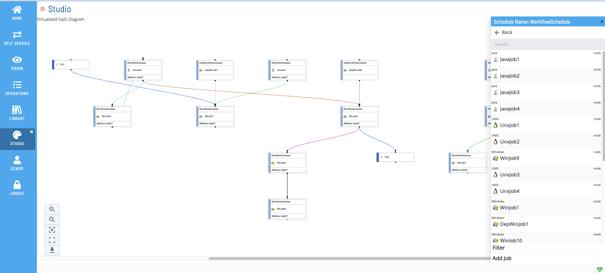
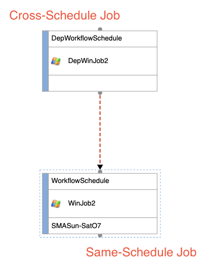
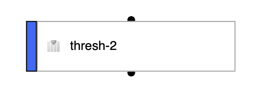
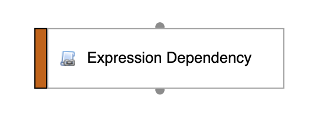
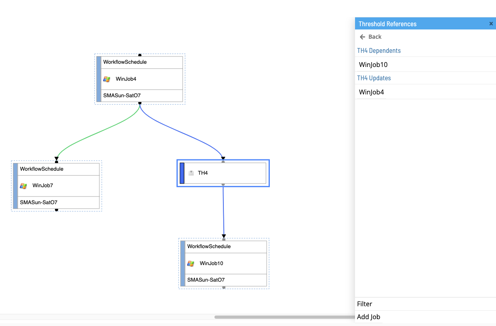
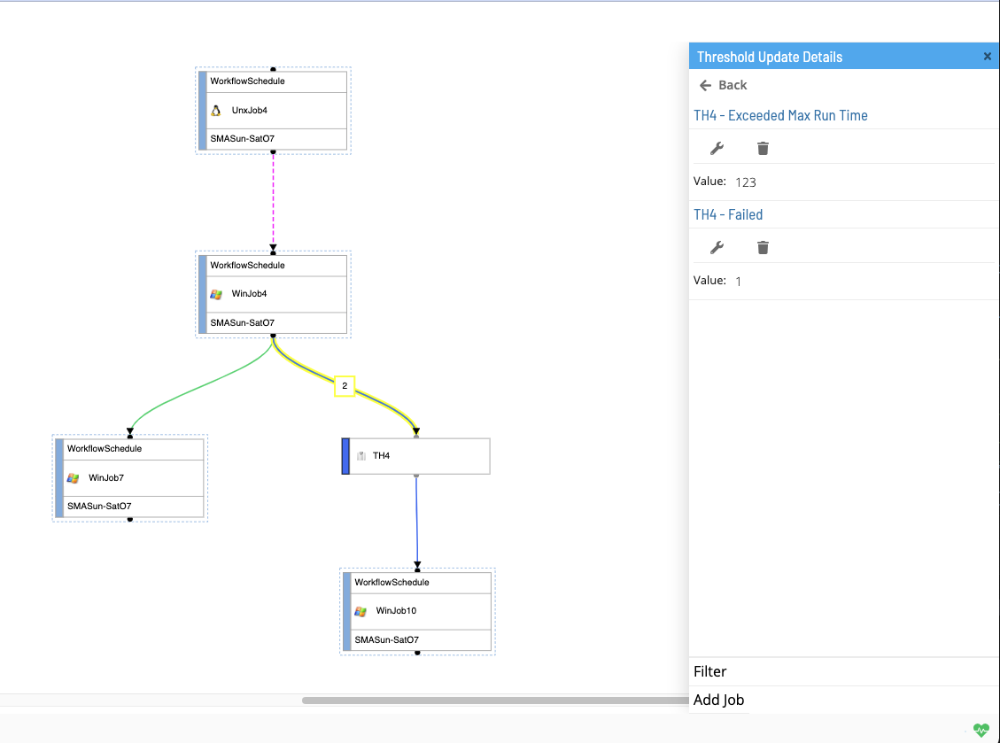
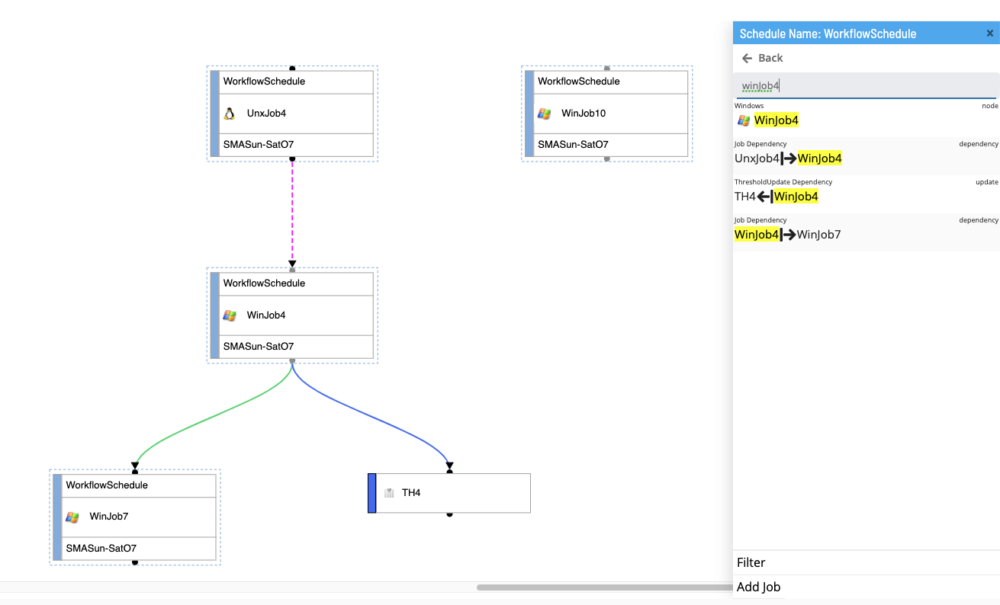
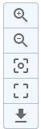

# Viewing Master Schedule

Studio Canvas functionality renders on-demand diagrams that show job nodes and job dependency relationships. These visualizations can be accessed from the **Studio** page by selecting a schedule and clicking **View**.

## Studio Concepts

### Nodes

Nodes represent job, threshold, resource, or expression entities.

The color on the left-hand side of the node is dependent upon the type of node, as indicated below:

Light Blue: Job Node  
Dark/Royal Blue: Threshold Node  
Yellow: Resource Node  
Orange: Expression Node

Hovering over a node will highlight the node with a solid yellow border effect. Selecting a node will highlight the selected node with a solid blue border effect.

Upon opening studio the coordinate of all nodes will be saved and their positions will be updated when any node is moved.  
Newly added nodes will be placed in the coordinate (0,0) and will be displayed with a green border.

 Node")

All nodes contain two handles - a target handle and a source handle. The target handle represents incoming edge dependencies, whereas the source handle represents outgoing edge dependencies.

#### Job Nodes

Job nodes represent a [Master Job](../../../../../../objects/jobs.md). Jobs that are associated with the currently selected schedule (i.e., not a Cross-Schedule Job) are represented with a blue dotted border around the node. Jobs that are assocated outside of the currently selected schedule (i.e., a job that exists from a separate schedule from the one currently selected) do not have a blue dotted border and are applied a transparency effect.

Job nodes contain different pieces of information relating to it's specific Master Job.

#### Threshold Nodes

#### Resource Nodes

#### Expression Nodes

### Edges

Edges represent dependencies. Specifically, they can represent job dependencies, threshold dependencies and threshold updates, resource dependencies and resource updates, and expression dependencies.

The color of the edge and the style (i.e., dotted vs solid) is dependent upon the type of dependency as well as (if applicable, in the case of job dependencies) the type of job dependency, as indicated below:

Job Dependencies:

    Job Type:

    required: solid light green
    requiredOnFailure solid red
    requiredIgnoreEC: solid black
    after: dotted light green
    afterOnFailure: dotted red
    afterIgnoreEC: dotted black
    excludes: pink
    conflict: dotted magenta

Threshold (Dependencies and Updates):

    solid dark blue

Resource (Dependencies and Updates):

    solid gold

Job Name Like Dependencies:

    solid magenta

Expression Dependencies:

    orange

#### Cross Schedule Dependencies

Dependencies can be created between two jobs that are not necessarily from the same selected schedule. In such a situation, a cross-schedule dependency is created. Cross schedule dependencies are represented like normal dependency lines, however the nodes themselves will indicate which job is from the currently selected schedule and which job is not. (See [Job Nodes](./Viewing-Master-Schedules.md#job-nodes) for more details.)

#### Dependency Disambiguator

There may be situations (e.g., in the case of threshold and resource updates) where there exists multiple dependencies between two nodes. In such situations, the edge will be updated with a numerical indicator, displaying the total number of dependencies that are represented by that singular edge. Selecting an edge with a numerical indicator will open up the right panel with a list of the dependencies. You can then make your edge selection from the right panel. (See [Selecting an Edge with disambiguator](./Viewing-Master-Schedules.md#selecting-an-edge-with-disambiguator) for more details)

### Right Panel

The right panel (also called the action container) is a context-sensitive drawer/navigation component that will change based on different selection(s) in the studio canvas. From here, the user can perform actions such as adding/editing/deleting job/dependencies, viewing node and dependency details, seeing disambiguated dependency selections, filtering, searching, etc.

#### Default Selection (null)

When no selection is made in the canvas (i.e., no edge or node selection), the default right panel will pull out.

From this view, the user can perform the following actions:

- Click the **Back** button to navigate out of the current schedule and go back into the studio schedule list page.
- Search the canvas (See [Search](./Viewing-Master-Schedules.md#search) for more details).
- Select a node from the list.
- Filter the canvas (See [Filter](./Viewing-Master-Schedules.md#filter) for more details).
- Click the **Add Job** button to navigate to the `/library/masterjobs/` page to add a new master job.

#### Selecting a Node

Left clicking a node will make a node selection. When a node selection is made, the right panel will display details corresponding to the selected node.

##### Selecting a Job Node:

When selecting a job node, the view of the right panel will be updated. From this view, the user can perform the following actions:

In the upper header container:

- Click the **Back** button to navigate out of the selected job node and go back to the default right panel view (i.e., with no edge or node selected).
- Edit the currently selected Master Job.
- Copy the currently selected Master Job.
- Delete the currently selected Master Job.
- Check the cross reference(s) on the currently selected Master Job.

In the lower footer container:

- Filter the canvas (See [Filter](./Viewing-Master-Schedules.md#filter) for more details).
- Click the **Add Job** button to navigate to the `/library/masterjobs/` page to add a new master job.
- Click the **Add Dependency** button to open a dialog window to add a new Job Dependency (See [Job Dependencies](../../../../../../job-components/job-dependencies.md) for more details).
- Click the **Add Threshold Update** button to open a dialog window to add a new Threshold Update Dependency (See [Threshold Updates](../../../../../../job-components/threshold-resource-updates.md#threshold-updates) for more details).
- Click the **Add Threshold Dependency** button to open a dialog window to add a new Threshold Dependency (See [Threshold Dependencies](../../../../../../job-components/threshold-resource-dependencies.md#threshold-dependencies) for more details).
- Click the **Add Resource Update** button to open a dialog window to add a new Resource Update (See [Resource Updates](../../../../../../job-components/threshold-resource-updates.md#resource-updates) for more details).
- Click the **Add Resource Dependency** button to open a dialog window to add a new Resource Dependency (See [Resource Dependencies](../../../../../../job-components/threshold-resource-dependencies.md#resource-dependencies) for more details).
- Click the **Add Expression Dependency** button to open a dialog window to add a new Expression Dependency (See [Expression Dependencies](../../../../../../job-components/expression-dependencies.md) for more details).

##### Selecting a Threshold/Resource Node:

When selecting a threshold or resource node, the view of the right panel will be updated. Since a threshold or resource can be designated as either a dependency or an update, selecting a threshold/resource node will provide a list of all jobs that have threshold/resource job connections (dependencies or updates).

##### Selecting an Expression Node:

When selecting an expression node, the view of the right panel will be updated. Since expression dependencies are unique to specific master jobs, in the same vein, expression nodes are unique to job nodes in the canvas.

#### Selecting an Edge

Left clicking an edge will make an edge selecion. When an edge selection is made, the right panel will display details corresponding to the selected edge.

#### Selecting an Edge with Disambiguator

Selecting an edge with a numerical indicator (disambiguator) will open up the right panel with a list of the dependencies associated with that edge. Since there are multiple valid dependency selections on the same edge, you can make your specific edge selection from the right panel - selecting an edge from here will load the right panel with the dependency details of your selection.

#### Search

The search feature is a text input field used to locate specific nodes or edges on the canvas. Search queries will generate a list matching results (i.e., nodes and edges) in the right panel. Selecting a result from the right panel will center the canvas to selection as well as actively select it.

#### Filter

The filter feature is set of filter selections used to narrow down rendered nodes and edges on the canvas as well as search results. You can filter the schedule by schedule instances, show threshold and resources, job related dependencies, frequency related dependencies, and by specific frequencies. By default, all nodes and dependencies are displayed, with no filter by any schedule instances or specific frequencies.

### Subschedules

Container jobs have the ability to represent subschedules as nodes in the canvas. If a selected schedule is a subschedule itself (i.e., it has parent scehdules), relevant subschedule and parent schedule information will be render in the bottom bar.

#### Breadcrumbs

If a selected schedule is itself a subschedule, the bottom bar will render a breadcrumbs component in the lower left hand corner. The breadcrumbs will indicate two pieces of information:

1. An list/array comprising all parent schedules that reference the currently selected scehdule
1. The currently selected schedule (which can be represented as the subschedule to each of the listed parent schedules)

#### Selecting a Parent Schedule

Listed parent scehdules in the breadcrumbs are selectable elements (note that the currently selected schedule is non-selectabled). Clicking a parent schedule from the breadcrumbs list will re-direct the user to a view of the newly selected schedule. By default, only one parent schedule is displayed; if there is more than one parent schedule, the list will initially render a collapsed list with an ellipses (...), which , when clicked, will fully expand the parent list.

#### Selecting a Subschedule from a Container Job

Job nodes represented as container jobs have the ability to contain subschedules. Right clicking a container job in the canvas will open the right panel with the contained subschedule. Clicking the subschedule will re-direct the user to a view of the selected subschedule.

### Controls

The controls are located in the lower left hand corner of the studio canvas page. Here, you can zoom in, zoom out, center to root node, fit to screen and download canvas page image.

### Legend

Open/Close the legend by clicking on the info button in the controls. Here, you could see the details for each dependency line.  
  
The Legend will be located in the lower left corner next to the controls, Click the info button again to close the legend.  

### Mini-Map

The minimap is located in the lower right hand corner of the studio canvas page. Here, you can see and move the viewport of what is current on the studio canvas page.

