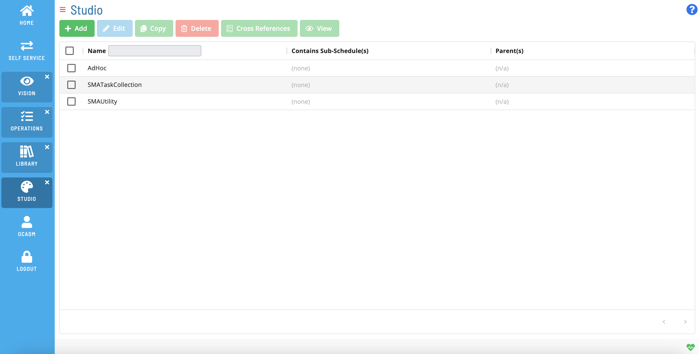

# Overview

**Theme:** Overview  
**Who Is It For?** System Administrator, Automation Engineer

## What Is It?

Studio is where Master Schedules are created and managed. Master Schedules can contain multiple jobs. Use the selection bar on the left side of the screen to navigate available options.

:::note
Use the bar on the left side of the screen
:::

Please check back for more content.

## When Would You Use It?

- Studio is where Master Schedules are created and managed

## Why Would You Use It?

- **Overview**: Studio is where Master Schedules are created and managed

## Configuration Options

| Setting | What It Does | Default | Notes |
|---|---|---|---|
## FAQs

**Q: What does Overview do?**

title: Managing Studio

**Q: Where can you find Overview in OpCon?**

Access Overview through the appropriate section in the Enterprise Manager or Solution Manager navigation.

## Glossary

**Enterprise Manager (EM)**: OpCon's rich client graphical user interface for Windows and Linux, used to define schedules and jobs, manage automation data, and perform operational tasks.

**Solution Manager**: OpCon's browser-based graphical user interface for managing automation data, performing operational actions, and administering the system.

**Resource**: A numeric variable in OpCon representing a finite pool. Jobs can be configured to require a set number of resource units to run, limiting concurrent executions and preventing resource contention.

**Schedule**: A named container for jobs in OpCon, built for a specific date to create that day's automation. Schedules define build settings, frequencies, and the jobs that run within them.

**Job**: The fundamental unit of work in OpCon. A job defines what to run, on which machine, when to start, and what conditions must be met. Job results are tracked and can trigger events and notifications.

**OpCon**: Continuous' workflow automation platform. The OpCon server includes the database, SAM and Supporting Services (SAM-SS), and graphical user interfaces. agents installed on target platforms run jobs and report results.
